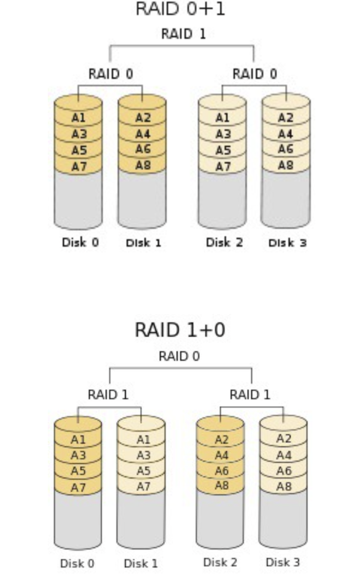

### 데이터베이스

<details>
<summary>데이터베이스의 특징에 대해 설명해주세요.</summary>
<div>

데이터베이스(Database)는 구조화된 정보나 데이터의 집합을 체계적으로 관리, 저장, 검색할 수 있게 해주는 시스템이며 데이터베이스 관리 시스템(Database Management System, DBMS)을 통해 데이터베이스를 관리하며, 이를 통해 데이터의 무결성, 일관성, 보안성, 백업 및 복구 등 여러 가지 중요한 기능을 수행할 수 있습니다. 

#### 데이터베이스의 주요 특징

- 구조화된 데이터의 저장: 데이터베이스는 데이터를 테이블 형태로 구조화하여 저장합니다. 각 테이블은 열(column)과 행(row)으로 구성되어 있으며, 각 열은 특정 유형의 데이터를 나타냅니다.
- 데이터의 무결성(Integrity): 데이터베이스는 데이터의 정확성과 일관성을 유지하기 위한 여러 가지 무결성 제약 조건을 제공합니다. 예를 들어, 기본키(primary key) 제약 조건은 테이블의 각 행이 유일하게 식별되도록 합니다.
- 데이터의 일관성(Consistency): 데이터베이스는 트랜잭션 처리를 통해 데이터의 일관성을 보장합니다. 트랜잭션은 하나 이상의 연산을 포함할 수 있으며, 모든 연산이 성공적으로 완료되거나 전혀 실행되지 않아야 합니다.=
- 보안(Security): 데이터베이스는 사용자 인증과 권한 부여를 통해 데이터 접근을 제어합니다. 이를 통해 민감한 정보를 보호하고 데이터의 무단 접근을 방지할 수 있습니다.
- 백업 및 복구(Backup and Recovery): 데이터 손실에 대비하여 데이터베이스는 데이터의 백업 및 복구 기능을 제공합니다. 시스템 장애나 데이터 손상이 발생했을 때 이전 상태로 복구할 수 있습니다.
- 동시성(Concurrency): 동시에 여러 사용자가 데이터베이스를 사용할 수 있도록 지원합니다. 데이터베이스 관리 시스템은 동시성 제어를 통해 여러 사용자의 데이터베이스 접근이 서로 간섭하지 않도록 관리합니다.
- 확장성(Scalability) 및 성능(Performance): 데이터베이스는 데이터의 양이 증가함에 따라 확장 가능하도록 설계되어 있으며, 인덱스, 쿼리 최적화 등 다양한 기술을 통해 높은 성능을 제공합니다.

</div>
</details>

<details>
<summary>데이터베이스 언어(DDL,DML,DCL) 에 대해 설명하라</summary>
<div>

### 데이터 정의 언어 (DDL: Data Definition Language)
DDL은 데이터베이스 스키마를 정의하거나 수정하고, 데이터베이스 내의 객체(테이블, 인덱스, 뷰 등)를 생성, 변경, 삭제하는 데 사용되는 언어입니다. DDL의 주요 명령어로는 CREATE, ALTER, DROP 등이 있습니다.
- CREATE: 데이터베이스, 테이블, 뷰 등의 새로운 객체를 생성합니다.
- ALTER: 기존의 데이터베이스 객체를 수정합니다.
- DROP: 데이터베이스 객체를 삭제합니다.
### 데이터 조작 언어 (DML: Data Manipulation Language)
DML은 데이터베이스 내의 데이터를 실제로 조작(추가, 수정, 삭제, 조회)하는 데 사용되는 언어입니다. DML의 주된 명령어로는 INSERT, UPDATE, DELETE, SELECT 등이 있습니다.
- INSERT: 테이블에 새로운 데이터를 추가합니다.
- UPDATE: 테이블의 기존 데이터를 수정합니다.
- DELETE: 테이블에서 데이터를 삭제합니다.
- SELECT: 테이블에서 데이터를 조회합니다.
### 데이터 제어 언어 (DCL: Data Control Language)
DCL은 데이터베이스 내의 데이터 접근 권한을 관리하거나 데이터의 무결성을 유지하기 위해 사용되는 언어입니다. DCL의 주요 명령어로는 GRANT, REVOKE 등이 있습니다.
- GRANT: 사용자에게 데이터베이스 객체에 대한 접근 권한을 부여합니다.
- REVOKE: 사용자에게 부여된 접근 권한을 제거합니다.
</div>
</details>

<details>
<summary>DBMS란?</summary>
<div>

DBMS(Database Management System, 데이터베이스 관리 시스템)란 데이터를 효율적으로 저장, 검색, 수정할 수 있도록 돕는 소프트웨어 시스템입니다. DBMS는 사용자와 데이터베이스 사이에서 중개자 역할을 하여 사용자의 요청에 따라 데이터를 조작하고 관리할 수 있게 합니다. 다양한 유형의 DBMS가 있으며, 이들은 크게 관계형 데이터베이스 관리 시스템(RDBMS)과 비관계형 데이터베이스 관리 시스템(NoSQL DBMS)으로 분류될 수 있습니다.

</div>
</details>

<details>
<summary>DBMS의 기능은?</summary>
<div>

- 데이터 정의: DBMS를 사용하여 데이터베이스의 구조를 생성, 수정, 삭제할 수 있습니다. 이는 데이터 정의 언어(DDL)를 사용하여 수행됩니다.
- 데이터 조작: 사용자는 데이터 조작 언어(DML)을 사용하여 데이터를 삽입, 수정, 삭제, 검색할 수 있습니다.
- 데이터 보안 및 무결성 관리: DBMS는 데이터의 보안, 무결성 및 일관성을 유지하기 위한 메커니즘을 제공합니다. 사용자 권한 관리를 통해 특정 데이터에 대한 접근을 제어할 수 있습니다.
- 데이터 백업 및 복구: 데이터의 손실이 발생했을 때 이를 복구할 수 있도록 DBMS는 백업 및 복구 기능을 제공합니다.
- 동시성 제어: 다수의 사용자가 동시에 데이터베이스에 접근할 때 발생할 수 있는 데이터의 불일치 문제를 방지하기 위해 DBMS는 동시성 제어 기능을 제공합니다.
- 트랜잭션 관리: DBMS는 트랜잭션이 데이터베이스의 무결성을 유지하면서 완전하게 처리될 수 있도록 관리합니다.
</div>
</details>

<details>
<summary>UML이란?</summary>
<div>
UML (Unified Modeling Language)은 소프트웨어 시스템의 설계를 시각화, 명세화, 구축 및 문서화하기 위해 사용되는 표준화된 모델링 언어입니다. UML은 소프트웨어 개발 과정에서 요구 사항의 분석부터 시스템 설계, 구현, 테스트, 유지 보수에 이르기까지 다양한 단계에서 사용됩니다. 크게 시스템의 정적인 구조를 표현하기 위한 구조 다이어그램, 시스템의 동적인 행위를 표현하기 위한 행동 다이어그램으로 나뉩니다.
</div>
</details>

<details>
<summary>정규화란?</summary>
<div>

정규화(Normalization)는 데이터베이스 설계에서 중복을 최소화하여 데이터의 무결성과 일관성을 유지하고, 수정, 삭제, 삽입 이상(anomalies)을 방지하기 위해 데이터를 구조화하는 과정입니다. 이 과정은 데이터를 여러 테이블로 분할하고, 테이블 간의 관계를 정의하여 구현합니다. 정규화는 주로 관계형 데이터베이스에서 사용되며, 여러 단계의 정규 형태(Normal Forms)로 구성됩니다.

#### 정규화의 주요 목표
- 중복 제거: 데이터의 중복을 최소화하여 저장 공간을 효율적으로 사용합니다.
- 데이터 무결성 유지: 데이터 간의 일관성과 정확성을 보장합니다.
- 이상 현상 방지: 데이터 삽입, 수정, 삭제 시 발생할 수 있는 문제를 최소화합니다.
#### 정규 형태
- 제1정규형(1NF): 모든 필드의 값이 원자값(더 이상 나눌 수 없는 값)으로만 구성되어야 합니다.
- 제2정규형(2NF): 제1정규형을 만족하며, 모든 비주요 키 속성이 기본 키에 완전 함수적 종속을 만족해야 합니다.
- 제3정규형(3NF): 제2정규형을 만족하며, 모든 비주요 키 속성이 기본 키에 이행적 종속이 되지 않아야 합니다.
- BCNF(Boyce-Codd Normal Form): 제3정규형을 만족하며, 모든 결정자가 후보 키가 되는 정규형입니다.
- 제4정규형(4NF) 및 제5정규형(5NF): 더 복잡한 다중값 종속성과 조인 종속성을 해결하기 위한 단계입니다.
</div>
</details>

<details>
<summary>정규화의 장단점?</summary>
<div>

### 정규화의 장점
- 데이터 중복 감소: 데이터 중복을 줄여 저장 공간을 효율적으로 사용할 수 있습니다.
- 데이터 무결성 및 일관성 유지: 데이터의 정확성과 일관성을 유지하며, 데이터베이스에서 오류가 발생할 확률을 줄입니다.
- 삽입/삭제/갱신 이상 최소화: 데이터 중복을 줄임으로써 삽입 이상, 삭제 이상, 갱신 이상과 같은 문제를 최소화합니다.
- 데이터 구조의 유연성 증가: 정규화된 데이터베이스는 변경이 필요할 때 더 쉽게 수정할 수 있습니다.
### 정규화의 단점
- 조회 성능 저하: 정규화로 인해 데이터가 여러 테이블에 분산되어 있을 때, 조인 연산이 빈번하게 발생하여 조회 성능이 저하될 수 있습니다.(Join 연산의 증가)
- 복잡성 증가: 데이터베이스의 구조가 복잡해지고, 관리가 어려워질 수 있습니다.
- 개발 및 유지 보수 비용 증가: 정규화된 데이터베이스는 설계가 더 복잡하고, 이로 인해 개발 및 유지보수 비용이 증가할 수 있습니다.
</div>
</details>

<details>
<summary>DB에서 View는 무엇인가? 가상 테이블이란?</summary>
<div>

데이터베이스에서 View는 실제 테이블의 데이터를 기반으로 한 가상의 테이블입니다. 이 가상 테이블은 하나 이상의 실제 테이블에서 데이터를 합성하여 만들어진 결과물로, 사용자에게는 실제 테이블처럼 보이지만, 데이터베이스에 물리적으로 존재하는 데이터의 집합은 아닙니다. View는 데이터를 검색하는 SQL 쿼리문에 이름을 부여한 것으로 이해할 수 있습니다.

#### View의 특징
- 보안성 향상: 사용자에게 특정 데이터만 보여주도록 하여 데이터 접근 제어를 용이하게 합니다.
- 복잡성 감소: 복잡한 쿼리를 간단하게 만들 수 있으며, 사용자는 복잡한 쿼리를 직접 작성하지 않고도 필요한 데이터에 접근할 수 있습니다.
- 데이터 독립성: 실제 테이블 구조가 변경되어도 View를 통해 접근하는 사용자는 영향을 받지 않을 수 있습니다.
#### 가상 테이블
가상 테이블은 View와 같이 물리적으로는 존재하지 않지만, 사용자가 쿼리를 통해 접근할 때 실제 테이블처럼 동작하는 데이터의 집합을 말합니다. 가상 테이블은 데이터베이스 시스템이 쿼리 실행 시점에 임시로 생성하며, 쿼리 처리가 끝나면 사라집니다.

###### View의 사용 사례
- 복잡한 쿼리 간소화: 여러 테이블에 걸쳐 있는 데이터를 조인 등을 통해 합치는 복잡한 쿼리를 View로 만들어 간단하게 접근할 수 있게 합니다.
- 특정 데이터 접근 제한: 사용자별로 특정 데이터에만 접근할 수 있도록 제한하고 싶을 때 View를 사용하여 접근 가능한 데이터를 제한할 수 있습니다.
</div>
</details>

<details>
<summary>이상현상이란?</summary>
<div>

이상현상(Anomalies)은 데이터베이스에서 데이터를 추가, 삭제, 수정할 때 발생할 수 있는 일관성 없는 데이터의 문제를 말합니다. 이러한 이상현상들은 데이터베이스가 잘못 설계되었을 때 주로 발생하며, 이를 방지하기 위해 데이터베이스 정규화 과정을 수행하여 데이터 중복을 최소화하고 각 정보가 적절히 분리되어 관리될 수 있도록 설계해야 합니다. 
</div>
</details>

<details>
<summary>이상현상의 종류?</summary>
<div>

### 삽입 이상 (Insertion Anomaly)
새로운 데이터를 삽입하려 할 때, 필요 이상의 정보를 입력해야 하는 문제입니다. 예를 들어, 학생 정보를 저장하는 테이블에서 학생이 수강하는 강의 정보도 함께 저장해야 한다면, 해당 학생이 아직 수강하는 강의가 없는 경우에도 강의 정보를 어떻게든 입력해야 합니다.

### 삭제 이상 (Deletion Anomaly)
특정 정보를 삭제할 때, 의도치 않게 관련된 다른 정보까지 함께 삭제되는 문제입니다. 예를 들어, 위의 학생 정보 테이블에서 특정 강의를 수강하는 모든 학생 정보를 삭제하면, 그 강의에 대한 정보도 함께 사라지게 됩니다.

### 갱신 이상 (Update Anomaly)
데이터 중복으로 인해, 데이터를 갱신할 때 일부만 갱신되어 데이터 간의 불일치가 발생하는 문제입니다. 예를 듀어, 하나의 테이블에 여러 학생이 같은 강의를 수강하고 있는 정보가 중복되어 있을 때, 그 강의 정보를 갱신하려면 모든 학생에 대한 레코드를 일일이 갱신해야 합니다. 일부만 갱신되면 데이터가 서로 일치하지 않게 됩니다.
</div>
</details>

<details>
<summary>역정규화를 하는 이유?</summary>
<div>

- 성능 향상: 정규화는 데이터 중복을 최소화하여 데이터 무결성을 보장하지만, 이로 인해 데이터를 조회할 때 여러 테이블 간에 조인(join) 연산이 많이 필요할 수 있습니다. 이러한 조인 연산은 데이터베이스의 성능을 저하시킬 수 있습니다. 역정규화를 통해 자주 사용되는 데이터를 하나의 테이블에 모으거나, 계산된 값을 저장함으로써 조회 성능을 향상시킬 수 있습니다.

- 쿼리 단순화: 여러 테이블에 걸쳐 있는 데이터를 조합하여 정보를 얻기 위한 복잡한 쿼리를 단순화할 수 있습니다. 역정규화를 통해 데이터가 한 곳에 모여 있게 되면, 사용자는 더 단순한 쿼리로 필요한 정보를 얻을 수 있습니다.

- 트랜잭션 속도 개선: 데이터를 업데이트하거나 삽입할 때, 정규화된 구조에서는 여러 테이블에 걸쳐 동시에 작업을 해야 할 수 있습니다. 역정규화를 통해 관련 데이터를 한 곳에 모으면, 이러한 작업들이 더 빨리 처리될 수 있습니다.

- 읽기 성능 향상: 특히 대규모 데이터를 다루는 데이터 웨어하우스와 같은 시스템에서는, 조회(읽기) 성능이 매우 중요합니다. 이 경우, 역정규화를 통해 데이터를 사전에 집계하거나 요약하여 빠르게 접근할 수 있도록 할 수 있습니다.
</div>
</details>

<details>
<summary>데이터베이스를 설계할 때 가장 중요한 것이 무엇이라고 생각하나요?</summary>
<div>
데이터의 무결성 유지와 성능 입니다. 데이터베이스의 주된 목적은 신뢰성 있는 데이터 저장이므로 데이터의 무결성 유지는 매우 중요한 요소 중 하나라고 생각합니다. 무결성을 유지하기 위해서는 정규화를 통해 데이터 중복을 최소화하고, 데이터베이스의 상태를 일관성 있게 유지하기 위해 트랜잭션 관리를 함으로써 데이터의 무결성을 보장하도록 합니다.
</div>
</details>

<details>
<summary>데이터베이스 무결성이란?</summary>
<div>

데이터베이스 무결성(Database Integrity)은 데이터베이스 내의 데이터가 정확하고 일관된 상태를 유지하는 것을 의미합니다. 데이터베이스 무결성을 보장하는 것은 데이터베이스 시스템의 핵심적인 요소 중 하나로, 데이터의 정확성, 일관성, 신뢰성을 유지하기 위해 다양한 제약 조건과 규칙을 적용합니다.
### 데이터베이스 무결성 종류
- 도메인 무결성(Domain Integrity): 각 필드(열)의 데이터가 정의된 도메인(유효한 값의 집합)에 속해야 한다는 것을 보장합니다. 예를 들어, 날짜 필드에는 유효한 날짜만 저장되어야 하며, 성별 필드에는 '남', '여'와 같은 유효한 값만 저장되어야 합니다.
- 엔터티 무결성(Entity Integrity): 테이블의 각 행(레코드)이 고유하게 식별될 수 있도록 합니다. 이를 위해 주로 기본 키(Primary Key)를 사용하여 각 행의 고유성을 보장합니다. 기본 키는 중복되거나 누락될 수 없는 값이어야 합니다.
- 참조 무결성(Referential Integrity): 외래 키(Foreign Key)를 사용하여 서로 관련된 테이블 간의 관계를 정확하게 유지합니다. 외래 키에 의해 참조되는 테이블의 행이 삭제되거나 변경될 때, 관련된 테이블의 데이터도 함께 업데이트되거나 삭제되어야 합니다.
- Null 무결성: Null 값 허용 여부를 제어합니다.
- 고유 무결성(Unique Integrity): 중복된 데이터 입력을 방지합니다. 즉, 항상 고유하도록 유지합니다.
</div>
</details>

<details>
<summary>트리거란?</summary>
<div>

트리거는 데이터베이스 관리 시스템(DBMS) 내에서 특정 이벤트(예: 데이터 삽입, 수정, 삭제 등)가 발생할 때 자동으로 실행되는 프로시저나 코드 블록입니다. 트리거는 데이터의 무결성을 유지하고, 복잡한 비즈니스 규칙을 자동으로 적용하며, 데이터 변경에 따른 자동 감사나 로깅 등의 작업을 수행하는 데 유용합니다. 트리거는 데이터의 상태를 관리하거나(변경 사항 모니터링) 무결성을 강화하기 위해 사용될 수 있습니다.
</div>
</details>

<details>
<summary>Commit과 Rollback이란?</summary>
<div>

### Commit
- Commit은 하나 이상의 데이터 변경(예: 삽입, 수정, 삭제)이 성공적으로 완료되었음을 데이터베이스에 알리는 명령어입니다. Commit 명령이 실행되면, 해당 트랜잭션에 의해 변경된 모든 데이터는 데이터베이스에 영구적으로 반영됩니다.
- Commit을 통해 트랜잭션은 성공적으로 종료되며, 이후 데이터 변경은 되돌릴 수 없습니다.
### Rollback
- Rollback은 트랜잭션 처리 중에 발생한 모든 데이터 변경사항을 취소하는 명령어입니다. 오류가 발생하거나 사용자가 데이터 변경을 원치 않을 경우, Rollback 명령을 통해 트랜잭션 시작 시점으로 데이터 상태를 되돌릴 수 있습니다.
- Rollback을 실행하면, 트랜잭션이 시작된 이후에 실행된 모든 데이터 변경사항이 취소되며, 데이터베이스는 트랜잭션 시작 전의 상태로 복구됩니다.

</div>
</details>

<details>
<summary>SELECT 쿼리의 수행 순서를 알려주세요.</summary>
<div>

1. FROM 절: 가장 먼저, DBMS는 FROM 절에 명시된 테이블(또는 뷰)을 읽습니다. 이 단계에서 조인이 있을 경우, 관련 테이블이 결합됩니다.

2. WHERE 절: FROM 절로부터 가져온 데이터에 대해 WHERE 절의 조건을 적용하여 필터링합니다. 이 단계에서는 특정 조건을 만족하는 행만 선택됩니다.

3. GROUP BY 절: WHERE 절에 의해 필터링된 결과에 대해 GROUP BY 절이 적용됩니다. 이는 데이터를 지정된 열의 값에 따라 그룹화합니다.

4. HAVING 절: GROUP BY 절에 의해 그룹화된 결과에 대해 HAVING 절의 조건이 적용됩니다. HAVING 절은 그룹화된 결과에 대한 추가적인 필터링을 수행합니다.

5. SELECT 절: 필터링 및 그룹화된 결과에 대해 SELECT 절이 적용됩니다. 이 단계에서는 최종적으로 반환될 열이 결정됩니다.

6. DISTINCT: SELECT 절에서 DISTINCT 키워드가 사용되었다면, 이 단계에서 중복된 결과를 제거합니다.

7. ORDER BY 절: 모든 처리가 완료된 후, ORDER BY 절에 따라 결과가 정렬됩니다. 이는 최종 결과 집합을 사용자가 지정한 순서대로 정렬하는 작업입니다.

8. LIMIT / OFFSET 절 (해당되는 경우): 마지막에, LIMIT 또는 OFFSET 절이 적용되어 최종 결과 집합에서 특정 수의 행만을 반환하거나, 특정 위치부터 행을 반환합니다.
</div>
</details>

<details>
<summary>데이터 베이스에서 인덱스(색인)이란 무엇인가요, 장단점은?</summary>
<div>

데이터베이스에서 인덱스(색인)는 데이터베이스 테이블의 데이터에 빠르게 접근할 수 있도록 도와주는 데이터 구조입니다. 인덱스는 검색 쿼리의 성능을 향상시키기 위해 사용되며, 주로 B-트리나 해시 테이블 같은 자료 구조를 사용하여 구현됩니다.

#### 장점
- 검색 성능 향상: 인덱스를 사용하면 데이터베이스에서 데이터를 찾는 속도가 크게 빨라집니다. 특히, 대용량 데이터에서는 검색, 정렬, 조인 연산의 성능이 크게 향상됩니다.
- 정렬된 데이터 접근: 인덱스를 사용하면 데이터를 정렬된 상태로 유지할 수 있어, 범위 검색과 정렬 쿼리의 성능을 향상시킬 수 있습니다.
#### 단점
- 저장 공간 사용: 인덱스는 추가적인 저장 공간을 사용합니다. 인덱스를 많이 생성할수록 더 많은 디스크 공간이 필요합니다.
- 작성 및 유지 관리 비용: 인덱스가 있는 테이블에 데이터를 삽입, 삭제, 수정하는 경우 인덱스도 함께 업데이트해야 하므로, 데이터 변경 작업의 성능이 저하될 수 있습니다.
- 성능 저하: 잘못 설계된 인덱스는 성능을 저하시킬 수 있습니다. 예를 들어, 필요하지 않은 인덱스가 많은 경우, 데이터 변경 작업의 성능이 떨어질 수 있습니다.
</div>
</details>

<details>
<summary>RDBMS와 NoSQL의 차이에 대해 설명해주세요.</summary>
<div>

### RDBMS
- 구조: RDBMS는 테이블 기반의 구조를 가지며, 데이터는 열과 행으로 구성된 테이블에 저장됩니다. 각 행은 고유한 키를 가지며, 테이블 간의 관계를 통해 데이터를 관리합니다.
- 데이터 무결성 및 일관성: RDBMS는 엄격한 데이터 무결성 규칙을 적용하며, ACID (Atomicity, Consistency, Isolation, Durability) 속성을 통해 데이터의 일관성과 신뢰성을 보장합니다.
- 쿼리 언어: SQL (Structured Query Language)을 사용하여 데이터를 조회, 수정, 삭제합니다.
- 사용 사례: 복잡한 쿼리와 트랜잭션이 필요한 응용 프로그램, 은행이나 금융 서비스 등 데이터의 일관성과 무결성이 중요한 분야에 적합합니다.
### NoSQL
- 구조: NoSQL 데이터베이스는 비관계형이며, 다양한 데이터 모델(키-값 저장소, 문서 지향, 컬럼 패밀리, 그래프 기반 등)을 지원합니다. 이러한 유연성은 구조화되지 않은 데이터를 쉽게 저장하고 관리할 수 있게 해줍니다.
- 확장성: NoSQL은 수평적 확장성이 뛰어나며, 대량의 데이터와 트래픽을 처리할 수 있도록 설계되었습니다. 데이터를 여러 서버에 분산시켜 저장할 수 있습니다.
- 유연성: NoSQL은 스키마가 없거나 유연한 스키마를 제공하여, 빠르게 변화하는 데이터 구조에 적합합니다.
- 사용 사례: 대규모 웹 애플리케이션, 실시간 분석, 빅 데이터 처리 등 변화가 빠르고, 대규모 분산 데이터를 처리해야 하는 환경에 적합합니다.
</div>
</details>

<details>
<summary>트랜잭션이란 무엇인지 설명해주세요.</summary>
<div>

트랜잭션이란 데이터베이스 관리 시스템(DBMS)에서 안전하게 데이터를 처리하기 위해 사용되는 작업의 단위입니다. 이는 하나 이상의 데이터베이스 연산(예: 삽입, 갱신, 삭제)을 포함할 수 있으며, 이러한 연산들은 전체가 함께 성공적으로 완료되거나 전혀 실행되지 않아야 합니다. 트랜잭션의 주요 목적은 데이터의 일관성과 무결성을 유지하는 것입니다.
</div>
</details>

<details>
<summary>트랜잭션의 특성(ACID)에 대해 설명해주세요.</summary>
<div>

- 원자성(Atomicity): 트랜잭션 내의 모든 연산은 하나의 단위로 처리됩니다. 즉, 모든 연산이 성공적으로 완료되거나 하나도 실행되지 않아야 합니다.
- 일관성(Consistency): 트랜잭션이 성공적으로 완료되면, 데이터베이스는 하나의 일관된 상태에서 다른 일관된 상태로 변화해야 합니다. 이는 데이터의 무결성 제약 조건이 유지되어야 함을 의미합니다.
- 독립성(Isolation): 동시에 실행되는 여러 트랜잭션들은 서로 영향을 주지 않고 독립적으로 실행되어야 합니다. 이를 위해 DBMS는 동시성 제어 메커니즘을 사용합니다.
- 지속성(Durability): 트랜잭션이 성공적으로 완료되면, 그 결과는 영구적으로 데이터베이스에 반영됩니다. 시스템 장애가 발생해도 이러한 결과는 손실되지 않습니다.
</div>
</details>

<details>
<summary>트랜잭션의 원자성에 대해 설명해주세요.</summary>
<div>

트랜잭션 내의 모든 연산은 하나의 단위로 처리됩니다. 즉, 모든 연산이 성공적으로 완료되거나 하나도 실행되지 않아야 합니다.
</div>
</details>

<details>
<summary>트랜잭션을 사용할 때 주의해야 할 점은 무엇인가요?</summary>
<div>

- 락(Lock) 경쟁과 데드락(Deadlock): 여러 트랜잭션이 동시에 동일한 데이터에 접근하려고 할 때, 락 경쟁이 발생할 수 있습니다. 이는 시스템의 성능 저하로 이어질 수 있으며, 최악의 경우에는 데드락이 발생하여 트랜잭션이 서로를 기다리는 상태가 될 수 있습니다. 이를 방지하기 위해서는 트랜잭션 설계 시 락을 최소화하고, 필요한 경우 타임아웃을 설정하는 등의 방법을 고려해야 합니다.

- 트랜잭션의 길이: 트랜잭션의 실행 시간이 길어질수록, 다른 트랜잭션이 해당 데이터에 접근하는데 걸리는 시간도 길어집니다. 따라서 트랜잭션을 가능한 짧게 유지하여, 시스템의 동시성과 성능을 향상시키는 것이 중요합니다.

- Isolation Level 선택: 트랜잭션의 격리 수준(Isolation Level)을 적절히 선택하는 것이 중요합니다. 격리 수준이 낮으면 데이터 일관성 문제가 발생할 수 있고, 격리 수준이 높으면 성능 저하가 발생할 수 있습니다. 따라서 애플리케이션의 요구 사항과 성능 기대치를 고려하여 적절한 격리 수준을 선택해야 합니다.

- 롤백(Rollback)과 커밋(Commit): 트랜잭션 중에 오류가 발생하거나 예상치 못한 상황이 발생했을 때, 트랜잭션을 롤백하여 데이터의 일관성을 유지해야 합니다. 반면, 트랜잭션이 성공적으로 완료되었다면 커밋을 통해 변경 사항을 데이터베이스에 반영해야 합니다. 이 과정에서 실수로 롤백 또는 커밋을 잘못 사용하면 데이터 손실 또는 불일치가 발생할 수 있습니다.

- 리소스 사용 최적화: 트랜잭션을 사용할 때는 리소스(네트워크, CPU, 메모리 등) 사용을 최적화하는 것이 중요합니다. 불필요한 데이터 접근을 최소화하고, 필요한 데이터만 처리하여 리소스 낭비를 줄이는 것이 좋습니다.
</div>
</details>

<details>
<summary>트랜잭션을 병행으로 처리(동시성 제어)하려고 할 때 발생할 수 있는 문제를 설명해보시오.</summary>
<div>

- 데이터 불일치 (Inconsistency): 트랜잭션 간 데이터 간섭으로 인해 데이터의 일관성이 깨질 수 있습니다. 예를 들어, 두 개의 트랜잭션이 동시에 같은 데이터를 수정하면 데이터 불일치가 발생할 수 있습니다.
- 갱신 손실 (Lost Update): 두 개의 트랜잭션이 동시에 같은 데이터를 수정하면, 나중에 실행된 트랜잭션의 수정 내용이 이전 트랜잭션의 수정 내용을 덮어쓰는 문제가 발생할 수 있습니다.
- Dirty Read: 한 트랜잭션이 아직 커밋되지 않은 데이터를 다른 트랜잭션이 읽는 경우, 해당 데이터가 롤백되면 문제가 발생할 수 있습니다.
- Non-repeatable Read: 한 트랜잭션이 동일한 쿼리를 두 번 실행할 때, 두 쿼리 사이에 다른 트랜잭션이 데이터를 변경하고 커밋함으로써, 두 쿼리의 결과가 다르게 나오는 현상입니다. 이는 데이터의 일관성을 해칠 수 있습니다.
- Phantom Read: 한 트랜잭션이 일련의 레코드를 두 번 조회할 때, 첫 번째 조회와 두 번째 조회 사이에 다른 트랜잭션이 새로운 레코드를 삽입하거나 삭제함으로써, 두 조회 결과가 다르게 나오는 현상입니다. 이는 특히 범위 쿼리에서 문제가 될 수 있습니다.
</div>
</details>

<details>
<summary>트랜잭션을 병행으로 처리할 때 위와 같은 문제를 방지하기 위한 방법을 설명하시오.</summary>
<div>

- 록킹(Locking) 메커니즘: 데이터베이스는 특정 데이터 항목에 대한 동시 액세스를 관리하기 위해 록을 사용합니다. 록에는 공유 록(읽기용)과 배타적 록(쓰기용)이 있으며, 이를 통해 동시성 문제를 해결합니다. 록킹을 통해 데이터 항목에 대한 독점적 액세스 권한을 부여할 수 있지만, 과도한 록 사용은 성능 저하 및 데드락을 초래할 수 있습니다.
- 데드락 감지 및 복구: 데드락은 두 개 이상의 트랜잭션이 서로의 록을 기다리며 무한 대기 상태에 빠지는 현상입니다. 데이터베이스 시스템은 데드락을 감지하고, 강제로 트랜잭션 중 하나를 중단하여 데드락을 해결합니다.
- 타임스탬프 기반 기법: 이 방법은 트랜잭션이 시작될 때 타임스탬프를 부여하고, 이를 기반으로 트랜잭션의 실행 순서를 결정합니다. 타임스탬프 기반 기법은 록킹보다 데드락 발생 가능성이 낮지만, 트랜잭션 롤백이 더 빈번하게 발생할 수 있습니다.
- 낙관적 동시성 제어(Optimistic Concurrency Control, OCC): 낙관적 동시성 제어는 데이터에 대한 액세스를 시작할 때 록을 사용하지 않고, 트랜잭션이 커밋되기 직전에만 데이터가 변경되었는지 확인합니다. 변경이 없으면 트랜잭션을 커밋하고, 변경이 발견되면 롤백합니다.
- 격리 수준(Isolation Level): SQL 표준에서는 다양한 격리 수준을 정의하여, 애플리케이션의 요구 사항과 성능 기대치에 따라 적절한 격리 수준을 선택할 수 있게 합니다. 높은 격리 수준은 데이터 일관성을 보장하지만 성능 저하를 초래할 수 있으며, 낮은 격리 수준은 성능은 좋지만 데이터 일관성 문제가 발생할 수 있습니다.
</div>
</details>

<details>
<summary>그렇다면 이 로킹 단위를 크게했을 때와 작게 했을 때의 차이점을 설명하시오.</summary>
<div>

### 로킹 단위를 크게 했을 때
- 관리의 단순성: 큰 단위로 로킹을 하면 관리해야 할 로크의 수가 줄어들어 관리가 상대적으로 간단해집니다.
- 데드락 발생 확률 감소: 로킹 단위가 크면 동시에 여러 데이터에 접근하는 트랜잭션 사이의 충돌이 줄어들어 데드락 발생 확률이 감소할 수 있습니다.
- 성능 저하: 큰 단위로 데이터를 잠그면 많은 데이터가 오랫동안 잠기게 되어 다른 트랜잭션의 대기 시간이 증가하고, 결과적으로 시스템의 동시성과 성능이 저하될 수 있습니다.
### 로킹 단위를 작게 했을 때
- 성능 향상: 작은 단위로 로킹을 하면 필요한 데이터만 잠그므로 다른 트랜잭션이 동시에 수행될 수 있어 시스템의 동시성과 성능이 향상됩니다.
- 데드락 발생 확률 증가: 로킹 단위가 작을수록 관리해야 할 로크의 수가 많아지고, 이로 인해 데드락 발생 확률이 증가할 수 있습니다.
- 관리의 복잡성: 작은 단위로 로킹을 할 경우 관리해야 할 로크의 수가 많아지므로 로크 관리가 복잡해집니다.
</div>
</details>

<details>
<summary>로킹 제어가 일으킬 수 있는 문제점은 무엇인가?</summary>
<div>
로킹 제어는 동시성을 관리하고 데이터 일관성을 유지하는 데 필수적인 메커니즘이지만, 잘못 관리되었을 때 데이터의 불일치 문제와 트랙잭션의 처리의 문제가 발생할 수 있습니다.
- 데드락
- lock 경합
- lock overhead
- starvation
</div>
</details>

<details>
<summary>격리 수준 중 SERIALIZABLE에 대해 설명해주세요.</summary>
<div>

SERIALIZABLE 격리 수준은 데이터베이스 트랜잭션의 가장 높은 격리 수준입니다. 이 격리 수준에서는 트랜잭션이 순차적으로 실행되는 것처럼 보장하여, 트랜잭션이 서로 영향을 주지 않도록 합니다. SERIALIZABLE 격리 수준은 동시성을 크게 제한하지만, 데이터 일관성과 정합성을 가장 강력하게 보장합니다.
- Dirty Read: 한 트랜잭션이 아직 커밋되지 않은 다른 트랜잭션의 변경 사항을 읽는 것을 방지합니다.
- Non-Repeatable Read: 한 트랜잭션 내에서 동일한 쿼리를 여러 번 실행했을 때, 결과가 바뀌는 현상을 방지합니다. 즉, 한 트랜잭션 동안 조회한 데이터는 그 트랜잭션이 종료될 때까지 변경되지 않음을 보장합니다.
- Phantom Read: 한 트랜잭션 내에서 동일한 쿼리를 여러 번 실행했을 때, 새로 추가된 레코드가 조회되는 현상을 방지합니다. 즉, 한 트랜잭션 동안 조회 조건에 맞는 데이터 집합이 그 트랜잭션이 종료될 때까지 변하지 않음을 보장합니다.

</div>
</details>

<details>
<summary>DB 락에 대해 설명해주세요.</summary>
<div>

데이터베이스(DB) 락(lock)은 동시에 여러 트랜잭션이 데이터베이스에 접근할 때 데이터의 일관성과 무결성을 보장하기 위해 사용되는 메커니즘입니다. 이는 데이터를 동시에 읽거나 쓰는 여러 트랜잭션 간의 충돌을 방지하여, 데이터베이스 시스템에서 안정적으로 데이터를 관리할 수 있도록 도와줍니다.

#### DB lock 종류
- 공유 락(Shared Lock): 데이터를 읽기 위해 사용되는 락입니다. 여러 사용자가 동시에 데이터를 읽을 수 있습니다.
- 배타 락(Exclusive Lock): 데이터를 쓰기 위해 사용되는 락입니다. 한 사용자만 데이터를 수정할 수 있습니다.
- 업데이트 락(Update Lock): 데드락(Deadlock) 방지를 위해 사용되는 락입니다. 데이터를 업데이트하는 트랜잭션에 부여됩니다.
- 내재 락(Inherent Lock): 데이터베이스 시스템에 의해 자동으로 설정되며 사용자가 요청한 범위에 대한 락(ex, 테이블 락)을 걸 수 있는지 여부를 빠르게 파악하기 위해 사용되는 락입니다.
</div>
</details>

<details>
<summary>JDBC와 ODBC의 차이는?</summary>
<div>

JDBC(Java Database Connectivity)와 ODBC(Open Database Connectivity)는 데이터베이스에 접근하기 위해 사용되는 프로그래밍 인터페이스입니다. 
- 언어 및 플랫폼 종속성:
  - JDBC는 Java 프로그래밍 언어에 종속적입니다. Java 애플리케이션에서만 사용할 수 있습니다.
  - ODBC는 언어 및 플랫폼 독립적입니다. Windows, Linux, macOS 등 다양한 운영 체제에서 사용할 수 있습니다.
- 데이터베이스 연결 방식:
  - JDBC는 Java 애플리케이션과 데이터베이스를 직접 연결합니다.
  - ODBC는 중간에 ODBC 드라이버를 사용하여 데이터베이스에 연결합니다.
- 성능:
  - JDBC는 ODBC에 비해 데이터베이스 연결 및 쿼리 실행 속도가 빠릅니다.
  - ODBC는 중간 드라이버 계층으로 인해 JDBC보다 성능이 다소 떨어질 수 있습니다.
- 데이터베이스 독립성:
  - JDBC는 데이터베이스 벤더별로 드라이버를 제공하므로 데이터베이스 독립성이 높습니다.
  - ODBC는 ODBC 드라이버를 통해 데이터베이스 독립성을 제공합니다.
- 사용 목적:
  - JDBC는 Java 애플리케이션에서 데이터베이스 연동을 위해 사용됩니다.
  - ODBC는 Windows 애플리케이션에서 데이터베이스 연동을 위해 사용됩니다.
</div>
</details>

<details>
<summary>커넥션 풀을 사용하는 이유와 장점 그리고 주의점</summary>
<div>

매번 요청이 있을 때마다 데이터베이스 연결을 새로 생성하고 종료하는 것은 성능 저하를 초래합니다. 커넥션 풀은 이러한 문제를 해결하기 위해 사용됩니다.

#### 장점
- 성능 향상: 미리 생성된 연결을 풀에서 가져와 사용하기 때문에, 연결 생성과 종료에 드는 비용이 절감되어 전체적인 성능이 향상됩니다.
- 자원의 효율적 사용: 동시에 사용할 수 있는 데이터베이스 연결의 수를 제한하여, 자원을 효율적으로 관리할 수 있습니다.
- 관리의 용이성: 커넥션 풀을 통해 연결의 최대 개수, 최소 개수, 대기 시간 등을 설정할 수 있어, 데이터베이스 연결 관리가 용이해집니다.
#### 주의점
- 커넥션 누수 방지: 사용한 커넥션은 반드시 풀로 반환해야 합니다. 반환되지 않은 커넥션은 '커넥션 누수(Leak)'로 이어져, 결국 사용가능한 커넥션이 고갈될 수 있습니다.
- 적절한 풀 크기 설정: 너무 작은 풀 크기는 동시 요청 처리 성능에 제약을 줄 수 있으며, 너무 큰 풀 크기는 불필요한 자원 사용을 초래할 수 있습니다. 애플리케이션의 요구 사항과 자원 한계를 고려하여 적절한 크기를 설정해야 합니다.
- 트랜잭션 관리 주의: 커넥션 풀을 사용할 때, 트랜잭션 관리에 주의해야 합니다. 트랜잭션이 완료된 후 커넥션을 풀로 반환하기 전에 트랜잭션을 명확하게 종료(커밋 또는 롤백)해야 합니다.
</div>
</details>

<details>
<summary>어떤 상황에서 NoSQL을 쓰는 것이 더 적합한가?</summary>
<div>

- 대규모 분산 데이터: NoSQL은 수평적 확장성이 뛰어나기 때문에, 대규모 분산 시스템에서 데이터를 효율적으로 처리하고 관리할 수 있습니다.
- 비정형 데이터: NoSQL은 비정형 데이터나 반정형 데이터를 저장하고 관리하는 데 용이합니다. 다양한 형태의 데이터(문서, 키-값 쌍, 그래프 등)를 효과적으로 처리할 수 있습니다.
- 유연한 스키마: 스키마 변경이 빈번하거나 스키마가 미리 정의되지 않은 경우 NoSQL이 더 적합할 수 있습니다. NoSQL 데이터베이스는 유연한 스키마를 지원하여, 데이터 모델을 빠르게 변경하고 적용할 수 있습니다.
- 빠른 읽기/쓰기 요구: 실시간 분석, 콘텐츠 관리 시스템, 온라인 광고 네트워크와 같이 빠른 읽기와 쓰기 성능이 요구되는 경우 NoSQL이 더 적합할 수 있습니다. NoSQL 데이터베이스는 고성능 읽기/쓰기 작업을 지원합니다.
- 고가용성과 내결함성 요구: NoSQL 데이터베이스는 대부분 데이터의 복제(replication)와 분산(distribution)을 지원하여, 시스템의 일부가 실패하더라도 서비스가 지속될 수 있도록 고가용성과 내결함성을 제공합니다.
- 확장성 요구: 데이터 양이 급격히 증가하는 경우에, NoSQL 데이터베이스는 데이터베이스 서버를 추가적으로 배치하여 쉽게 확장할 수 있는 수평적 확장성(horizontal scalability)을 제공합니다.
</div>
</details>

<details>
<summary>CAP 이론</summary>
<div>
CAP 이론은 분산 데이터베이스 시스템에서 시스템 장애로 인해 전체 데이터베이스를 어떻게 제어할지 결정하는 이론입니다.
CAP 이론은 이 세 가지 속성 중 어느 두 가지는 만족시킬 수 있지만, 모든 세 가지 속성을 동시에 만족시키는 것은 불가능하다고 주장합니다.

- Consistency (일관성): 모든 노드가 같은 순간에 같은 데이터를 보여줘야 한다는 원칙입니다. 즉, 어떤 데이터를 업데이트하면 모든 사용자는 그 변경사항을 즉시 볼 수 있어야 합니다.
- Availability (가용성): 모든 요청이 성공적으로 처리되어야 하며, 어떤 사용자도 서비스 거부를 경험해서는 안 된다는 원칙입니다. 시스템은 항상 응답을 반환해야 합니다.
- Partition Tolerance (분할 내성): 네트워크 분할이 발생해도 시스템이 계속 작동해야 한다는 원칙입니다. 즉, 네트워크의 일부가 실패하거나 일부 노드 간의 통신이 끊어져도 시스템은 계속 작동할 수 있어야 합니다.
</div>
</details>

<details>
<summary>OLTP, OLAP</summary>
<div>

#### OLTP(Online Transaction Processing)
- 실시간으로 발생하는 다수의 간단한 트랜잭션을 처리하는 데 사용됩니다. (DBMS의 전형적인 예)
- 은행 ATM, 온라인 뱅킹, 전자 상거래 등의 실시간 데이터 처리에 활용됩니다.
- 데이터 무결성 유지와 동시 사용자 접근 제어가 중요합니다.
- 빠른 응답 시간과 높은 처리량이 요구됩니다.
#### OLAP(Online Analytical Processing)
- 복잡한 쿼리와 다차원 분석을 고속으로 수행하는 데 사용됩니다.
- 비즈니스 인텔리전스, 의사 결정 지원, 예측 분석 등에 활용됩니다.
- 다양한 데이터 소스를 통합하여 다각도로 분석할 수 있습니다.
- 데이터 모델링의 유연성과 빠른 쿼리 처리 속도가 중요합니다.
</div>
</details>

<details>
<summary>ETL</summary>
<div>
ETL은 Extract, Transform, Load의 약자로, 데이터를 한 환경이나 형식에서 다른 환경이나 형식으로 이동시키기 위한 데이터 웨어하우스의 주요 과정입니다. 이 과정은 데이터를 추출하고, 필요에 따라 변환한 후, 마지막으로 다른 시스템에 로드하는 세 단계로 구성됩니다.

1. Extract (추출): 이 단계에서는 다양한 소스(예: 관계형 데이터베이스, 파일 시스템, 웹 페이지 등)에서 필요한 데이터를 추출합니다. 이 과정에서 데이터는 아직 변환되지 않은 원시 형태로 존재합니다.

2. Transform (변환): 추출된 데이터는 저장, 조회, 분석 등의 목적에 맞게 변환됩니다. 이 과정에는 데이터 클린징, 중복 제거, 형식 변환, 데이터 통합, 비즈니스 규칙 적용 등이 포함될 수 있습니다. 변환 과정을 통해 데이터는 분석이나 데이터 웨어하우스에 저장하기에 적합한 형태로 만들어집니다.

3. Load (로드): 변환된 데이터는 최종적으로 대상 시스템(예: 데이터 웨어하우스, 데이터 레이크, 다른 데이터베이스 등)에 로드됩니다. 대량의 데이터를 효율적으로 저장하기 위해 배치 로드나 실시간 로드와 같은 다양한 로드 전략을 사용할 수 있습니다.
</div>
</details>

</details>

### 알고리즘, 자료구조

<details>
<summary>BigO 란 무엇인가</summary>
<div>

Big O 표기법은 알고리즘의 실행 시간이나 필요한 공간이 입력 크기에 대해 어떻게 변화하는지를 나타내는 방법입니다. 이는 최악의 경우 시나리오를 기준으로 한 표현으로, 알고리즘의 효율성을 이해하고 비교하는 데 사용됩니다. Big O 표기법은 알고리즘의 성능을 큰 입력에 대해 추상화하여 표현함으로써, 다양한 알고리즘을 간결하게 비교할 수 있도록 합니다.

### Big O 표기법의 예시
- O(1): 상수 시간 - 입력 크기와 관계없이 실행 시간이 일정합니다. 예: 배열에서 하나의 요소에 접근하기
- O(log n): 로그 시간 - 입력 크기가 커질수록 실행 시간이 로그 비율로 증가합니다. 예: 이진 검색
- O(n): 선형 시간 - 실행 시간이 입력 크기에 비례하여 증가합니다. 예: 배열을 순회하며 각 요소를 확인하기
- O(n log n): 선형 로그 시간 - 많은 정렬 알고리즘들이 이 범주에 속합니다. 예: 퀵 정렬, 병합 정렬
- O(n^2): 제곱 시간 - 실행 시간이 입력 크기의 제곱에 비례하여 증가합니다. 예: 간단한 정렬 알고리즘인 버블 정렬
- O(2^n): 지수 시간 - 실행 시간이 입력 크기에 대한 2의 거듭제곱으로 증가합니다. 예: 특정한 조합 문제들
- O(n!): 팩토리얼 시간 - 실행 시간이 입력 크기의 팩토리얼에 비례하여 증가합니다. 예: 완전 탐색으로 모든 순열을 생성하는 경우
</div>
</details>

<details>
<summary>DFS와 BFS의 차이</summary>
<div>

DFS (Depth-First Search)와 BFS (Breadth-First Search)는 그래프 탐색 알고리즘으로, 그래프의 모든 노드를 방문하는 방법입니다. 이 두 알고리즘은 탐색 방식의 차이를 가지며, 각각의 특징과 사용 사례가 다릅니다.

### DFS (Depth-First Search, 깊이 우선 탐색)
- 방식: DFS는 한 방향으로 깊이 탐색하다가 더 이상 탐색할 노드가 없을 때까지 진행한 후, 되돌아가 다른 방향의 노드를 탐색합니다. 재귀 함수 또는 스택을 사용하여 구현할 수 있습니다.
- 특징: 메모리 사용량이 상대적으로 적고, 해가 있는 경우 빠르게 해당 해를 찾을 수 있습니다. 그러나 최단 경로를 찾는 데는 적합하지 않을 수 있습니다.
- 사용 사례: 복잡한 퍼즐 해결, 경로 탐색 문제, 백트래킹 문제 등에 사용됩니다.
### BFS (Breadth-First Search, 너비 우선 탐색)
- 방식: BFS는 시작 노드로부터 가까운 노드부터 차례대로 너비를 넓혀가며 탐색합니다. 큐를 사용하여 구현합니다.
- 특징: 모든 노드를 최단 경로로 방문합니다. 따라서 최단 경로 또는 최소 비용 문제에 적합합니다. 그러나 DFS에 비해 메모리 사용량이 더 많을 수 있습니다.
- 사용 사례: 최단 경로 문제, 소셜 네트워킹 서비스의 친구 추천 시스템, 네트워크 브로드캐스팅 등에 사용됩니다.
</div>
</details>

<details>
<summary>Fibonacci에서의 세 가지(Recursion, Dynamic Programming, 반복) 방식에 대한 시간복잡도와 공간복잡도 차이</summary>
<div>

1. 재귀(Recursion)
- 시간 복잡도: O(2^n)
  - 재귀 호출이 중복되어 지수적으로 증가하기 때문에 매우 비효율적입니다.
- 공간 복잡도: O(n)
  - 재귀 호출로 인해 스택 프레임이 쌓이므로 공간 복잡도가 선형적으로 증가합니다.
2. 동적 프로그래밍(Dynamic Programming): 재귀지만 메모리를 사용
- 시간 복잡도: O(n)
  - 이전에 계산된 값을 저장하여 중복 계산을 방지하므로 선형 시간 복잡도를 가집니다.
- 공간 복잡도: O(n)
  - 이전에 계산된 값을 저장하기 위해 선형 공간 복잡도가 필요합니다.
3. 반복(Iteration): for문을 사용
- 시간 복잡도: O(n)
  - 반복문을 통해 선형 시간 복잡도로 계산할 수 있습니다.
- 공간 복잡도: O(1)
  - 상수 공간만 필요하므로 공간 복잡도가 O(1)입니다.
</div>
</details>

<details>
<summary>정렬 알고리즘의 종류와 개념</summary>
<div>

#### 버블 정렬 (Bubble Sort)
- 가장 간단한 정렬 알고리즘 중 하나로, 인접한 두 원소를 비교해가며 순서대로 정렬합니다.
- 시간 복잡도: 평균 및 최악의 경우 O(n^2)
#### 선택 정렬 (Selection Sort)
- 전체 원소 중에서 최소값을 찾아 선택한 뒤, 맨 앞에 위치한 원소와 교환하는 방식으로 정렬합니다.
- 시간 복잡도: 항상 O(n^2)
#### 삽입 정렬 (Insertion Sort)
- 각 숫자를 적절한 위치에 삽입하는 방식으로 정렬합니다. 이미 정렬된 배열에 새 원소를 적절한 위치에 삽입합니다.
- 시간 복잡도: 평균 및 최악의 경우 O(n^2), 최선의 경우 O(n)
#### 퀵 정렬 (Quick Sort)
- 분할 정복 알고리즘의 일종으로, 피벗을 선택하고 피벗보다 작은 요소들은 피벗의 왼쪽, 큰 요소들은 오른쪽으로 분할하여 정렬합니다.
- 시간 복잡도: 평균 O(n log n), 최악의 경우 O(n^2)
#### 병합 정렬 (Merge Sort)
- 분할 정복 기법을 사용하여, 배열을 더 이상 나눌 수 없을 때까지 반으로 나누고, 그 후 정렬된 하위 배열들을 병합하면서 정렬합니다.
- 시간 복잡도: 항상 O(n log n)
#### 힙 정렬 (Heap Sort)
- 힙 자료구조를 이용하여 전체 트리를 최대 힙으로 만든 다음, 최대 힙에서 최대값(루트)을 배열의 마지막 요소와 교환하고, 힙의 크기를 줄여가며 정렬을 진행합니다.
- 시간 복잡도: O(n log n)
</div>
</details>

<details>
<summary>Greedy 알고리즘</summary>
<div>

탐욕 알고리즘(Greedy Algorithm)은 최적화 문제를 해결하는 데 사용되는 알고리즘입니다. 이 방식은 매 선택지를 고를 때마다 그 순간에 가장 좋다고 생각되는 것을 선택하는 방법으로, 전체를 고려하지 않고 지역적으로 최적의 해를 찾아갑니다. 탐욕 알고리즘은 간단하고 빠르게 해답에 접근할 수 있다는 장점이 있지만, 항상 최적의 해를 보장하지는 않습니다. 대표적인 예로 거스름돈 문제가 있습니다.
</div>
</details>

<details>
<summary>최소 신장 트리(MST, Minimum Spanning Tree)란</summary>
<div>

최소 신장 트리(Minimum Spanning Tree, MST)는 가중치가 부여된 연결 그래프에서 모든 정점을 포함하면서 사이클이 없는 부분 그래프(트리) 중 가중치의 합이 최소인 트리를 의미합니다. 이 트리는 네트워크 설계, 도로망 구축, 전기 회로 설계 등 다양한 분야에서 최소 비용 문제를 해결하기 위해 사용됩니다.
#### 최소 신장 트리의 특징
- 연결 그래프의 모든 정점을 포함합니다.
- 사이클을 형성하지 않습니다. 즉, 트리의 성질을 만족합니다.
- 정점의 수가 N개일 때, 최소 신장 트리는 정확히 N-1개의 간선을 가집니다.
- 가중치의 합이 최소가 되어야 합니다.
</div>
</details>

<details>
<summary>Kruskal MST 알고리즘</summary>
<div>

- 모든 간선을 가중치에 따라 오름차순으로 정렬합니다.
- 가중치가 가장 낮은 간선부터 선택하여 트리를 구성합니다. 단, 선택된 간선이 사이클을 형성하는 경우에는 제외합니다.
- 이 과정을 모든 정점이 연결될 때까지 반복합니다.
- 시간 복잡도는 O(ElogE)입니다 (E는 간선의 수).
</div>
</details>

<details>
<summary>Prim MST 알고리즘</summary>
<div>

- 시작 정점을 선택합니다.
- 선택된 정점과 인접한 간선 중 가중치가 가장 낮은 간선을 선택하여 트리를 확장합니다.
- 모든 정점이 트리에 포함될 때까지 반복합니다.
- 시간 복잡도는 O(E + VlogV)입니다 (V는 정점의 수, E는 간선의 수).
</div>
</details>

<details>
<summary>본인이 사용하는 언어의 sort 함수 내부 작동 알고리즘에 대해서 설명하세요</summary>
<div>

### Java의 Arrays.sort()
Java에서는 배열을 정렬할 때 Arrays.sort() 함수를 사용합니다. 이 함수는 내부적으로 두 가지 주요 알고리즘을 사용합니다.

- Dual-Pivot Quicksort: 기본 데이터 타입(예: int, long, byte, char 등) 배열을 정렬할 때 사용됩니다. 기존의 퀵소트보다 개선된 버전으로, 배열을 세 부분으로 나누어 정렬합니다. 이 알고리즘은 평균적으로 O(n log n)의 시간 복잡도를 가지며, 최악의 경우에도 O(n^2)보다 나은 성능을 보입니다.

- TimSort: 객체 배열(예: Integer[], String[] 등)을 정렬할 때 사용됩니다. TimSort는 병합 정렬(Merge Sort)과 삽입 정렬(Insertion Sort)을 결합한 알고리즘으로, 작은 배열에 대해서는 삽입 정렬을, 큰 배열에 대해서는 병합 정렬을 사용하여 최적화된 성능을 제공합니다. TimSort의 시간 복잡도는 최악의 경우에도 O(n log n)입니다.

### Python의 sort()와 sorted()
Python에서는 리스트의 sort() 메소드나 내장 함수 sorted()를 사용하여 데이터를 정렬할 수 있습니다. Python의 정렬 알고리즘은 TimSort를 사용합니다.
- TimSort: Python의 정렬 알고리즘은 자바의 객체 배열 정렬에 사용되는 것과 동일한 알고리즘입니다. 작은 배열에 대해서는 삽입 정렬을 사용하고, 큰 배열에 대해서는 병합 정렬의 기법을 적용합니다. 이 방식은 데이터의 초기 정렬 상태를 최대한 활용하여, 이미 정렬되어 있거나 거의 정렬된 데이터에 대해 매우 빠른 성능을 보입니다. 시간 복잡도는 최악의 경우에도 O(n log n)입니다.
</div>
</details>

<details>
<summary>Trie 알고리즘</summary>
<div>  

Trie 알고리즘은 문자열 검색을 위해 사용되는 트리 기반의 자료 구조입니다. 이 자료 구조는 효율적으로 문자열 집합을 저장하고 검색할 수 있도록 설계되었습니다. 각 노드는 문자 하나를 나타내며, 문자열은 루트에서 리프 노드까지의 경로로 표현됩니다.
</div>
</details>

<details>
<summary>스택과 큐에 대해 설명하세요</summary>
<div>

#### 스택(Stack)
스택은 가장 마지막에 삽입된 데이터가 가장 먼저 나오는 LIFO(Last In, First Out) 방식의 자료구조입니다. 즉, 스택의 가장 윗부분에서만 데이터의 추가와 삭제가 이루어집니다. 스택은 함수 호출, 괄호 검사, 역순 문자열 생성, 웹 브라우저의 뒤로 가기 기능 등 다양한 곳에서 활용됩니다.

#### 큐(Queue)
큐는 가장 먼저 삽입된 데이터가 가장 먼저 나오는 FIFO(First In, First Out) 방식의 자료구조입니다. 큐에서는 한쪽 끝에서는 데이터가 추가되고, 반대쪽 끝에서는 데이터가 제거됩니다. 큐는 프린터의 인쇄 작업 관리, 운영체제의 태스크 스케줄링, 네트워크 요청의 처리 순서 등 다양한 곳에서 사용됩니다.
</div>
</details>

<details>
<summary>그래프와 트리 각각의 개념과 차이에 대해 설명해주세요</summary>
<div>

#### 그래프(Graph)
- 그래프는 정점(Vertex)과 간선(Edge)으로 이루어진 자료구조입니다.
- 정점은 객체를 나타내며, 간선은 객체 간의 관계를 나타냅니다.
- 그래프는 무방향 그래프, 방향 그래프, 가중치 그래프 등 다양한 형태로 존재합니다.
- 그래프는 지도, 지하철 노선도, 소셜 네트워크 등 연결된 객체들의 관계를 표현하는 데 사용됩니다.
- 그래프 관련 용어로는 인접 정점, 차수, 경로, 사이클 등이 있습니다.
#### 트리(Tree)
- 트리는 계층적인 자료 구조로, 노드와 간선으로 구성됩니다.
- 트리는 루트 노드, 자식 노드, 부모 노드 등의 개념이 존재합니다.
- 트리는 사이클이 없는 연결 그래프이며, 루트 노드에서 시작하여 리프 노드로 이어지는 구조입니다.
- 트리는 파일 시스템, 조직도, 메뉴 구조 등 계층적 관계를 표현하는 데 사용됩니다.
- 트리 관련 용어로는 루트 노드, 리프 노드, 내부 노드, 레벨, 높이 등이 있습니다.
#### 그래프와 트리의 차이
1. 구조
- 그래프는 정점과 간선으로 이루어진 일반적인 구조입니다.
- 트리는 계층적 구조로, 루트 노드에서 시작하여 리프 노드로 이어지는 구조입니다.
2. 사이클
- 그래프는 사이클이 존재할 수 있습니다.
- 트리는 사이클이 존재하지 않습니다.
3. 부모-자식 관계
- 트리에는 부모-자식 관계가 명확하게 정의됩니다.
- 그래프에는 부모-자식 관계가 존재하지 않습니다.
4. 활용 분야
- 그래프는 관계 표현, 최단 경로 찾기 등에 활용됩니다.
- 트리는 계층적 데이터 표현, 검색 알고리즘 등에 활용됩니다.
</div>
</details>

<details>
<summary>RAID 란?</summary>
<div>

### RAID 개요

RAID는 여러 개의 독립적인 디스크를 하나의 논리적인 디스크로 구성하는 기술입니다.

- 데이터 안정성 향상: 데이터 중복성을 통해 디스크 장애 시 데이터 손실을 방지할 수 있습니다.
- 성능 향상: 데이터를 여러 디스크에 분산 저장하여 입출력 속도를 높일 수 있습니다.
- 저장 용량 확장: 여러 개의 디스크를 하나의 논리적 디스크로 구성할 수 있습니다.

### RAID 레벨
- RAID 0: 데이터를 여러 디스크에 분산 저장하여 성능을 높이지만, 데이터 중복성이 없어 데이터 안정성이 낮습니다.
- RAID 1: 데이터를 두 개의 디스크에 동시에 저장하여 데이터 안정성을 높이지만, 저장 공간이 절반으로 줄어듭니다.
- RAID 5: 데이터와 패리티 정보를 여러 디스크에 분산 저장하여 데이터 안정성과 성능을 모두 높일 수 있습니다.
- RAID 6: RAID 5와 유사하지만, 두 개의 패리티 정보를 저장하여 데이터 안정성을 더욱 높입니다.

이때 RAID 5 6은 패러티 비트를 한 디스크에 저장하지 않고 매번 다른 디스크에 저장. 데이터는 block 단위로 striping

아래처럼 합친 버전도 있음.

</div>
</details>

<details>
<summary>Stack과 Queue, Tree와 Heap의 구조에 대해 설명해주세요.</summary>
<div>

스택과 큐는 선형 자료구조로 데이터 삽입/삭제 방식이 다르며, 트리와 힙은 계층적 자료구조로 트리는 일반적인 구조이고 힙은 완전 이진 트리의 특수한 형태입니다.
</div>
</details>

<details>
<summary>Stack과 Queue의 실사용 예를 들어 간단히 설명해주세요.</summary>
<div>
스택은 LIFO 형태로 주로 브라우저 뒤로 가기나 함수 호출 스택 등으로 사용되며 큐는 FIFO 형태로 주로 프린터의 인쇄 대기열, 운영체제의 태스크 스케줄링 등에 쓰입니다.
</div>
</details>

<details>
<summary>Priority Queue(우선순위 큐)에 대해 설명해주세요.</summary>
<div>
Priority Queue(우선순위 큐)는 요소가 우선순위와 함께 저장되는 특별한 형태의 큐입니다. 이 데이터 구조에서는 요소가 추가될 때 우선순위에 따라 정렬되며, 요소를 제거할 때는 가장 높은 우선순위를 가진 요소가 먼저 제거됩니다. 우선순위 큐는 일반 큐가 제공하는 FIFO(First In, First Out) 원칙을 따르지 않으며, 대신 우선순위에 따라 요소가 처리됩니다.

#### 특징
- 우선순위: 각 요소는 우선순위를 가지고 있으며, 이는 보통 정수, 실수 또는 다른 순서가 정해진 타입으로 표현됩니다.
- 동적 구조: 요소가 추가되거나 제거될 때, 우선순위 큐는 동적으로 재구성되어 우선순위 순서를 유지합니다.
- 구현: 힙(Heap)과 같은 트리 기반의 데이터 구조를 사용하여 효율적으로 구현될 수 있습니다. 힙을 사용하면 우선순위 큐의 삽입과 삭제 연산을 (O(\log n)) 시간에 처리할 수 있습니다.
#### 용도
- 작업 스케줄링: 다양한 우선순위를 가진 작업들을 관리하고, 가장 중요한 작업부터 먼저 처리합니다.
- 디익스트라(Dijkstra) 알고리즘: 최단 경로를 찾을 때, 우선순위 큐를 사용하여 가장 낮은 비용의 노드부터 먼저 처리합니다.
- 허프만 코딩(Huffman Coding): 자주 사용되는 문자에 대해 더 짧은 비트 패턴을 할당할 때 사용됩니다.
</div>
</details>

<details>
<summary>Stack 클래스를 손코딩으로 구현해주세요.</summary>
<div>

```python
class Stack:
    def __init__(self):
        self.items = []

    def isEmpty(self):
        return len(self.items) == 0

    def push(self, item):
        self.items.append(item)

    def pop(self):
        if not self.isEmpty():
            return self.items.pop()
        else:
            return "Stack is empty"

    def top(self):
        if not self.isEmpty():
            return self.items[-1]
        else:
            return "Stack is empty"

    def size(self):
        return len(self.items)
```

</div>
</details>

<details>
<summary>해시 테이블(Hash Table)과 시간 복잡도에 대해 설명해주세요.</summary>
<div>

해시 테이블(Hash Table)은 키(Key)를 값(Value)에 매핑하여 데이터를 저장하는 자료구조입니다. 해시 테이블의 핵심은 해시 함수(Hash Function)를 사용하여 저장할 데이터의 키를 배열의 인덱스로 변환하는 것입니다. 이 인덱스를 사용하여 데이터에 빠르게 접근할 수 있습니다.

### 해시 테이블의 구조
- 해시 테이블은 내부적으로 배열을 사용하여 데이터를 저장합니다. 각 데이터는 키를 통해 해시 함수에 입력되고, 해시 함수는 해당 키를 배열의 인덱스로 변환합니다.
- 해시 충돌(Hash Collision): 두 개 이상의 키가 동일한 인덱스로 해시되는 경우를 말합니다. 이를 해결하기 위해 체이닝(Chaining)이나 오픈 어드레싱(Open Addressing) 같은 기법이 사용됩니다.
### 시간 복잡도
- 평균적인 경우(Average case): O(1)입니다. 해시 함수가 균일하게 분포되어 있고, 해시 충돌을 효과적으로 관리할 수 있다면 대부분의 연산(삽입, 삭제, 검색)을 상수 시간 내에 수행할 수 있습니다.
- 최악의 경우(Worst case): O(n)입니다. 모든 키가 동일한 인덱스로 해시되어 하나의 체인에 모든 데이터가 쌓이게 되는 경우입니다. 이 경우, 해시 테이블은 링크드 리스트와 같이 동작하여 모든 연산의 시간 복잡도가 O(n)이 됩니다.
</div>
</details>
