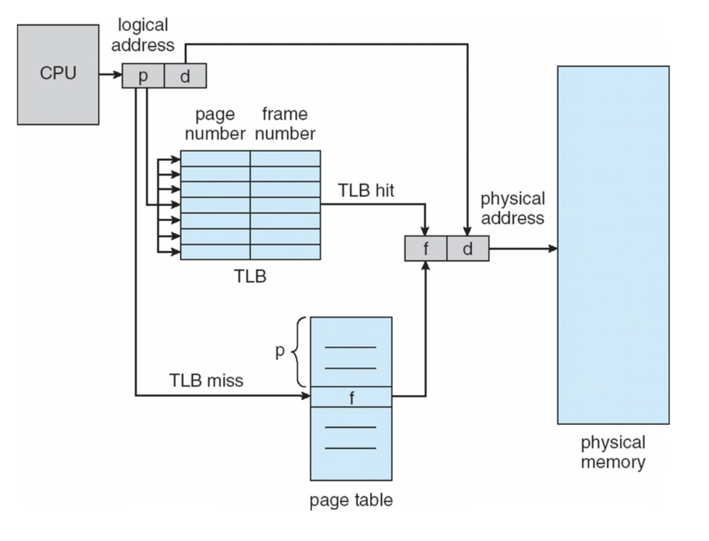

### 운영체제

<details>
<summary>
운영체제란 무엇인가?
</summary>
<div>

운영체제는 컴퓨터 시스템의 자원을 효율적으로 관리하고 사용자에게 편리하고 효과적인 환경을 제공하는 시스템 소프트웨어입니다. 운영체제는 하드웨어와 사용자 응용 프로그램 사이의 중개자 역할을 하며, 컴퓨터 시스템의 자원을 효율적으로 할당하고 관리합니다.

#### 운영체제 역할
- 자원 관리: 운영체제는 컴퓨터의 하드웨어 자원(프로세서, 메모리, 디스크 공간, 입출력 장치 등)을 효율적으로 분배하고 관리합니다. 여러 프로그램과 사용자가 동시에 컴퓨터를 사용할 수 있도록 합니다.
- 프로세스 관리: 운영체제는 프로세스의 생성, 실행, 중지 등을 관리합니다. 프로세스 스케줄링을 통해 CPU 시간을 각 프로세스에 할당하고, 멀티태스킹 환경에서 여러 프로세스가 공정하게 자원을 사용할 수 있도록 합니다.
- 메모리 관리: 운영체제는 메모리 할당 및 회수를 관리하며, 가상 메모리 시스템을 통해 실제 메모리보다 더 큰 메모리 공간을 제공할 수 있습니다.
- 파일 시스템 관리: 파일과 디렉터리를 조직화하고 관리하는 기능을 제공합니다. 사용자와 응용 프로그램이 데이터를 저장하고 접근할 수 있도록 합니다.
- 입출력 시스템 관리: 키보드, 마우스, 디스플레이, 프린터 등 다양한 입출력 장치와의 통신을 관리합니다.
- 보안 및 접근 제어: 운영체제는 시스템 보안을 유지하기 위해 사용자 인증, 접근 권한 설정 등의 기능을 제공합니다.
</div>
</details>

<details>
<summary>
프로세스와 스레드의 차이는 무엇인가요?
</summary>
<div>

#### 프로세스(Process)
프로세스는 실행 중인 프로그램의 인스턴스입니다. 운영 체제가 메모리에 프로그램을 로드하고 실행할 때, 그 프로그램은 프로세스가 됩니다. 프로세스는 독립된 메모리 영역(코드, 데이터, 힙, 스택 등)을 가지며, 최소 하나의 스레드(메인 스레드)를 포함합니다. 프로세스들은 서로 독립적이기 때문에, 하나의 프로세스가 다른 프로세스의 자원에 직접 접근하는 것은 허용되지 않습니다. 이는 운영 체제가 제공하는 프로세스 간 통신(IPC) 기법을 사용하여 간접적으로만 가능합니다.

##### IPC란?
독립적인 프로세스들이 서로 데이터를 주고받거나 통신할 수 있도록 하는 메커니즘입니다. 파이프, 네임드 파이프, 메시지 큐, 세마포어, 공유 메모리, 소켓 방법이 존재합니다.

#### 스레드(Thread)
스레드는 프로세스 내에서 실행되는 실행의 단위입니다. 스레드는 프로세스의 자원을 공유하면서 동시에 실행될 수 있습니다. 각 스레드는 고유한 실행 흐름을 가지며, 자신만의 스택을 포함하지만, 코드, 데이터, 힙 영역은 프로세스 내의 다른 스레드와 공유합니다. 이러한 특성 때문에 스레드 간의 데이터 공유와 통신이 용이하지만, 동시성 문제를 일으킬 수 있습니다.

##### 차이점
- 메모리 공간: 프로세스는 독립된 메모리 영역을 가지는 반면, 스레드는 같은 프로세스 내에서 메모리(코드, 데이터, 힙)를 공유하고 고유한 스택만 가집니다.
- 자원의 독립성: 프로세스는 완전히 독립된 자원을 가지지만, 스레드는 일부 자원(힙 메모리 등)을 공유합니다.
- 생성과 관리의 비용: 일반적으로 프로세스를 생성하고 관리하는 비용이 스레드를 생성하고 관리하는 비용보다 더 큽니다.
- 통신 방법: 프로세스 간 통신(IPC)은 복잡하고 비용이 많이 드는 반면, 스레드 간 통신은 자원을 공유하기 때문에 더 간단하고 효율적입니다.
- 독립성: 프로세스는 완전히 독립적인 실행 단위로, 하나의 프로세스가 실패해도 다른 프로세스에 영향을 미치지 않습니다. 반면, 스레드는 프로세스 내에서 상대적으로 독립적이지만, 하나의 스레드에 문제가 생기면 같은 프로세스 내의 다른 스레드에 영향을 줄 수 있습니다.
</div>
</details>

<details>
<summary>
멀티 스레드와 멀티 프로세스의 차이는 무엇인가요?
</summary>
<div>

#### 멀티 프로세스
멀티 프로세스는 동시에 여러 프로세스를 실행하여 작업을 처리하는 방식입니다. 각 프로세스는 독립된 메모리 공간(코드, 데이터, 힙, 스택 등)을 가지며, 다른 프로세스와의 데이터 공유는 IPC(Inter-Process Communication)를 통해 이루어집니다. 멀티 프로세스 방식은 각 프로세스가 독립적으로 실행되기 때문에 안정성이 높고, 하나의 프로세스에 문제가 발생해도 다른 프로세스에는 영향을 주지 않습니다. 하지만, 프로세스 간의 커뮤니케이션 비용이 높고, 리소스(자원)의 소모가 크다는 단점이 있습니다.

#### 멀티 스레드
멀티 스레드는 하나의 프로세스 내에서 여러 스레드를 생성하여 동시에 작업을 처리하는 방식입니다. 스레드들은 프로세스 내의 코드, 데이터, 힙 영역을 공유하면서 각자의 스택을 가지고 독립적으로 실행됩니다. 멀티 스레드 방식은 스레드 간의 데이터 공유가 쉽고, 컨텍스트 스위칭(Context Switching) 비용이 낮아 리소스를 효율적으로 사용할 수 있다는 장점이 있습니다. 그러나, 스레드 간의 자원 공유로 인해 동기화 문제가 발생할 수 있으며, 하나의 스레드에 문제가 발생하면 전체 프로세스에 영향을 줄 수 있습니다.
</div>
</details>

<details>
<summary>
멀티 프로세스로 처리 가능한 걸 굳이 멀티 스레드로 하는 이유는?
</summary>
<div>

- 자원 공유: 멀티 스레드는 동일한 프로세스 내에서 메모리 공간(코드, 데이터, 힙)을 공유합니다. 이로 인해 스레드 간의 데이터 공유가 매우 효율적으로 이루어집니다. 반면, 멀티 프로세스는 각 프로세스가 독립된 메모리 공간을 가지므로, 프로세스 간 통신(IPC)을 위해 추가적인 오버헤드가 발생합니다.
- 오버헤드 감소: 멀티 스레드는 프로세스를 생성하고 관리하는 것보다 적은 오버헤드를 가집니다. 스레드 생성은 프로세스 생성보다 자원을 적게 소모하며, 컨텍스트 스위칭 시에도 더 효율적입니다. 이는 특히 자원이 제한된 시스템에서 중요한 이점입니다.
- 병렬 처리 효율성: 멀티 스레드는 CPU 코어를 효율적으로 활용하여 병렬 처리를 수행할 수 있습니다. 멀티 스레드 환경에서는 한 스레드가 블로킹 작업(예: I/O 작업)을 수행할 때, 다른 스레드가 CPU를 사용하여 계속 작업을 수행할 수 있습니다.
- 개발 및 유지보수 용이: 멀티 스레드는 프로세스 내에서 실행되므로, 프로세스 간 통신(IPC)이 필요하지 않으며 공유 메모리를 통한 데이터 공유가 직관적이며, 프로세스 간 통신보다 간단합니다.

그러나 멀티 스레드 환경은 스레드 간의 동기화 문제, 공유 자원에 대한 경쟁 상황(race condition) 등의 복잡성을 증가시키며, 하나의 스레드에서 발생한 오류가 전체 프로세스에 영향을 줄 수 있다는 단점도 있습니다.
</div>
</details>

<details>
<summary>
동기와 비동기의 차이 ?
</summary>
<div>

동기 방식은 작업 처리의 간결성과 예측 가능성을 제공하지만, 긴 작업 실행 시 시스템의 전반적인 반응성이 떨어질 수 있습니다. 반면, 비동기 방식은 동시에 여러 작업을 처리할 수 있어 효율적이지만, 작업 사이의 의존성 관리와 복잡한 구현이 요구됩니다. 따라서, 애플리케이션의 요구 사항과 특성에 따라 적절한 방식을 선택해야 합니다.

#### 동기(Synchronous)
- 동기 방식에서는 한 작업이 완료될 때까지 기다린 후 다음 작업을 실행합니다. 즉, 작업을 순차적으로 처리합니다.
##### 특징
- 작업의 완료를 기다리기 때문에 프로그램의 실행 흐름이 예측 가능합니다.
- 하나의 작업이 다른 작업의 시작을 차단(block)합니다.
- 구현이 비교적 단순하지만, 긴 작업이 있을 경우 전체 시스템의 효율성이 떨어질 수 있습니다.
#### 비동기(Asynchronous)
- 비동기 방식에서는 한 작업을 시작한 후, 그 작업이 끝나기를 기다리지 않고 즉시 다음 작업을 실행합니다. 작업의 완료 여부와 상관없이 다른 작업을 병행 처리할 수 있습니다.
##### 특징
- 작업의 완료를 기다리지 않기 때문에, 여러 작업을 동시에 처리할 수 있어 효율성이 높습니다.
- 작업 사이의 의존성 관리가 필요하며, 구현이 복잡할 수 있습니다.
- 이벤트 루프, 콜백 함수, 프로미스(Promise), async/await 등을 통해 구현됩니다.

</div>
</details>

<details>
<summary>
멀티 쓰레드 환경에서의 주의 사항 ?
</summary>
<div>

멀티 쓰레드 환경에서는 여러 쓰레드가 동시에 실행되므로, 자원 공유와 동시성 제어에 특별한 주의가 필요합니다.

- 공유 자원의 동시 접근 제어: 멀티 쓰레드 환경에서 여러 쓰레드가 공유 자원에 동시에 접근할 때, 데이터의 일관성과 무결성을 유지하기 위해 동기화 기법이 필요합니다. mutex나 semaphore 같은 동기화 메커니즘을 사용하여 자원 접근을 제어해야 합니다.
- 데드락(Deadlock) 방지: 두 개 이상의 쓰레드가 서로 다른 쓰레드의 작업 완료를 무한히 기다리는 상황을 데드락이라고 합니다. 데드락을 방지하기 위해서는 자원 할당 순서를 일관되게 유지하고, 필요하지 않은 자원은 빠르게 해제하며, 필요한 최소한의 자원만을 잠그도록 해야 합니다.
- 스레드 기아(Starvation): 일부 쓰레드가 자원에 접근하지 못하고 무한히 대기하는 상황입니다. 이를 방지하기 위해서는 공정한 자원 분배 정책을 사용하고, 우선순위 부여에 주의해야 합니다.
- 컨텍스트 스위칭(Context Switching) 비용 인식: 쓰레드는 경량 프로세스로 비교적 컨텍스트 스위칭 비용이 낮지만, 쓰레드의 수가 많아지면 이 비용이 상당히 증가할 수 있습니다. 쓰레드를 너무 많이 생성하지 않도록 주의하고, 쓰레드 풀을 사용하는 등의 방법으로 최적화할 수 있습니다.
- 메모리 관리 주의: 멀티 쓰레드 환경에서는 동적으로 할당된 메모리를 공유 자원으로 사용할 때 해제 시점을 정확히 관리해야 합니다. 잘못된 메모리 해제는 메모리 누수나 무효 메모리 접근을 초래할 수 있습니다.
- 레이스 컨디션(Race Condition) 방지: 레이스 컨디션은 여러 쓰레드가 데이터를 동시에 읽고 쓰려고 할 때 발생하는 문제로, 결과의 정확성을 보장할 수 없습니다. 변수 접근 시 동기화를 통해 이를 방지해야 합니다.
</div>
</details>

<details>
<summary>
교착상태(DeadLock)가 무엇이며, 4가지 조건은?
</summary>
<div>

교착상태(Deadlock)는 멀티태스킹 시스템에서 두 개 이상의 프로세스나 스레드가 서로의 실행을 무한히 기다리는 상태를 말합니다. 이 상태에 이르면, 각 프로세스는 다른 프로세스가 자원을 해제하기를 기다리고 있기 때문에 시스템이 멈춰버리게 됩니다.
##### 데드락 조건
- 상호 배제(Mutual Exclusion): 한 번에 하나의 프로세스만이 자원을 사용할 수 있습니다. 다른 프로세스는 그 자원이 해제될 때까지 기다려야 합니다.
- 보유 대기(Hold and Wait): 프로세스가 어떤 자원을 보유한 상태에서 다른 자원을 기다립니다.
- 비선점(No Preemption): 프로세스가 자원을 스스로 해제하기 전까지는 다른 프로세스가 그 자원을 강제로 빼앗을 수 없습니다.
- 순환 대기(Circular Wait): 각 프로세스가 순환적으로 다음 프로세스가 요구하는 자원을 보유하고 있어, 서로가 서로의 자원을 기다리는 상태가 됩니다.

##### 데드락 해결법
- prevention: 4가지중 하나를 부정
- avoidance: safe state(데드락이 발생하지 않는 상태 즉, 자원이 충분한 상태), safe sequence(데드락이 발생하지 않은 순서) ex)은행원 알고리즘 - 미리 결정된 모든 자원들의 최대 가능한 할당량을 가지고 시뮬레이션 해서 Safe state에 들 수 있는지 여부를 검사
- detection and recovery: 시스템의 자원 할당 상태를 가지고 데드락 발생 여부 판단, 프로세스 1개 이상 중단 or 자원 선점

https://chanhuiseok.github.io/posts/cs-2/
</div>
</details>

<details>
<summary>
가상 메모리란?
</summary>
<div>

가상 메모리는 컴퓨터 시스템에서 사용되는 메모리 관리 기술입니다. 이 기술은 프로그램이 사용할 수 있는 메모리 양을 물리적 메모리(주로 RAM)의 크기에 제한되지 않게 하여, 더 큰 메모리 공간을 제공하는 것처럼 만듭니다. 가상 메모리는 물리적 메모리와 보조 저장 장치(예: 하드 드라이브 또는 SSD)를 함께 사용하여 구현됩니다.

##### 주요 개념 및 작동 원리

- 가상 주소 공간: 각 프로세스는 독립된 가상 주소 공간을 갖습니다. 이 공간은 실제 물리적 메모리 주소와는 별개로, 프로세스에 의해 참조되는 메모리 주소입니다.
- 페이지: 가상 메모리는 페이지라는 작은 고정 크기의 블록으로 나뉩니다. 물리적 메모리도 같은 크기의 페이지 프레임으로 나누어집니다.
- 페이지 매핑: 운영 체제는 페이지 테이블을 사용하여 가상 페이지와 물리적 페이지 프레임 간의 매핑을 관리합니다. 이를 통해 프로세스가 가상 주소를 사용해 메모리에 접근할 때, 실제 물리적 주소로 변환될 수 있습니다.
- 스와핑: 사용되지 않는 페이지는 보조 저장 장치로 옮겨지는데, 이 과정을 스와핑이라고 합니다. 필요할 때 다시 물리적 메모리로 가져올 수 있습니다. 이를 통해 제한된 물리적 메모리를 보다 효율적으로 사용할 수 있습니다.
- 페이지 폴트: 프로그램이 접근하려는 페이지가 물리적 메모리에 없을 경우, 페이지 폴트가 발생합니다. 운영 체제는 해당 페이지를 보조 저장 장치에서 찾아 물리적 메모리로 로드합니다.

</div>
</details>

<details>
<summary>
외부 단편화와 내부 단편화란?
</summary>
<div>

#### 외부 단편화(External Fragmentation)
- 외부 단편화는 메모리 공간에 충분한 여유 공간이 있지만, 그 공간이 연속적이지 않아 프로세스를 할당할 수 없는 상황을 말합니다.
- 예를 들어, 메모리에 10MB, 5MB, 3MB의 빈 공간이 있다고 가정해 봅시다. 이 경우 총 18MB의 여유 공간이 있지만, 프로세스가 필요로 하는 8MB의 메모리를 할당할 수 없습니다. 이처럼 메모리 공간이 연속적이지 않아 발생하는 문제가 외부 단편화입니다.

#### 내부 단편화(Internal Fragmentation)
- 내부 단편화는 프로세스가 필요로 하는 메모리 크기보다 실제 할당된 메모리 크기가 더 큰 경우에 발생합니다. 이로 인해 할당된 메모리 공간 중 일부가 사용되지 않고 남게 되는 현상입니다.

- 예를 들어, 프로세스가 4MB의 메모리를 필요로 하지만, 운영체제가 8MB의 메모리 블록을 할당했다고 가정해 봅시다. 이 경우 4MB의 메모리가 사용되지 않고 남게 되는데, 이것이 내부 단편화입니다.

##### 단편화 해결 방법
- 압축(Compaction): 외부 단편화를 해결하기 위해 메모리 내의 빈 공간을 모아 하나의 큰 공간을 만드는 기법입니다.
- 동적 할당(Dynamic Allocation): 프로세스의 메모리 요구량에 따라 동적으로 메모리를 할당하여 내부 단편화를 줄일 수 있습니다.
- 페이징(Paging): 프로세스를 페이지 단위로 나누어 관리함으로써 단편화를 방지할 수 있습니다.
- 세그먼테이션(Segmentation): 프로세스를 논리적 단위인 세그먼트로 나누어 관리함으로써 단편화를 줄일 수 있습니다.

##### Appendix 가상 메모리와 단편화
가상 메모리 기술은 단편화 문제를 해결하는 데 도움이 됩니다. 가상 메모리는 물리 메모리와 논리 메모리를 분리하여 관리함으로써, 프로세스가 실제 물리 메모리 크기를 초과하여 실행될 수 있도록 합니다. 이를 통해 단편화로 인한 메모리 할당 문제를 해결할 수 있습니다.

또한 가상 메모리 시스템에서는 MMU(Memory Management Unit)가 논리 주소를 물리 주소로 변환하는 역할을 수행합니다. 이를 통해 프로세스는 실제 물리 메모리 구조를 인식하지 않고도 메모리를 사용할 수 있습니다.
</div>
</details>

<details>
<summary>
페이징과 세그먼테이션이란?
</summary>
<div>

#### 페이징 (Paging)
페이징은 물리적 메모리를 고정된 크기의 작은 블록으로 나누는 방식입니다. 이러한 블록들을 페이지(논리적 메모리에서는 페이지로 나누고 물리적 메모리는 프레임으로 나눠서 매칭)라고 하며, 물리적 메모리의 페이지와 동일한 크기의 가상 메모리 페이지로 프로세스의 주소 공간을 분할합니다. 페이징에서는 가상 메모리 주소가 물리적 메모리 주소로 변환될 때 페이지 테이블을 사용하여 변환합니다. 페이징 기법의 주요 장점은 내부 단편화를 줄일 수 있다는 점과 메모리 관리가 단순해진다는 점입니다. 하지만 모든 페이지가 동일한 크기이기 때문에, 프로세스의 메모리 요구 사항에 딱 맞지 않는 경우가 생길 수 있으며, 이로 인해 약간의 내부 단편화가 발생할 수 있습니다.


#### 세그먼테이션 (Segmentation)
세그먼테이션은 프로세스의 주소 공간을 논리적으로 의미 있는 여러 세그먼트로 분할하는 방식입니다. 예를 들어, 코드, 데이터, 스택 등으로 분리할 수 있습니다. 각 세그먼트는 시작 주소와 길이를 가지며, 이를 통해 메모리에 할당됩니다. 세그먼테이션의 주요 장점은 메모리를 더 유연하게 관리할 수 있다는 것입니다. 프로그램의 논리적 구조에 따라 메모리를 할당할 수 있기 때문에, 개발자가 메모리를 효율적으로 사용할 수 있도록 도와줍니다. 하지만, 세그먼테이션은 외부 단편화 문제를 야기할 수 있으며, 세그먼트의 크기가 다양하기 때문에 메모리 관리가 복잡해질 수 있습니다.

##### 요약
페이징은 메모리를 고정된 크기의 페이지로 나누고, 내부 단편화를 줄이며 메모리 관리를 단순화합니다.
세그먼테이션은 메모리를 논리적 단위인 세그먼트로 나누어 더 유연한 메모리 관리를 가능하게 하지만, 외부 단편화와 복잡한 메모리 관리 문제를 가질 수 있습니다.
</div>
</details>

<details>
<summary>
비선점형(Non-preemptive) 스케줄링
</summary>
<div>

비선점형(Non-preemptive) 스케줄링은 컴퓨터 운영체제의 중요한 작업 스케줄링 방식 중 하나입니다. 이 방식에서는 한 번 CPU(중앙 처리 장치)가 작업(프로세스 또는 스레드)에 할당되면, 해당 작업이 완료되거나, I/O(입출력) 작업 등으로 대기 상태가 될 때까지 CPU를 계속 사용하게 됩니다. 즉, 작업이 실행 중일 때 다른 작업으로 CPU를 강제로 빼앗는 것이 허용되지 않습니다.

##### 특징
- 프로세스가 CPU 사용을 완료하거나 I/O 작업을 요청할 때까지 CPU 제어권을 가짐
- 프로세스 간 우선순위 고려 없이 FIFO(First-In-First-Out) 방식으로 CPU 할당
- 프로세스 전환 시 문맥 교환(Context Switching) 오버헤드가 낮음
##### 장점
- 프로세스 간 공정성 보장
- 응답 시간 예측 가능
- 문맥 교환 오버헤드 감소
##### 단점
- 높은 우선순위 프로세스가 대기해야 하는 상황 발생 가능
- 실시간 시스템에 적합하지 않음
- 프로세스 간 우선순위 고려 불가
</div>
</details>

<details>
<summary>
선점형(preemptive) 스케줄링
</summary>
<div>

선점형 스케줄링은 프로세스가 CPU를 사용하는 도중에도 운영체제가 CPU 제어권을 강제로 회수할 수 있는 방식입니다. 즉, 프로세스가 CPU를 점유하고 있더라도 운영체제가 필요에 따라 CPU 제어권을 회수할 수 있습니다.

##### 특징
- 프로세스 간 우선순위에 따라 CPU 제어권 강제 회수 가능
- 문맥 교환(Context Switching) 오버헤드가 비선점형 스케줄링보다 높음
- 실시간 시스템에 적합한 스케줄링 방식
##### 장점
- 높은 우선순위 프로세스에 CPU 자원 신속 할당 가능
- 실시간 시스템에 적합
##### 단점
- 문맥 교환 오버헤드 증가
- 프로세스 간 공정성 보장이 어려움

##### 선점형 스케줄링 알고리즘
- 라운드 로빈(Round Robin, RR) 스케줄링:
  - 각 프로세스에 동일한 시간 할당(Time Slice)
  - 시간 할당이 끝나면 강제로 CPU 제어권 회수
  - 공정성이 높지만 응답 시간이 길어질 수 있음
- 최단 잔여 시간 우선(Shortest Remaining Time, SRT) 스케줄링:
  - 남은 실행 시간이 가장 짧은 프로세스에 CPU 할당
  - 새로운 프로세스가 도착하면 현재 실행 중인 프로세스를 선점할 수 있음
  - 평균 대기 시간이 짧지만 실행 시간이 긴 프로세스에 불리할 수 있음
- 다단계 피드백 큐(Multilevel Feedback Queue, MFQ) 스케줄링:
  - 여러 개의 준비 큐를 사용하여 우선순위를 관리(같은 우선순위 안에서는 라운드 로빈)
  - 프로세스가 CPU를 오래 사용하면 우선순위가 낮아짐
  - 대화형 프로세스와 배치 프로세스를 구분하여 효율적으로 관리
</div>
</details>

<details>
<summary>
인터럽트란 무엇인가요?
</summary>
<div>

인터럽트는 컴퓨터 시스템에서 중요한 개념으로, 현재 진행 중인 작업을 일시 중단시키고, 긴급하게 처리해야 할 작업(인터럽트 요청에 의해 발생한 작업)을 먼저 처리한 후, 원래의 작업으로 돌아가게 하는 메커니즘입니다. 인터럽트는 컴퓨터 하드웨어나 소프트웨어에 의해 발생할 수 있으며, 시스템의 효율성과 반응성을 향상시키는 데 중요한 역할을 합니다.

##### 인터럽트의 종류
- 하드웨어 인터럽트: 외부 장치(키보드, 마우스, 네트워크 카드 등)로부터 발생하는 인터럽트입니다. 예를 들어, 사용자가 키보드를 누를 때마다 하드웨어 인터럽트가 발생하여 CPU에 입력 처리를 요청합니다.
- 소프트웨어 인터럽트: 운영 체제나 실행 중인 프로그램 내부에서 발생하는 인터럽트입니다. 예를 들어, 시스템 호출이나 예외 처리 과정에서 발생할 수 있습니다.
##### 인터럽트 처리 과정
- 인터럽트 발생: 시스템 내부 또는 외부에서 인터럽트 신호가 발생합니다.
- 현재 작업 중단: CPU는 현재 처리 중인 작업을 일시 중단하고, 작업의 현재 상태를 저장합니다.
- 인터럽트 처리 루틴 실행: 인터럽트 벡터를 사용하여 해당 인터럽트를 처리할 루틴(함수, ISR)을 찾아 실행합니다.
- 원래 작업 복귀: 인터럽트 처리가 완료되면, 중단되었던 원래의 작업 상태를 복원하고 작업을 재개합니다.
##### 인터럽트의 중요성
- 멀티태스킹 지원: 인터럽트를 통해 여러 작업을 효율적으로 동시에 처리할 수 있습니다.
- 시스템 반응성 향상: 긴급한 작업이 발생했을 때 즉각적으로 대응할 수 있어 사용자 경험을 향상시킵니다.
- 자원 효율적 사용: 인터럽트를 이용하여 CPU와 다른 자원들을 보다 효율적으로 사용할 수 있습니다
</div>
</details>

<details>
<summary>
운영체제한테 CPU가 넘어가는 경우는 언제인가?
</summary>
<div>

1. 인터럽트(Interrupt) 발생 시: 하드웨어나 소프트웨어에서 발생한 인터럽트 신호를 처리하기 위해 운영체제가 CPU 제어권을 넘겨받습니다. 예를 들어, 입출력 장치로부터의 요청, 타이머 인터럽트, 네트워크 카드로부터의 신호 등이 이에 해당합니다.

2. 시스템 콜(System Call) 실행 시: 사용자 프로그램이 운영체제의 서비스를 요청하기 위해 시스템 콜을 실행하면, 해당 서비스를 처리하기 위해 운영체제가 CPU 제어권을 넘겨받습니다. 파일 열기, 읽기, 쓰기, 네트워크 통신 등의 작업이 시스템 콜을 통해 수행됩니다.

3. 프로세스 스케줄링: 운영체제는 프로세스 간 CPU 사용 시간을 공정하게 분배하기 위해 스케줄링을 수행합니다. 현재 실행 중인 프로세스의 시간 할당량(타임 슬라이스)이 끝나거나 우선 순위가 더 높은 프로세스가 준비 상태가 되면, 운영체제는 스케줄러를 통해 CPU 제어권을 넘겨받아 새로운 프로세스로 전환합니다.

4. 예외 상황(Exception) 발생 시: 소프트웨어 오류나 금지된 작업(예: 0으로 나누기, 잘못된 메모리 접근)이 발생했을 때, 운영체제는 예외 처리 루틴을 실행하기 위해 CPU 제어권을 넘겨받습니다.
</div>
</details>

<details>
<summary>
인터럽트 처리중에 또다른 인터럽트가 발생하는 경우는 어떻게 되는가?
</summary>
<div>

인터럽트 처리 중에 또 다른 인터럽트가 발생하는 경우, 시스템은 인터럽트의 우선 순위에 따라 처리 방식을 결정합니다. 이를 인터럽트 중첩(Interrupt Nesting)이라고 하며, 인터럽트 처리의 효율성과 반응성을 높이기 위해 사용됩니다. 처리 방식은 대체로 다음과 같습니다:

- 우선 순위가 낮은 인터럽트 처리 중에 우선 순위가 높은 인터럽트가 발생하는 경우: 시스템은 현재 처리 중인 인터럽트를 일시 중단하고, 더 높은 우선 순위의 인터럽트를 먼저 처리합니다. 이 과정을 통해 중요한 작업을 더 신속하게 처리할 수 있습니다.

- 우선 순위가 같은 인터럽트가 발생하는 경우: 대부분의 시스템에서는 같은 우선 순위의 인터럽트가 동시에 발생하면, 일반적으로 현재 처리 중인 인터럽트를 먼저 완료하고, 그 다음에 대기 중인 인터럽트를 처리합니다.

- 우선 순위가 높은 인터럽트 처리 중에 우선 순위가 낮은 인터럽트가 발생하는 경우: 우선 순위가 낮은 인터럽트는 현재 처리 중인 높은 우선 순위의 인터럽트 처리가 완료될 때까지 대기하게 됩니다.

- 여러 장치에서 인터럽트가 동시에 발생하거나 인터럽트 서비스 루틴 수행 중 인터럽트가 발생한 경우 우선순위 판별 필요
  1. 전원 이상(Power fail)
  2. 기계 착오(Machine Check)
  3. 외부 신호(External)
  4. 입출력(I/O)
  5. 명령어 잘못
  6. 프로그램 검사(Program Check)
  7. SVC(SuperVisor Call)
일반적으로 하드웨어 인터럽트가 소프트웨어 인터럽트보다 우선 순위가 높고, 일반적으로 내부 인터럽트 보다 외부 인터럽트가 우선 순위가 높다.

</div>
</details>

<details>
<summary>
PCB란 무엇인가요?
</summary>
<div>

#### PCB(Process Control Block)
- PCB는 운영 체제 커널의 데이터 구조로, 특정 프로세스를 관리하는 데 필요한 정보를 포함하고 있습니다.
- PCB에는 프로세스 식별자, 프로세스 상태, 프로그램 카운터, CPU 레지스터, CPU 스케줄링 정보, 메모리 관리 정보, 계정 정보, 입출력 상태 정보 등이 포함됩니다.
- PCB는 운영 체제에 의해 보호된 메모리 영역에 위치하며, 일부 운영 체제에서는 커널 스택의 처음에 위치합니다.
##### PCB의 역할과 중요성
- PCB는 운영 체제가 프로세스를 효과적으로 관리하고 제어하는 데 필수적인 역할을 합니다.
- 프로세스 생성 시 PCB가 만들어지며, 프로세스의 상태 정보를 저장하고 관리합니다.
- 프로세스 간 전환(context switching) 시 현재 프로세스의 정보를 PCB에 저장하고, 새로운 프로세스의 정보를 PCB에서 읽어 CPU 레지스터에 로드합니다.
##### PCB의 구성 요소
- 프로세스 식별자(PID): 프로세스를 고유하게 식별하는 번호
- 프로세스 상태: 실행 중, 대기 중, 준비 중 등 프로세스의 현재 상태
- 프로그램 카운터: 다음에 실행할 명령어의 주소
- CPU 레지스터: 프로세스 실행에 필요한 CPU 레지스터 값
- CPU 스케줄링 정보: 프로세스 우선순위, 실행 시간 등 스케줄링 관련 정보
- 메모리 관리 정보: 프로세스가 사용하는 메모리 영역 정보
- 계정 정보: 프로세스 실행 시간, 자원 사용량 등 계정 정보
- 입출력 상태 정보: 프로세스의 입출력 작업 상태
##### PCB와 Context Switching
Context Switching은 현재 프로세스의 PCB 정보를 저장하고, 새로운 프로세스의 PCB 정보를 로드하는 과정입니다.
인터럽트 처리나 새로운 프로세스 할당 등의 요청이 있을 때 Context Switching이 발생합니다.
Context Switching은 프로세스 간 전환을 원활하게 하여 운영 체제의 효율적인 프로세스 관리를 가능하게 합니다.

</div>
</details>

<details>
<summary>
PCB는 왜 필요한가요?
</summary>
<div>

- 프로세스 관리: PCB에는 프로세스의 상태 정보와 실행에 필요한 다양한 정보가 포함되어 있습니다. 이를 통해 운영 체제는 프로세스를 생성, 중지, 일시 중지, 재개 등의 작업을 수행할 수 있습니다.
- 프로세스 간 전환(Context Switching): PCB는 Context Switching 과정에서 사용됩니다. 현재 프로세스의 정보를 PCB에 저장하고, 새로운 프로세스의 정보를 PCB에서 읽어 CPU 레지스터에 로드합니다. 이를 통해 여러 프로세스 간의 공정한 시간 분배와 운영 체제의 효율적인 관리가 가능해집니다.
- 자원 할당 및 관리: PCB에는 프로세스가 사용하는 메모리 영역 정보, 계정 정보, 입출력 상태 정보 등이 포함되어 있습니다. 이를 통해 운영 체제는 자원을 효율적으로 할당하고 관리할 수 있습니다.
- 프로세스 식별: PCB에는 프로세스를 고유하게 식별하는 번호(PID)가 포함되어 있습니다. 이를 통해 운영 체제는 각 프로세스를 식별하고 구분할 수 있습니다.
</div>
</details>

<details>
<summary>
Context Swiching이란 무엇인가요?
</summary>
<div>

컨텍스트 스위칭(Context Switching)은 운영 체제가 CPU를 사용하는 한 프로세스에서 다른 프로세스로 전환하는 과정을 말합니다. 이 과정은 멀티태스킹 환경에서 여러 프로세스나 스레드가 CPU 시간을 공유할 수 있게 해 주며, 시스템의 효율성과 반응성을 높이는 데 중요한 역할을 합니다.

##### 컨텍스트 스위칭 과정
- 현재 실행 중인 프로세스의 상태 저장: 운영 체제는 현재 CPU를 사용하고 있는 프로세스의 상태(레지스터 값, 프로그램 카운터, 스택 포인터 등)를 해당 프로세스의 PCB(Process Control Block)에 저장합니다. 이를 통해 프로세스가 나중에 다시 실행될 때 이전에 중단된 지점부터 정확히 실행을 재개할 수 있습니다.
- 다음 실행할 프로세스의 상태 복원: 운영 체제는 다음에 실행할 프로세스의 PCB에서 저장된 상태를 읽어들여 CPU의 레지스터와 다른 제어 레지스터에 복원합니다. 이로써 새로운 프로세스가 실행될 준비가 완료됩니다.
- 실행 전환: CPU는 이제 새로운 프로세스의 실행을 시작합니다.

컨텍스트 스위칭은 필수적인 작업이지만, 자원을 소모하는 작업입니다. 컨텍스트를 저장하고 복원하는 과정에서 시간이 소요되며, 이로 인해 CPU의 유휴 시간이 발생할 수 있습니다. 따라서 운영 체제는 컨텍스트 스위칭을 효율적으로 관리하여 시스템의 전반적인 성능을 최적화하려고 노력합니다.
</div>
</details>

<details>
<summary>
사용자 수준 스레드 vs 커널 수준 스레드 차이는?
</summary>
<div>

#### 사용자 수준 스레드(User-Level Threads, ULT)
- 관리: 사용자 수준의 스레드 라이브러리에 의해 관리됩니다. 커널은 이러한 스레드의 존재를 알지 못합니다.
- 성능: 커널 개입 없이 스레드를 생성하고 관리할 수 있으므로, 컨텍스트 스위칭이 빠르고 효율적입니다.
- 자원 할당: 프로세스 단위로 자원을 할당받으며, 하나의 스레드가 블록되면 다른 스레드에 영향을 줄 수 있습니다.
- 구현과 이식성: 특정 운영 체제에 의존하지 않으므로 다양한 시스템에 쉽게 이식할 수 있습니다.
#### 커널 수준 스레드(Kernel-Level Threads, KLT)
- 관리: 운영 체제의 커널에 의해 직접 관리됩니다. 커널은 각 스레드를 개별적으로 인식하고 스케줄링합니다.
- 성능: 스레드 관리를 위해 커널 모드로의 전환을 필요로 하므로, 사용자 수준 스레드에 비해 컨텍스트 스위칭이 느릴 수 있습니다.
- 자원 할당: 각 스레드는 독립적으로 자원을 할당받으며, 하나의 스레드가 블록되더라도 다른 스레드는 영향을 받지 않습니다.
- 구현과 이식성: 운영 체제의 지원을 필요로 하므로, 특정 시스템에 종속적일 수 있습니다.
</div>
</details>

<details>
<summary>
뮤텍스, 세마포어가 뭔지, 차이점은?
</summary>
<div>

#### 뮤텍스(Mutex)
- 뮤텍스는 상호 배제(Mutual Exclusion)를 위한 동기화 기법입니다.
- 공유 자원에 대한 접근을 한 번에 하나의 스레드/프로세스만 허용하여, 데이터 불일치 문제를 방지합니다.
- 뮤텍스는 임계 영역(Critical Section)에 대한 접근을 제어하는 역할을 합니다.
- 뮤텍스는 잠금(Lock)과 해제(Unlock) 함수를 통해 구현됩니다.
#### 세마포어(Semaphore)
- 세마포어는 공유 자원에 대한 접근을 제어하는 동기화 기법입니다.
- 세마포어는 정수 값을 사용하여 자원의 가용성을 나타냅니다.
- 세마포어는 자원을 요청하는 스레드/프로세스에게 자원을 할당하거나 대기열에 넣는 역할을 합니다.
- 세마포어는 wait()와 signal() 함수를 통해 구현됩니다.

##### 차이점
- 접근 제어 방식
  - 뮤텍스는 한 번에 하나의 스레드/프로세스만 접근할 수 있도록 제한합니다.
  - 세마포어는 정수 값을 사용하여 여러 스레드/프로세스가 동시에 접근할 수 있도록 합니다.
- 구현 방식
  - 뮤텍스는 잠금(Lock)과 해제(Unlock) 함수를 사용하여 구현됩니다.
  - 세마포어는 wait()와 signal() 함수를 사용하여 구현됩니다.
- 용도
  - 뮤텍스는 공유 자원에 대한 상호 배제를 위해 사용됩니다.
  - 세마포어는 공유 자원에 대한 동기화를 위해 사용됩니다.
</div>
</details>

<details>
<summary>
프로세스의 스택, 데이터, 코드, 힙에 대해 설명해주세요.
</summary>
<div>

1. 코드(Code) 영역
- 사용자가 작성한 프로그램 코드가 저장되는 영역
- CPU가 실행할 수 있는 기계어 명령어 형태로 저장됩니다.
- 읽기 전용(Read-Only)으로 실행 중에는 변경할 수 없습니다.
2. 데이터(Data) 영역
- 전역 변수, static 변수 등 프로그램이 사용하는 데이터가 저장되는 영역
- 초기화된 데이터(Data Segment)와 초기화되지 않은 데이터(BSS Segment)로 구분됩니다.
3. 스택(Stack) 영역
- 함수 호출 시 전달되는 매개변수, 지역 변수, 복귀 주소 등이 저장되는 영역
- 후입선출(LIFO) 구조를 가지며, 함수 호출/반환 시 동적으로 메모리가 할당/해제됩니다.
4. 힙(Heap) 영역
- 동적으로 메모리를 할당/해제하는 데 사용되는 영역
- 프로그래밍 언어의 동적 메모리 할당 기능(malloc, new 등)에 의해 사용됩니다.

##### 메모리 영역의 특징
- 코드 영역과 데이터 영역은 프로그램 실행 중 변경될 수 없는 정적 영역입니다.
- 스택과 힙은 동적으로 메모리가 할당/해제되는 영역입니다.
- 스택은 함수 호출 시 빠르게 메모리를 할당/해제할 수 있지만, 크기가 제한적입니다.
- 힙은 동적 메모리 할당이 가능하지만, 스택보다 느리고 메모리 관리가 복잡합니다.
</div>
</details>

<details>
<summary>
4 CPU 환경에서 4개의 쓰레드가 실행된다고 가정해보자. 어떤 문제가 발생할 수 있겠는가?
</summary>
<div>

- 경쟁 상태(Race Condition): 여러 쓰레드가 동시에 공유 자원에 접근하려고 할 때, 그 접근 순서에 따라 실행 결과가 달라질 수 있습니다. 이러한 상황을 경쟁 상태라고 하며, 데이터가 예기치 않게 변경되거나 손상될 위험이 있습니다.
- 교착 상태(Deadlock): 두 개 이상의 쓰레드가 서로가 보유한 자원의 해제를 무한정 기다리며, 어떤 쓰레드도 진행할 수 없는 상태입니다. 예를 들어, 쓰레드 A가 자원 1을 보유하고 자원 2를 요청하는 동안, 쓰레드 B가 자원 2를 보유하고 자원 1을 요청할 때 교착 상태가 발생할 수 있습니다.
- 메모리 일관성 문제(Memory Consistency Issues): 여러 쓰레드가 공유 메모리를 동시에 수정할 때, 메모리의 일관성을 유지하기 위한 추가적인 메커니즘이 필요합니다. 이러한 메커니즘 없이는 예측 불가능한 결과를 초래할 수 있습니다.
</div>
</details>


### 리눅스

<details>
<summary>
ssh 인증 방식에 대해 설명해주세요
</summary>
<div>

SSH(Secure Shell)는 네트워크를 통해 서버와 클라이언트 간의 보안된 통신을 가능하게 하는 프로토콜입니다. SSH 인증 방식은 크게 세 가지 주요 유형으로 나뉩니다: 비밀번호 기반 인증, 공개키 기반 인증, 그리고 호스트 기반 인증입니다.

- 비밀번호 기반 인증: 가장 기본적인 형태의 인증 방식입니다. 사용자가 SSH 접속을 시도할 때 서버에 저장된 사용자의 비밀번호를 입력하여 인증을 시도합니다. 비밀번호는 네트워크를 통해 암호화된 상태로 전송되므로 안전하게 처리됩니다. 하지만, 비밀번호 자체가 약하거나 외부에 노출되었을 경우 보안에 취약할 수 있습니다.
- 공개키 기반 인증: 더 안전한 인증 방식 중 하나로, 공개키 암호화 기술을 사용합니다. 사용자는 개인키와 공개키라는 두 가지 키를 생성합니다. 공개키는 서버에 저장되고, 개인키는 사용자만이 보유합니다. 인증시, 서버는 사용자에게 공개키와 매칭되는 개인키를 사용하여 요청을 암호화한 메시지를 보냅니다. 사용자는 개인키를 이용해 메시지를 복호화하고, 복호화에 성공한다면 인증이 완료됩니다. 이 방식은 개인키가 외부에 노출되지 않는 한 매우 안전합니다. (이거 좀 공부)
- 호스트 기반 인증: 이 방식은 클라이언트의 호스트 자체의 신뢰를 기반으로 합니다. 클라이언트 호스트의 공개키가 서버에 미리 등록되어 있으며, 서버는 해당 호스트로부터의 접속만을 신뢰하는 방식입니다. 이는 주로 내부 네트워크나 신뢰할 수 있는 시스템 간의 자동화된 프로세스에서 사용됩니다.
SSH 인증 방식의 선택은 네트워크의 보안 요구사항, 사용 편의성, 관리 용이성 등을 고려하여 결정됩니다. 공개키 기반 인증은 보안성이 높아 많이 사용되는 추세이며, 복잡한 네트워크 환경에서는 여러 인증 방식을 혼합하여 사용하기도 합니다.


#### ssh 접속 과정
1. 클라이언트 초기화: 사용자가 SSH 클라이언트 소프트웨어를 사용해 서버에 접속을 시도합니다. 이때, 사용자는 서버의 호스트 이름이나 IP 주소와 접속할 사용자 이름을 지정합니다.

2. 서버와의 암호화된 채널 구성: 클라이언트와 서버 사이에 암호화된 연결(세션)을 설정합니다. 이 과정에서 서버는 자신의 공개 키를 클라이언트에게 전송합니다. 클라이언트는 이 공개 키를 사용하여 서버와의 통신을 암호화합니다.(이때 서버의 공개키는 openssh 서버를 설치했을 때 생성됩니다.)

3. 서버 인증: 클라이언트는 서버로부터 받은 공개 키가 신뢰할 수 있는지 확인합니다. 일반적으로 클라이언트는 이전에 연결했던 서버의 공개 키를 저장해 두었다가(.ssh/known_hosts), 재접속 시 이를 확인합니다. 처음 접속하는 서버의 경우, 사용자에게 공개 키의 지문(fingerprint)을 보여주고, 이를 수락할 것인지 묻습니다.

4. 사용자 인증: 클라이언트가 서버에 접속하기 위해서는 사용자 인증이 필요합니다. 이를 위해 비밀번호, 공개 키 인증, 일회용 비밀번호 등 다양한 방법이 사용될 수 있습니다. 가장 보안성이 높은 방법 중 하나는 공개 키 인증 방식으로, 사용자는 자신의 개인 키를 사용하여 인증 요청을 서명하고, 서버는 해당 사용자의 공개 키를 사용하여 서명을 검증합니다.(이때 ssh-keygen -t rsa와 같은 명령어로 key를 생성하며 수동으로 **~/.ssh/authorized_keys**에 클라이언트의 공개키를 추가하거나 **ssh-copy-id USER@remote-host -i 파일위치** 와 같은 명령어로 클라이언트의 공개키를 전송하는 방법이 있다.)

5. 세션 개시: 사용자 인증이 성공하면, SSH 세션이 시작됩니다. 이 시점부터 클라이언트와 서버 사이의 모든 통신은 암호화되어 안전하게 이루어집니다. 사용자는 원격 셸을 통해 명령을 실행하거나, 파일 전송과 같은 추가적인 SSH 기능을 사용할 수 있습니다.

6. 세션 종료: 사용자가 작업을 마치고 접속을 종료하면, SSH 세션은 안전하게 종료됩니다.

#### Appendix
https://gwonbookcase.tistory.com/56


</div>
</details>

<details>
<summary>
SeLinux가 무엇이고, 장점과 단점에는 무엇이 있는가?
</summary>
<div>

#### SELinux란?
SELinux는 Linux 운영 체제에 내장된 보안 모듈로, 강제 접근 제어(Mandatory Access Control) 기능을 제공합니다. 이를 통해 사용자 권한 남용을 방지하고 시스템 보안을 강화할 수 있습니다.

#### SELinux의 장점
- 강화된 보안: SELinux는 프로세스와 리소스 간의 접근을 엄격하게 제어하여 시스템 보안을 강화합니다.
- 유연성: SELinux는 다양한 보안 정책을 제공하여 사용자의 요구사항에 맞게 유연하게 구성할 수 있습니다.
- 관리 용이성: SELinux는 Red Hat 계열 Linux 배포판에 기본적으로 포함되어 있어 관리가 용이합니다.
#### SELinux의 단점
- 복잡성: SELinux의 구성과 관리가 복잡하여 초기 설정에 시간이 많이 소요될 수 있습니다.
- 호환성 문제: SELinux는 일부 애플리케이션과 호환성 문제가 발생할 수 있습니다.
- 학습 곡선: SELinux를 효과적으로 사용하려면 관리자가 SELinux에 대한 이해와 경험이 필요합니다.

#### SELinux 세 가지 모드

- **Enforcing** : 이 모드에서 SELinux는 정책을 강제 적용하고, 정책에 위반되는 액세스를 차단합니다. 이 모드가 시스템의 보안을 최대한 강화하는 기본 모드입니다.
- **Permissive** : 이 모드에서 SELinux는 정책 위반을 감지하지만, 액세스를 차단하지 않고 로그에 기록만 합니다. 이 모드는 문제 해결이나 정책 테스트 목적으로 사용됩니다.
- **Disabled** : 이 모드에서 SELinux는 완전히 비활성화되어 정책을 적용하지 않습니다. 시스템 보안이 약화되므로 꼭 필요한 경우가 아니라면 사용하지 않습니다
    
</div>
</details>

<details>
<summary>
리눅스 파일 권한과 사용자 관리는 어떻게 이루어지나요?
</summary>
<div>

#### 리눅스 파일 권한
- 리눅스 파일 시스템은 사용자, 그룹, 기타 사용자에 대한 권한을 가지고 있습니다.
- 파일 권한은 읽기(r), 쓰기(w), 실행(x)으로 구성되며, 이를 통해 사용자의 파일 접근을 제어할 수 있습니다.
- 파일 권한은 chmod 명령어를 사용하여 변경할 수 있습니다.
- 파일 소유권은 chown 명령어로 변경할 수 있으며, 그룹 소유권은 chgrp 명령어로 변경할 수 있습니다.
#### 리눅스 사용자 관리
- 리눅스에는 루트 사용자, 일반 사용자, 시스템 사용자 등 다양한 유형의 사용자가 존재합니다.
- 사용자 계정은 useradd 명령어로 생성할 수 있으며(삭제시엔 userdel), 그룹은 groupadd 명령어로 생성할 수 있습니다.
- usermod 명령어를 사용하여 사용자의 그룹을 변경할 수 있습니다.
- 사용자 권한 관리를 위해 역할 기반 접근 제어(RBAC)를 사용할 수 있습니다.
- 또한 접근 제어 목록(ACL)을 사용하여 사용자 및 그룹에 대한 세부적인 권한 설정이 가능합니다. 
</div>
</details>

<details>
<summary>
리눅스의 특수 권한에 대해서 설명해주세요
</summary>
<div>

리눅스에서는 일반적인 파일 권한(read, write, execute) 외에도, 특수 권한을 부여하여 시스템의 보안과 효율성을 높일 수 있습니다. 이러한 특수 권한에는 SetUID, SetGID, Sticky bit가 있습니다.

#### SetUID(Set User ID)
이 권한이 설정된 실행 파일은 해당 파일을 실행하는 사용자가 파일 소유자의 권한으로 프로그램을 실행하게 합니다. 이를 통해 일반 사용자도 특정 작업을 관리자 권한으로 실행할 수 있게 되지만, 보안에 주의해야 합니다. 예를 들어, passwd 명령어는 SetUID 권한이 설정되어 있어 일반 사용자가 자신의 비밀번호를 변경할 수 있습니다.

#### SetGID(Set Group ID)
이 권한이 설정된 실행 파일은 해당 파일을 실행하는 사용자가 파일 그룹의 권한으로 프로그램을 실행하게 합니다. 디렉토리에 SetGID가 설정된 경우, 해당 디렉토리에 생성된 새 파일과 서브 디렉토리는 부모 디렉토리의 그룹을 상속받게 됩니다. 이는 팀 프로젝트나 공유 자원 관리에 유용합니다.

#### Sticky bit
주로 공유 디렉토리에 설정되며, Sticky bit가 설정된 디렉토리에서는 파일의 소유자나 슈퍼유저만 해당 파일을 삭제하거나 이름을 변경할 수 있게 됩니다. 이는 공용 디렉토리에서 사용자들이 서로의 파일을 삭제하지 못하게 하여 데이터의 안정성을 보장합니다. 예를 들어, /tmp 디렉토리는 Sticky bit가 설정되어 있어 모든 사용자가 데이터를 임시로 저장할 수 있지만, 자신의 파일만 삭제할 수 있습니다.


이러한 특수 권한은 chmod 명령어를 사용하여 설정할 수 있으며, ls -l 명령어로 권한을 확인할 때, 특수 권한이 설정된 항목은 특수 문자(s 또는 t)로 표시됩니다. 이 권한들은 시스템의 유연성과 보안을 동시에 증가시키지만, 잘못 사용될 경우 보안 문제를 일으킬 수 있으므로 주의가 필요합니다.

</div>
</details>

<details>
<summary>
swap 메모리에 대해 설명하라
</summary>
<div>

#### Swap 메모리란?
Swap 메모리는 물리 메모리(RAM)가 가득 차게 되면 부족한 메모리를 하드 디스크 공간으로 할당하여 프로세스를 종료하지 않고 진행시키는데 사용됩니다.
즉, 디스크의 공간을 메모리처럼 활용하여 처리 속도는 떨어지지만 부족한 메모리를 보완할 수 있습니다.
#### Swap 메모리의 활용
- Swap 메모리는 RAM이 가득 차면 시스템 안정성과 성능을 유지하기 위해 사용됩니다.
- 예를 들어 EC2의 t2.micro 인스턴스와 같이 RAM이 부족한 경우, 임시로 Swap 메모리를 설정하여 메모리 부족 문제를 해결할 수 있습니다.
#### Swap 메모리 관리
- Swap 메모리 사용량이 늘어나면 시스템 성능이 저하될 수 있으므로, Swap 메모리 사용량을 모니터링하고 적절히 관리해야 합니다.
- Swap 메모리 사용량이 지속적으로 높다면 RAM 용량을 늘리거나 불필요한 프로세스를 종료하는 등의 조치가 필요할 수 있습니다.
- 종합적으로 Swap 메모리는 리눅스에서 물리 메모리가 부족할 때 활용되는 가상 메모리 공간입니다. Swap 메모리를 적절히 활용하면 시스템 안정성과 성능을 유지할 수 있습니다.
#### Swap 메모리 모니터링 방법
- free 명령어: 시스템의 전체 메모리 사용량과 swap 메모리 사용량을 확인할 수 있습니다. **free -h** 메모리 사용량을 사람이 읽기 쉬운 형식으로 출력합니다.
- swapon 명령어: 현재 활성화된 swap 파티션 및 파일을 확인할 수 있습니다. **swapon -s**로 활성화된 swap 공간의 사용량을 확인할 수 있습니다.
- vmstat 명령어: 시스템의 메모리, CPU, I/O 등 다양한 통계 정보를 제공합니다. **vmstat 1**로 1초 간격으로 메모리 및 swap 사용량을 실시간으로 확인할 수 있습니다.
- top 명령어: 실행 중인 프로세스와 시스템 리소스 사용량을 확인할 수 있습니다. **top -o %SWAP** swap 메모리 사용량이 가장 많은 프로세스를 확인할 수 있습니다.
#### Swap 메모리 모니터링 도구
- Zabbix: 시스템 모니터링 및 이벤트 관리 솔루션으로, swap 메모리 사용량을 모니터링할 수 있습니다.
- Grafana: 데이터 시각화 도구로, 다양한 데이터 소스로부터 swap 메모리 사용량을 모니터링할 수 있습니다.

    
> Swapping은 프로세스 **우선순위에 따라 프로세스를 일시적으로 보조기억장치로 이동시켜, 물리적 메모리를 확보하고 다른 프로세스를 실행할 수 있도록 한다.**

메모리는 크기가 크지 않기 때문에 **프로세스를 임시로 디스크에 보냈다가 다시 메모리에 로드해야 하는 상황**이 생깁니다. 이때 **디스크로 내보내는 것을 swap out, 메모리로 들여보내는 것을 swap in 이라고 한다.** 

스케줄러에 의해 swap out 시킬 프로세스를 선정하며, **우선 순위에 따라 어떤 프로세스를 swap in/out 할 지 결정**한다. 우선 순위가 낮은 프로세스를 swap out 시키고, 높은 프로세스를 메모리에 올려놓는 방식입니다.

#### Swapping의 과정
1. 스와퍼(swapper)라고 불리는 중기 스케줄러에 의해 **swap-out 시킬 프로세스를 선택**합니다.. (중기 스케줄러는 메모리에 적재된 프로세스의 수를 동적으로 조절하기 위한 스케줄러)
2. 스와퍼가 선택한 프로세스에게 할당된 메모리 주소 공간을 통째로 빼앗아 **디스크의 스왑 영역으로 swap-out** 합니다.
3. 여유가 생긴 메모리 공간에 필요한 프로세스의 메모리 주소 공간을 **swap-in** 시킵니다.

#### swapping 장점 
- 스와핑을 통해 프로세스 실행 대기 시간을 줄일 수 있으며, 이는 결국 CPU의 활용도를 높이게 된다.

#### swapping 단점
- 프로세스가 주 메모리와 보조 메모리 간을 이동하는 과정은 시스템의 전체 성능을 떨어뜨릴 수 있다.
- **스와핑 과정 중에 시스템이 갑자기 종료되면 swap-out된 프로세스의 데이터가 손실될 수도 있다.**
</div>
</details>

<details>
<summary>
ebpf 의 개념과 활용 예시에 대해 설명하라
</summary>
<div>

> BPF(Berkeley Packet Filter) : **패킷 필터로 패킷을 분석하고 필터링하는데에 사용되는 in-kernel virtual machine**
    
eBPF(eXtended Berkeley Packet Filter)는 강력한 프로그래밍 가능성을 제공하는 Linux 커널 기술입니다. 본래 패킷 필터링을 위해 설계되었으나, 현재는 시스템 모니터링, 네트워크 필터링, 보안 강화 등 다양한 목적으로 활용되고 있습니다. eBPF는 사용자 정의 코드를 안전하게 커널 내에서 실행할 수 있게 해주어, 커널을 수정하지 않고도 그 기능을 확장할 수 있습니다.

BPF는 유연함과 안정성으로 사용자가 커널 내부를 들여다볼 수 있도록 합니다. 즉, 리눅스 안에서 무슨 일이 일어나는지를 분석할 수 있으며 관측가능성을 부여하면 **리눅스에서 왜 지연 시간이 발생하는지, 어느 지점에서 병목 현상이 발생하는지 등을 관찰**할 수 있게 됩니다.

#### eBPF의 주요 특징
- 성능: 고성능 모니터링 및 분석 도구를 구현할 수 있도록 해줍니다.
- 안전성: 가상 머신에서 실행되므로, 커널에 불안정성이나 보안 취약점을 도입하지 않습니다.
- 유연성: 네트워킹, 보안, 시스템 모니터링 등 다양한 분야에 적용 가능합니다.
- 확장성: 사용자 공간 프로그램과 통신하여 데이터를 교환할 수 있습니다.
#### eBPF 활용 예시
- 시스템 모니터링 및 분석
  - 성능 모니터링: 시스템 호출, 네트워크 I/O, 파일 시스템 작업 등을 실시간으로 모니터링하여 시스템 성능 분석에 활용할 수 있습니다.
  - 애플리케이션 추적: 특정 애플리케이션의 동작을 추적하고 분석하여 성능 최적화에 기여할 수 있습니다.
- 네트워크 필터링 및 보안
  - 패킷 필터링: 네트워크 패킷의 출발지와 목적지를 검사하여 트래픽을 제어할 수 있습니다.
  - DDoS 방어: 비정상적인 트래픽 패턴을 식별하여 DDoS 공격을 막을 수 있습니다.
- 보안 강화
  - 침입 탐지 시스템: 시스템에 대한 비정상적인 접근을 감지하고 대응할 수 있습니다.
  - 데이터 접근 제어: 파일이나 네트워크 자원에 대한 접근을 제어하여 보안을 강화할 수 있습니다.    
</div>
</details>

<details>
<summary>
물리 서버에 접속은 되고 (즉 명령어는 실행할 수 있고), 애플리케이션 기능은 제대로 동작하지 않는 상황에서 무엇을 체크해볼 것인가? 생각나는 대로 대답하라 ([ref](https://netflixtechblog.com/linux-performance-analysis-in-60-000-milliseconds-accc10403c55))
</summary>
<div>

- 애플리케이션 로그 확인: 애플리케이션의 로그 파일을 확인하여 에러 메시지나 경고 메시지를 찾아봅니다.(/var/log 참조)
- 시스템 자원 사용량 확인: CPU, 메모리, 디스크 I/O, 네트워크 사용량 등을 확인하여 자원 과부하가 발생하고 있는지 확인합니다. (top, htop, iostat, vmstat 등의 명령어를 사용)
- 프로세스 상태 확인: 애플리케이션 프로세스가 정상적으로 실행 중인지, 혹은 중단되었는지 확인합니다. (ps, pgrep process_id, ps aux,top 명령어로 프로세스 상태를 확인)
- 네트워크 연결 상태 확인: 애플리케이션이 사용하는 포트가 올바르게 열려 있고, 외부와의 네트워크 연결이 정상적인지 확인합니다. (netstat 명령어로 확인)
- 의존성 있는 서비스 확인: 데이터베이스, 캐싱 시스템, 외부 API 등 애플리케이션이 의존하고 있는 다른 서비스들의 상태를 확인합니다.
- 설정 파일 검토: 애플리케이션의 설정 파일을 검토하여 잘못된 설정이나 최근 변경된 사항이 없는지 확인합니다.
- 보안 설정과 방화벽 확인: 방화벽이나 보안 그룹 설정으로 인해 애플리케이션이 필요로 하는 네트워크 통신이 차단되지 않았는지 확인합니다.
- 하드웨어 문제 확인: 디스크 오류, 메모리 오류 등에 문제가 있는지 확인합니다.
</div>
</details>

<details>
<summary>
좀비 프로세스에 대해 설명하라
</summary>
<div>

좀비 프로세스(Zombie Process)는 종료되었지만, 그 프로세스의 부모 프로세스가 자식 프로세스의 종료 상태를 아직 회수(reap)하지 않아 시스템의 프로세스 테이블에서 여전히 종료된 프로세스의 정보를 보관하고 있는 프로세스를 말합니다. 좀비 프로세스는 실행 중이지 않으며, 어떠한 시스템 자원도 사용하지 않습니다. 그러나 프로세스 테이블에서 일정 공간을 차지하고 있기 때문에, 많은 수의 좀비 프로세스가 발생하면 새로운 프로세스 생성에 영향을 줄 수 있습니다.

좀비 프로세스는 프로세스의 생명 주기에서 자연스럽게 발생할 수 있습니다. 리눅스와 같은 유닉스 계열 운영 체제에서 프로세스가 종료되면, 그 프로세스의 종료 상태(exit status)는 부모 프로세스가 회수할 때까지 보관되어야 합니다. 부모 프로세스는 wait() 시스템 호출을 사용하여 자식 프로세스의 종료 상태를 회수할 수 있습니다. 부모 프로세스가 이를 회수하지 않고 방치하게 되면, 자식 프로세스는 좀비 프로세스가 됩니다.

좀비 프로세스를 제거하려면, 부모 프로세스가 자식 프로세스의 종료 상태를 회수해야 합니다. 부모 프로세스가 정상적으로 작동하지 않아 좀비 프로세스를 회수하지 못하는 경우, 부모 프로세스를 종료시킨 후, 시스템의 1번 프로세스인 init 프로세스(또는 systemd)가 고아가 된 좀비 프로세스를 자동으로 회수하게 할 수 있습니다. 그러나 이는 일시적인 해결책에 불과하며, 프로그램이나 시스템을 설계할 때 부모 프로세스가 자식 프로세스의 종료 상태를 적절히 처리하도록 하는 것이 중요합니다.

- 좀비 프로세스 확인하기
```bash
ps aux | grep Z
```
</div>
</details>

<details>
<summary>
리눅스에서 가상화를 어떻게 구현할 수 있는지 설명하시오
</summary>
<div>

1. KVM (Kernel-based Virtual Machine)
KVM은 리눅스 커널에 직접 통합된 가상화 솔루션으로, 하드웨어 가상화 기술을 사용하여 각 가상 머신에 전체 가상화를 제공합니다. KVM은 리눅스 커널이 하이퍼바이저로 동작하게 하며, 이를 통해 각 가상 머신은 독립적인 리눅스 또는 윈도우 등의 운영 체제를 실행할 수 있습니다. KVM을 사용하려면 CPU가 가상화를 지원해야 하며, kvm 모듈을 커널에 로드해야 합니다.

2. LXC (Linux Containers)
LXC는 운영 체제 수준의 가상화 기술로, 리눅스 컨테이너를 사용하여 프로세스와 리소스를 격리합니다. LXC는 가벼운 가상화 솔루션으로, 각 컨테이너는 고유한 파일 시스템, 네트워크 인터페이스, 프로세스 공간 등을 가지지만, 모든 컨테이너가 동일한 커널을 공유합니다. 이를 통해 성능 오버헤드를 최소화하면서도 격리된 환경을 제공합니다.

3. Docker
Docker는 LXC를 기반으로 하지만, 이미지 관리, 레이어드 파일 시스템, 리포지토리와 같은 추가 기능을 제공하는 컨테이너화 플랫폼입니다. Docker는 어플리케이션과 그 의존성을 컨테이너 내에 패키징하여, 다양한 환경에서도 일관된 실행을 보장합니다. Docker는 개발 및 배포 과정을 간소화하고, 마이크로서비스 아키텍처를 구현하는 데 널리 사용됩니다.

4. Xen
Xen은 하이퍼바이저 기반의 가상화 기술로, 하드웨어 직접 실행을 통해 각 가상 머신에 전체 가상화 및 패러빗추얼화(paravirtualization)를 제공합니다. Xen은 리눅스나 윈도우와 같은 다양한 운영 체제를 독립적인 도메인(Domains)으로 실행할 수 있게 해 줍니다. Xen 하이퍼바이저는 물리적 하드웨어 위에서 직접 실행되며, 관리 도메인(Domain 0)을 통해 가상 머신을 관리합니다.

각 가상화 기술은 성능, 격리 수준, 유연성, 사용 편의성 등에서 서로 다른 특성을 가지고 있으므로, 사용 목적과 요구 사항에 따라 적합한 기술을 선택하는 것이 중요합니다.
</div>
</details>

<details>
<summary>
리눅스 서버에 원격으로 접근할 수 있는 방법과 장단점을 나열하시오.
</summary>
<div>

#### SSH (Secure Shell)
##### 장점
- 암호화를 통해 안전한 데이터 전송을 제공합니다.
- 명령줄 인터페이스를 통해 서버 관리를 할 수 있어 리소스 사용이 적습니다.
- 포트 포워딩, 파일 전송(SFTP) 등 추가 기능을 제공합니다.
##### 단점
- 그래픽 사용자 인터페이스(GUI)를 직접적으로 제공하지 않습니다. (X11 포워딩을 통해 가능하지만 성능 제한이 있습니다.)
- 초보 사용자에게 명령줄 인터페이스가 어려울 수 있습니다.

#### Telnet
##### 장점
- 간단하고 가벼워서 구성이 쉽습니다.
- 네트워크 장비 등 다양한 장치에서 지원합니다.
##### 단점
- 데이터가 암호화되지 않아 보안에 취약합니다.
- 현대의 많은 시스템에서는 보안상의 이유로 사용이 권장되지 않습니다.

#### VNC (Virtual Network Computing)
##### 장점
- GUI 기반의 원격 접근을 제공합니다.
- 다양한 운영체제에서 사용할 수 있습니다.
##### 단점
- 네트워크 속도가 느린 환경에서는 성능이 저하될 수 있습니다.
- 설정과 보안에 추가적인 주의가 필요합니다.

#### RDP (Remote Desktop Protocol)
##### 장점
- 원활한 GUI 기반 원격 접근을 제공합니다.
- 윈도우 서버와의 통합이 용이합니다.
##### 단점
- 주로 윈도우 환경에 최적화되어 있으며, 리눅스에서는 서드 파티 소프트웨어가 필요할 수 있습니다.
- 설정과 보안에 주의가 필요합니다.
- 리눅스 서버에 원격으로 접근할 때는 보안을 최우선으로 고려해야 합니다. 예를 들어, SSH 접근시에는 공개키 인증 방식을 사용하고, VNC나 RDP를 사용할 경우에는 VPN을 통한 접근이나 강력한 비밀번호와 같은 보안 조치를 취하는 것이 중요합니다.
</div>
</details>

<details>
<summary>
리눅스 배포본을 비교해보시오. (Red Hat, CentOS, Oracle Linux, SUSE, Ubuntu)
</summary>
<div>

1. Red Hat Enterprise Linux (RHEL)
특징: 안정성과 보안, 대규모 기업 환경에 최적화된 상용 리눅스 배포판입니다. 유료 구독 모델을 통해 지속적인 지원 및 업데이트를 제공합니다.
장점: 높은 안정성과 보안, 광범위한 하드웨어 및 소프트웨어 인증, 종합적인 지원 서비스.
단점: 비용이 발생하는 구독 모델.
2. CentOS (Community ENTerprise Operating System)
특징: RHEL과 호환되는 커뮤니티 기반의 무료 배포판입니다. RHEL의 소스 코드를 기반으로 하며, 엔터프라이즈급 기능을 무료로 제공합니다.
장점: RHEL과 호환되는 무료 배포판, 안정적인 성능.
단점: RHEL에 비해 상대적으로 지원 및 업데이트 속도가 느릴 수 있음. 2021년 CentOS Stream으로 전환되며, CentOS Linux는 8버전을 마지막으로 종료되었습니다.
3. Oracle Linux
특징: 오라클 데이터베이스와 애플리케이션을 위해 최적화된, 엔터프라이즈급 리눅스 배포판입니다. 유료 및 무료 버전이 있으며, RHEL과 호환됩니다.
장점: 오라클 데이터베이스 및 애플리케이션과의 높은 호환성, 유연한 구독 모델.
단점: 특정 오라클 제품에 최적화되어 다른 환경에서는 불리할 수 있음.
4. SUSE Linux Enterprise Server (SLES)
특징: 유럽에서 높은 인기를 가지고 있는 엔터프라이즈급 리눅스 배포판입니다. 안정성과 보안, 다양한 플랫폼 지원에 초점을 맞추고 있습니다.
장점: 높은 확장성과 유연성, 다양한 플랫폼 및 어플리케이션 지원.
단점: 미국 및 기타 지역에서는 상대적으로 인지도가 낮을 수 있음.
5. Ubuntu
특징: 사용자 친화적인 인터페이스와 뛰어난 하드웨어 호환성으로 유명한 리눅스 배포판입니다. 데스크탑과 서버 모두를 위한 버전이 있으며, 커뮤니티 지원이 활발합니다.
장점: 사용하기 쉬운 인터페이스, 뛰어난 하드웨어 및 소프트웨어 지원, 무료.
단점: 상업적 지원이 필요한 엔터프라이즈 환경에서는 다른 상용 배포판에 비해 지원이 부족할 수 있음
</div>
</details>

<details>
<summary>
FUSE와 파일시스템의 차이는? 성능 차이를 무시하고라도 FUSE는 쓸만한가?
</summary>
<div>

#### FUSE (Filesystem in Userspace)
- 구현 위치: FUSE는 사용자 공간(user space)에서 파일 시스템을 구현할 수 있게 해줍니다. 즉, 개발자가 커널 코드를 수정하지 않고도 새로운 파일 시스템을 만들 수 있습니다.
- 접근성과 유연성: 사용자 공간에서 작동하기 때문에, 다양한 프로그래밍 언어로 파일 시스템을 개발할 수 있으며, 개발과 디버깅이 더 쉽습니다.
- 보안: 잘못된 코드가 시스템 전체의 안정성을 덜 위협합니다. 커널 패닉을 일으킬 가능성이 낮습니다.
#### 전통적인 커널 기반 파일시스템
- 구현 위치: 커널 공간(kernel space)에서 구현됩니다. 이는 파일 시스템이 운영 체제의 핵심 부분과 밀접하게 통합되어 있다는 것을 의미합니다.
- 성능: 일반적으로 FUSE 기반 파일 시스템보다 빠릅니다. 이는 커널과 하드웨어 간의 직접적인 상호 작용 때문입니다.
- 안정성과 보안: 커널 공간에서 실행되기 때문에, 안정성과 보안에 더 큰 영향을 줄 수 있습니다. 잘못된 코드는 시스템 전체를 불안정하게 만들 수 있습니다.
- 개발 복잡성: 커널 공간에서 작동하기 때문에, 높은 수준의 전문 지식이 요구되고, 개발과 디버깅이 더 복잡합니다.

성능 차이를 무시한다면, FUSE는 여전히 매우 유용할 수 있습니다. 특히, 특정 사용 사례나 실험적인 파일 시스템 개발, 또는 특별한 기능이 필요한 경우에 그렇습니다. 예를 들어, 클라우드 스토리지나 암호화 파일 시스템을 사용자 공간에서 쉽게 구현할 수 있습니다. 또한, 시스템의 핵심 부분을 변경하지 않고도 파일 시스템의 동작을 확장하거나 수정할 수 있어, 개발자와 연구자에게 유연성을 제공합니다.

결론적으로, FUSE는 성능에 크게 의존하지 않는 다양한 상황에서 매우 유용할 수 있습니다. 그러나 성능이 중요한 환경에서는 전통적인 커널 기반 파일 시스템이 더 적합할 수 있습니다.
</div>
</details>

<details>
<summary>
리눅스의 메모리 할당 방식에 대해서 설명하시오.
</summary>
<div>
아래 이는 것중 가상 메모리 할당 방식에 대해서만 기억하고 있으면 될 것 같습니다. 추가로 overcommit 기능이 있는데 어떻게 설정하냐에 따라서 무작정 요청하는 거 다 주는지 비율에 따라 주는지 결정할 수 있습니다.
- 가상 메모리: 리눅스는 가상 메모리 시스템을 사용하여 각 프로세스에 독립적인 메모리 공간을 제공합니다. 가상 메모리는 실제 물리 메모리(RAM)와 스왑 공간(디스크의 일부)을 포함해, 프로세스는 이 두 공간을 모두 자신의 메모리 공간처럼 사용할 수 있습니다.

- 페이지: 리눅스는 메모리를 페이지라는 고정된 크기의 블록으로 관리합니다. 각 페이지는 가상 메모리 주소와 매핑되어 있으며, 필요에 따라 물리 메모리와 스왑 공간 사이에서 이동할 수 있습니다.

- 메모리 할당: 프로세스가 메모리를 요청하면, 커널은 가상 메모리 공간 내에서 해당 요청을 충족시킬 수 있는 공간을 찾습니다. 필요한 경우, 새로운 페이지를 할당하고, 해당 페이지를 물리 메모리에 매핑합니다.

- 슬랩 할당기: 리눅스 커널 내부에서는 슬랩 할당기를 사용하여 효율적으로 메모리를 관리합니다. 슬랩 할당기는 자주 사용되는 객체를 위한 메모리 캐시를 만들어 두어, 메모리 할당과 해제를 빠르게 수행할 수 있도록 합니다.

- 스왑: 시스템의 물리 메모리가 부족할 때, 리눅스는 스왑 공간을 사용하여 일부 페이지를 디스크로 옮깁니다. 이를 통해 물리 메모리를 확보하며, 필요할 때 다시 물리 메모리로 불러올 수 있습니다.

- Overcommit: 리눅스는 메모리 오버커밋 기능을 지원하여, 실제 사용 가능한 메모리보다 더 많은 메모리를 프로세스에게 약속할 수 있습니다. 이는 효율적인 메모리 사용을 가능하게 하지만, 메모리가 과도하게 요청될 경우 시스템의 안정성에 영향을 줄 수 있습니다.
</div>
</details>

<details>
<summary>
리눅스의 네임스페이스가 무엇인가? (가상화 관련/도커 컨테이너등에서 사용)
</summary>
<div>

> 리눅스의 네임스페이스(Namespace)는 리눅스 커널의 기능 중 하나로, 프로세스 그룹에 대해 시스템 리소스의 격리를 제공합니다. 이를 통해 한 시스템 내에서 여러 개의 독립적인 환경을 만들 수 있으며, 이 환경들은 서로 영향을 주지 않고 동작합니다. 네임스페이스는 주로 가상화 기술과 컨테이너 기반의 애플리케이션(예: Docker)에서 널리 사용됩니다.

#### 유형

- PID (Process ID) 네임스페이스: 프로세스 ID를 격리하여, 한 네임스페이스 내의 프로세스가 자신만의 PID 1을 가지며, 다른 네임스페이스의 프로세스와 PID가 겹치지 않게 합니다.
- Network 네임스페이스: 네트워크 인터페이스(예: IP 주소, 포트 번호)를 네임스페이스별로 독립적으로 관리할 수 있게 해줍니다.
- Mount 네임스페이스: 파일 시스템 마운트 포인트를 네임스페이스별로 독립적으로 관리하게 해줍니다. 이를 통해 각 네임스페이스는 자신만의 파일 시스템 뷰를 가질 수 있습니다.
- UTS (UNIX Time-sharing System) 네임스페이스: 호스트 이름과 도메인 이름을 네임스페이스마다 독립적으로 설정할 수 있게 해줍니다.
- IPC (Inter-Process Communication) 네임스페이스: 프로세스 간 통신(IPC) 리소스를 네임스페이스별로 격리합니다.
- User 네임스페이스: 사용자와 그룹 ID를 네임스페이스별로 격리합니다. 이를 통해 루트 권한 없이도 네임스페이스 내에서 루트와 같은 권한을 가진 프로세스를 실행할 수 있습니다.

네임스페이스를 사용함으로써, 개발자와 시스템 관리자는 보다 안전하고 격리된 환경에서 애플리케이션을 배포하고 실행할 수 있게 되며, 이는 리소스 사용의 효율성을 높이고 시스템의 안정성을 향상시킵니다. Docker 같은 컨테이너 기술은 이러한 네임스페이스 기능을 기반으로 하여 각 컨테이너가 독립적인 환경에서 실행될 수 있도록 합니다.\

> cgroup(Control Groups)은 프로세스 그룹의 시스템 리소스 사용량(예: CPU, 메모리, 디스크 I/O 등)을 관리하고 제한하는 기능을 제공합니다.
> 네임스페이스가 시스템 리소스의 격리를 담당한다면, cgroup은 리소스 사용량의 제어와 제한에 초점을 맞춥니다. 이 두 기능은 서로 보완적으로 작동하여 컨테이너와 같은 가상화 환경에서 각 컨테이너가 필요한 리소스를 공정하게 사용할 수 있도록 돕습니다.
> 네임스페이스와 cgroup은 모두 Linux 커널의 중요한 기능으로, 컨테이너 기술(예: Docker, Kubernetes)에서 광범위하게 사용됩니다. 네임스페이스는 프로세스, 네트워크 인터페이스, 파일 시스템 마운트 등의 격리를 제공하고, cgroup은 이러한 격리된 환경에서 실행되는 프로세스 그룹의 리소스 사용을 관리하고 제한합니다.

</div>
</details>

<details>
<summary>
kmalloc과 vmalloc의 차이점은 무엇인가?
</summary>
<div>

#### kmalloc
- kmalloc은 연속된 물리 메모리를 할당합니다. 이는 할당된 메모리가 물리적으로 연속적인 주소 공간에 위치하게 됨을 의미합니다.
- 할당 속도가 vmalloc에 비해 빠릅니다.
- 주로 작은 메모리 조각을 할당할 때 사용됩니다.
- 커널 모드에서 직접적으로 빠른 접근이 필요한 경우에 사용하기 적합합니다.
- 할당할 수 있는 메모리의 크기가 제한적입니다. 대량의 메모리가 필요한 경우에는 vmalloc을 사용하는 것이 좋습니다.
#### vmalloc
- vmalloc은 물리적으로 연속되지 않아도 되는 메모리를 할당합니다. 즉, 할당된 메모리는 가상 주소 공간에서 연속적이지만, 물리적으로는 분산될 수 있습니다.
- vmalloc을 사용하여 할당된 메모리는 페이지 테이블을 통해 접근되므로, kmalloc보다 접근 속도가 느릴 수 있습니다.
- 대량의 메모리 할당이 필요할 때 사용하기 적합합니다.
- 메모리 조각화 문제를 피할 수 있습니다.
- vmalloc으로 할당된 메모리는 명시적으로 해제해야 합니다.
##### 요약
- kmalloc은 빠르고 연속된 물리 메모리를 할당하는 데 사용되며, 주로 작은 메모리 조각을 할당할 때 적합합니다.
- vmalloc은 물리적으로 연속되지 않아도 되는 대량의 메모리를 할당하는 데 사용되며, 메모리 조각화 문제를 해결할 수 있습니다. 하지만 접근 속도가 느릴 수 있습니다.
</div>
</details>

<details>
<summary>
리눅스 부트 프로세스를 최대한 자세히 설명하시오. (하),(중)
</summary>
<div>

1. BIOS/UEFI 단계:
- 시스템이 전원이 켜지면, 첫 번째로 BIOS(Basic Input/Output System) 또는 UEFI(Unified Extensible Firmware Interface)가 활성화됩니다. 이 단계에서 시스템의 하드웨어가 초기화되고 자가 진단(POST, Power On Self Test)을 수행합니다.
- BIOS 또는 UEFI는 부팅 가능한 미디어(하드 드라이브, USB 등)를 찾아 부트 로더를 찾습니다. (POST 완료 후 BIOS는 마스터 부트 레코드(MBR)에 있는 부트로더를 실행합니다.)
2. 부트 로더(Boot Loader) 단계:
- 리눅스에서는 GRUB(GRand Unified Bootloader) 또는 LILO(Linux Loader)와 같은 부트 로더가 사용됩니다.
- 부트 로더는 커널 이미지와 필요한 설정(예: initrd)을 메모리로 로드합니다.
3. 커널 초기화:
- 커널이 메모리에 로드되면, 커널은 자기 자신을 압축 해제하고 시스템의 CPU, 메모리, 장치 드라이버 등을 초기화합니다.
- 이 단계에서 initrd(initramfs)가 있으면, 필요한 모듈과 드라이버를 로드하여 시스템을 완전히 구동할 준비를 합니다.
4. init 프로세스:
- 커널이 초기화되면 init 프로세스가 실행됩니다.
- init 프로세스는 시스템 서비스와 데몬을 시작하고 관리합니다. 
5. 런레벨 선택 및 시스템 초기화
- init 프로세스는 사용자가 선택한 런레벨에 따라 시스템을 초기화합니다.
- 런레벨은 시스템의 동작 모드를 결정합니다. 
</div>
</details>

<details>
<summary>
대량의 서버를 사내에서 구입했다고 가정해보자. Ubuntu와 CentOS 중 무엇을 선택하겠는가?
</summary>
<div>

1. 기술 지원과 커뮤니티:
- Ubuntu는 Canonical이라는 회사로부터 상업적 지원을 받을 수 있으며, 거대한 사용자 및 개발자 커뮤니티가 있어 문제 해결에 유리합니다. 또한, 문서화가 잘 되어 있습니다.
- CentOS는 Red Hat Enterprise Linux(RHEL)을 기반으로 하며, Red Hat의 상업적 지원을 직접 받지는 않지만, 안정성과 호환성 측면에서 이점을 보입니다. CentOS Stream 전환 이후 CentOS의 미래는 변화가 있으므로, 장기적인 지원 계획을 고려해야 합니다.
2. 성능 및 안정성:
- Ubuntu는 최신 기술과 소프트웨어 패키지를 빠르게 채택하는 경향이 있습니다. 따라서, 최신 기술을 사용해야 하는 환경에 적합할 수 있습니다.
- CentOS는 RHEL의 안정성을 바탕으로 안정적인 서버 운영 환경을 제공합니다. 엔터프라이즈 환경에서 오랜 기간 검증된 안정성을 원한다면 CentOS가 더 적합할 수 있습니다.
3. 업데이트와 업그레이드:
- Ubuntu는 6개월마다 새로운 버전이 출시되며, LTS(Long Term Support) 버전은 5년간 지원됩니다. 자주 업데이트되며 최신 소프트웨어를 원하는 경우 좋은 선택입니다.
- CentOS는 RHEL의 배포 주기를 따르며, 더 긴 지원 주기를 가집니다. 안정적인 환경에 중점을 두고 장기간 유지보수를 원한다면 CentOS를 고려할 수 있습니다.
4. 특정 소프트웨어나 기술의 요구 사항:
- 특정 소프트웨어나 기술 스택이 더 잘 지원되는 배포판을 선택해야 할 수도 있습니다. 예를 들어, 최신 개발 도구나 언어의 최신 버전을 사용하려면 Ubuntu가 더 적합할 수 있습니다.
</div>
</details>

<details>
<summary>
busybox가 무엇인가? 왜 사용하는가
</summary>
<div>

> BusyBox는 다양한 표준 Unix 유틸리티 명령어들을 하나의 작은 실행 파일로 결합한 소프트웨어입니다. 이는 리눅스 시스템에서 사용되며, 특히 메모리와 저장 공간이 제한된 임베디드 시스템이나 초기 부팅 시스템에서 많이 사용됩니다.
> BusyBox는 "스위스 군용 칼"로 불리울 정도로 다양한 기능을 제공합니다.

#### BusyBox를 사용하는 이유
- 경량화: BusyBox는 다양한 유틸리티를 하나의 실행 파일로 결합하여, 시스템의 메모리 사용량과 디스크 공간을 효율적으로 줄입니다. 이는 특히 저장 공간이 제한된 임베디드 시스템에서 중요합니다.
- 통합성: BusyBox는 다수의 유틸리티를 포함하기 때문에, 개별적으로 각 유틸리티를 설치할 필요가 없습니다. 이는 시스템 관리를 단순화하고, 관리 오버헤드를 줄일 수 있습니다.
- 호환성: BusyBox는 다양한 리눅스 배포판과 임베디드 시스템에서 사용될 수 있으며, 표준 Unix 명령어와 호환됩니다. 이는 다양한 환경에서의 유연한 사용을 가능하게 합니다.
- 초기 부팅과 복구: BusyBox는 초기 루트 파일 시스템(initramfs)이나 복구 모드에서 주로 사용됩니다. 시스템 복구나 유지 보수를 위해 필요한 최소한의 유틸리티를 제공하여, 시스템이 손상된 경우에도 복구 작업을 수행할 수 있게 합니다.

BusyBox는 이러한 이유로 임베디드 시스템, 모바일 기기, 리눅스 기반의 최소한의 설치 환경 등에서 널리 사용됩니다. 그러나 모든 Unix 명령어의 기능을 완전히 대체하는 것은 아니기 때문에, 사용자는 필요에 따라 BusyBox와 전통적인 Unix 유틸리티를 적절히 혼용하여 사용할 필요가 있습니다.
</div>
</details>

<details>
<summary>
OOM 정의와 발생 원인과 해결 방법
</summary>
<div>

#### OOM(Out of Memory) 정의
OOM은 시스템이 더 이상 메모리를 할당할 수 없는 상태를 의미합니다. 이는 주로 두 가지 상황에서 발생합니다:
- 시스템에서 사용 가능한 메모리가 부족한 경우
- 애플리케이션이 너무 많은 메모리를 요청하는 경우

#### OOM 발생 원인
- 과도한 데이터 처리: 애플리케이션이 너무 많은 데이터를 처리하거나 저장하려고 할 때 OOM이 발생할 수 있습니다.
- 메모리 누수: 메모리 할당은 되었지만 해제되지 않아 점점 메모리가 소진되는 경우 OOM이 발생할 수 있습니다.
- 시스템 리소스 한계: 물리적 메모리(RAM)가 너무 적거나 스왑 공간이 부족한 경우.
- 비효율적인 메모리 관리: 시스템이나 애플리케이션 수준에서 메모리 관리가 제대로 이루어지지 않는 경우.
#### OOM 해결 방법
- 메모리 사용 최적화: 과도한 메모리를 사용하는 프로세스를 찾아 최적화하거나, 필요 없는 서비스를 중지하여 메모리 사용량을 줄입니다. (top 명령어 활용)
- 메모리 누수 탐지 및 수정: 메모리 누수를 일으키는 애플리케이션을 찾아내어 코드를 수정합니다. 도구를 사용하여 메모리 누수를 탐지할 수 있습니다.
- 물리적 메모리(RAM) 추가: 가능한 경우, 물리적 메모리를 추가하여 시스템의 전체 메모리 용량을 늘립니다.
- 스왑 공간 확장: 스왑 공간을 확장하여 물리적 메모리가 부족할 때 시스템이 디스크 공간을 일시적인 메모리로 사용할 수 있도록 합니다.
- OOM Killer 조정: OOM Killer의 동작 방식을 조정하여 특정 중요 프로세스가 죽지 않도록 설정할 수 있습니다. 예를 들어, /proc/[pid]/oom_score_adj 파일을 수정하여 특정 프로세스의 OOM 점수를 조정할 수 있습니다.
- 리소스 제한 설정: cgroups(Control Groups) 같은 메커니즘을 사용하여 시스템 리소스 사용을 제한하고 관리하여, 특정 프로세스가 시스템 전체의 리소스를 고갈시키는 것을 방지할 수 있습니다.

</div>
</details>

### 가상화
    
<details>
<summary>
코드 가상화와 일반적인 가상화의 차이에 대해서 최대한 설명하시오.
</summary>
<div>

#### 코드 가상화(Code Virtualization)
코드 가상화는 애플리케이션 코드를 실행 환경에서 분리하여 가상화하는 기술입니다. 이를 통해 애플리케이션이 실행되는 환경과 독립적으로 코드를 실행할 수 있습니다.
##### 주요 특징
- 플랫폼 독립성: 코드 가상화를 통해 애플리케이션은 실행 환경에 독립적으로 동작할 수 있습니다.
- 보안 강화: 코드가 가상화되어 실행 환경과 분리되므로 보안 위험을 낮출 수 있습니다.
- 배포 및 업데이트 용이: 코드만 가상화되어 있어 배포와 업데이트가 쉽습니다.
- 성능 향상: 코드 가상화를 통해 애플리케이션 성능을 향상시킬 수 있습니다.
#### 일반적인 가상화(Virtualization)
일반적인 가상화는 단일 물리 하드웨어 시스템에서 여러 개의 가상 시스템을 생성하는 기술입니다.
##### 주요 특징
- 자원 활용 효율성 향상: 물리 하드웨어를 효율적으로 활용할 수 있습니다.
- 비용 절감: 하드웨어 투자 비용을 절감할 수 있습니다.
- 가용성 향상: 가상 시스템의 장애 발생 시 다른 가상 시스템에 영향을 최소화할 수 있습니다.
- 확장성 향상: 필요에 따라 가상 시스템의 리소스를 쉽게 확장할 수 있습니다.
</div>
</details>

<details>
<summary>
리눅스를 가상화 서버에 올릴 때 어떤 점을 유의해야 할지?
</summary>
<div>

1. 가상화 플랫폼 선택
호환성: 선택한 가상화 플랫폼이 리눅스 배포판과 호환되는지 확인합니다. 일부 가상화 소프트웨어는 특정 리눅스 배포판에 대해 더 잘 최적화되어 있을 수 있습니다.
성능: 가상화 솔루션의 성능을 평가하여 리소스 관리 및 할당 방식이 요구사항에 부합하는지 확인합니다.
2. 리소스 할당
CPU와 메모리: 가상 머신(VM)에 충분한 CPU 및 메모리를 할당하여 리눅스가 원활하게 실행되도록 합니다. 리소스 부족은 성능 저하로 이어질 수 있습니다.
스토리지: 고성능 스토리지 솔루션을 사용하고, 필요에 따라 SSD를 고려하여 I/O 병목 현상을 최소화합니다.
3. 네트워킹
네트워크 설정: 가상 네트워크 인터페이스와 실제 네트워크 환경 간의 통합을 계획하고 구성합니다. 이는 가상 머신이 네트워크 리소스에 효율적으로 접근할 수 있도록 합니다.
4. 보안
가상화 플랫폼 보안: 가상화 환경 자체의 보안을 강화합니다. 이는 하이퍼바이저의 취약점을 줄이고 가상 머신 간 격리를 보장하는 데 중요합니다.
게스트 OS 보안: 리눅스 VM 내에서도 방화벽 설정, 정기적인 업데이트 및 패치 적용과 같은 기본적인 보안 조치를 수행해야 합니다.
5. 백업 및 복구
정기적인 백업: 가상 머신의 데이터와 설정을 정기적으로 백업하여 재해 발생 시 빠른 복구가 가능하도록 합니다.
스냅샷 관리: 가상 머신의 상태를 저장하는 스냅샷을 적절히 활용하여 변경사항을 관리하고 필요 시 이전 상태로 복구할 수 있습니다.
6. 성능 모니터링 및 최적화
모니터링 도구: 가상화 환경에 적합한 모니터링 도구를 사용하여 리소스 사용량, 네트워크 트래픽, 시스템 로드 등을 지속적으로 모니터링합니다.
성능 최적화: 필요에 따라 리소스 할당을 조정하고, 가상화 오버헤드를 최소화하는 방법을 모색합니다.
</div>
</details>

<details>
<summary>
리눅스에서 가상화를 어떻게 구현할 수 있는지 설명하시오.
</summary>
<div>

#### 호스트 OS에서 직접 구현

리눅스 커널의 기능을 활용하여 가상화 환경을 직접 구현하는 방법입니다.
리눅스 커널의 cgroups, namespaces, KVM(Kernel-based Virtual Machine) 등의 기능을 사용합니다.
이 방법은 리눅스 커널에 대한 깊은 이해가 필요합니다.

#### 가상화 기술 사용
리눅스에서 사용할 수 있는 가상화 솔루션을 활용하는 방법입니다.
KVM, Xen, VirtualBox, VMware 등의 가상화 솔루션을 사용할 수 있습니다.
이 방법은 가상화 솔루션의 기능을 활용할 수 있지만, 솔루션 간 호환성이 낮을 수 있습니다.
1. KVM (Kernel-based Virtual Machine)
- KVM은 리눅스 커널을 기반으로 한 오픈소스 가상화 기술입니다. 리눅스 커널에 가상화 모듈이 통합되어 있으며, 이를 통해 리눅스 시스템을 하이퍼바이저로 변환할 수 있습니다. KVM을 사용하면 각 가상 머신(VM)이 독립된 가상 환경에서 리눅스 또는 윈도우 등의 운영 체제를 실행할 수 있습니다.
- 설치 및 사용법: KVM은 대부분의 리눅스 배포판에서 지원됩니다. kvm과 qemu 패키지를 설치한 후, virt-manager와 같은 가상 머신 관리 도구를 사용하여 가상 머신을 생성하고 관리할 수 있습니다.
2. Xen
- Xen은 파라바이탈라이제이션(paravirtualization)과 하드웨어 가상화를 모두 지원하는 오픈소스 가상화 솔루션입니다. Xen 하이퍼바이저는 직접 하드웨어 위에서 실행되어 높은 성능과 보안성을 제공합니다. Xen을 사용하면 다수의 운영 체제를 동시에 실행할 수 있으며, 특히 클라우드 서비스 제공자들 사이에서 널리 사용됩니다.

- 설치 및 사용법: Xen 설치는 리눅스 배포판의 패키지 관리자를 통해 진행할 수 있습니다. Xen 설치 후에는 xl 명령어를 사용하여 가상 머신을 생성하고 관리할 수 있습니다.

3. Docker (컨테이너 기반 가상화)
Docker는 전통적인 가상 머신과 다르게, 컨테이너 기반의 가상화를 제공합니다. 컨테이너는 애플리케이션과 그 종속성을 포함하는 경량의 실행 환경으로, 동일한 호스트 OS 커널을 공유하면서도 서로 격리된 상태로 실행됩니다. Docker를 사용하면 개발, 배포 및 실행을 더욱 빠르고 효율적으로 할 수 있습니다.

설치 및 사용법: Docker는 docker 패키지를 설치하여 사용할 수 있습니다. 설치 후, docker run 명령어를 사용하여 컨테이너를 생성하고 실행할 수 있습니다.
이 외에도 리눅스에서는 LXC(Linux Containers)와 같은 다른 컨테이너 기술도 사용할 수 있습니다. 가상화 기술 선택 시, 사용자의 요구 사항과 기존 인프라에 가장 적합한 기술을 고려하여 결정해야 합니다.

#### 리눅스 가상화 유형
- 전체 가상화(Full Virtualization): 하드웨어를 완전히 가상화하여 독립적인 가상 머신을 실행합니다. KVM, Xen 등이 이에 해당합니다.
- 반가상화(Para-Virtualization): 하드웨어를 부분적으로 가상화하여 가상 머신을 실행합니다. Xen이 대표적입니다.
- 컨테이너 가상화(Container Virtualization): 운영 체제 수준에서 가상화를 수행합니다. Docker, LXC 등이 이에 해당합니다.
</div>
</details>

<details>
<summary>
써본 것 중에 어떤 가상화 하이퍼바이저가 어떤 서비스에서 좋았는지 ?
</summary>
<div>

#### KVM (Kernel-based Virtual Machine)

장점: 리눅스 커널에 통합되어 있어 리눅스 환경에서 높은 성능을 제공합니다. 오픈소스이며, 다양한 리눅스 배포판에서 널리 지원됩니다. 또한, 하드웨어 가속을 지원하여 높은 성능의 가상 머신을 구현할 수 있습니다.
적합한 서비스: 클라우드 컴퓨팅 서비스, 대규모 가상화 환경, 리눅스 기반의 개발 환경 등에서 널리 사용됩니다.

#### Xen
장점: 고성능과 높은 보안성을 제공하는 하이퍼바이저로, 파라버추얼라이제이션과 하드웨어 가상화를 모두 지원합니다. 클라우드 서비스 제공자들 사이에서 인기가 높습니다.
적합한 서비스: 대규모 클라우드 서비스, 보안이 중요한 엔터프라이즈 환경, 여러 운영체제를 동시에 실행해야 하는 환경 등에서 유용합니다.
#### VMware vSphere/ESXi

장점: 높은 안정성과 성능, 사용이 편리한 관리 도구를 제공합니다. 폭넓은 운영체제와 호환되며, 다양한 가상화 기능을 지원합니다.
적합한 서비스: 엔터프라이즈 환경에서의 서버 가상화, 재해 복구, 데이터 센터 관리 등에 적합합니다.

#### Microsoft Hyper-V
장점: 윈도우 환경에서 높은 통합성과 성능을 제공합니다. 라이브 마이그레이션과 같은 고급 기능을 지원합니다.
적합한 서비스: 윈도우 서버를 많이 사용하는 엔터프라이즈 환경, 가상 데스크톱 인프라(VDI) 구축, 윈도우 기반의 개발 환경 등에서 유용합니다.
</div>
</details>

<details>
<summary>
lguest에 대해서 아는지 물어본다.
</summary>
<div>
(KVM이 자리잡으면서 밀려나게 된..)
lguest는 리눅스 커널용 가벼운 가상화 솔루션입니다. 이것은 하이퍼바이저 유형의 가상화 기술로, 리눅스 커널 자체에 의해 호스팅되는 간단한 게스트 운영 체제를 실행할 수 있게 해줍니다. lguest는 주로 교육용이나 테스트 목적으로 사용되며, 리눅스 커널의 가상화 기능을 이해하거나 실험하는 데 유용한 도구입니다.

#### lguest의 주요 특징

- 경량성: lguest는 매우 가벼운 가상화 솔루션으로, 최소한의 리소스를 사용하여 여러 가상 머신을 실행할 수 있습니다.

- 단순성: 설정과 사용이 비교적 간단하여, 가상화에 대한 이해도가 높지 않은 사용자도 쉽게 접근할 수 있습니다.

- 리눅스 커널 기반: lguest는 리눅스 커널의 일부로 구현되어 있으며, 최신 리눅스 커널에서 사용할 수 있습니다. 그러나 모든 리눅스 배포판에서 지원되는 것은 아니며, 특정 버전의 커널에서만 사용할 수 있습니다.

- 개발 및 테스트 용도: lguest는 복잡한 가상화 요구 사항이나 고성능의 가상 머신을 제공하기 위한 것이 아니라, 가상화 기술의 학습, 개발, 테스트에 더 적합합니다.

lguest를 사용하려면 호스트 시스템이 리눅스 커널과 호환되어야 하며, 가상화를 지원하는 CPU 기능이 필요할 수도 있습니다. lguest는 파워풀한 상용 가상화 솔루션과 비교할 때 제한된 기능을 제공하지만, 가상화 개념을 실습하고 이해하는 데 매우 유용한 도구입니다.
</div>
</details>

<details>
<summary>
리눅스 가상화에서 반가상화 드라이버는 무엇인지 설명하시오.
</summary>
<div>

반가상화 드라이버는 리눅스 가상화 환경에서 중요한 역할을 하는 소프트웨어 구성 요소입니다. 가상화 기술에는 크게 전가상화(Full Virtualization)와 반가상화(Paravirtualization) 두 가지 접근 방식이 있습니다. 전가상화는 가상 머신이 하드웨어를 직접 사용하는 것처럼 가상화 환경을 제공하는 반면, 반가상화는 가상 머신과 하이퍼바이저 사이에서 더 효율적인 통신을 가능하게 하기 위해 가상 머신의 운영 체제가 하이퍼바이저에 최적화되도록 수정되어야 합니다.

반가상화 드라이버는 이러한 반가상화 환경에서 중요한 역할을 합니다. 이 드라이버들은 가상 머신 내부의 운영 체제가 가상화된 하드웨어 자원(예: 네트워크 인터페이스, 디스크 I/O)에 접근할 때, 하이퍼바이저와 효율적으로 상호 작용할 수 있도록 돕습니다. 즉, 반가상화 드라이버는 가상화된 환경에서의 성능 저하를 최소화하고, 가상 머신과 하이퍼바이저 간의 통신을 최적화하여 리소스 사용을 효율적으로 만듭니다.

예를 들어, Xen이나 KVM 같은 하이퍼바이저를 사용하는 리눅스 시스템에서는, 네트워크나 디스크 I/O 등의 작업을 처리할 때 반가상화 드라이버를 통해 하이퍼바이저와의 통신이 이루어집니다. 이러한 방식으로, 가상 머신은 더 낮은 오버헤드와 더 높은 성능을 달성할 수 있습니다.

리눅스 가상화 환경에서 반가상화 드라이버의 사용은 가상 머신의 성능을 최적화하는 데 매우 중요하며, 특히 I/O 집약적인 작업을 실행할 때 그 효과가 두드러집니다.
</div>
</details>

<details>
<summary>
리눅스 가상화에서 링 보호 개념이 무엇인지 설명하시오.
</summary>
<div>

링 보호 개념은 컴퓨터 시스템에서 계층별로 보호 권한을 구분한 구조입니다. 이를 통해 시스템 자원에 대한 접근 권한을 제어하는 보안 메커니즘을 제공합니다.  

- Ring 0 (커널 모드): 가장 높은 권한을 가지며, 운영 체제의 커널이 실행된다. 하드웨어 직접 액세스가 가능하며, 시스템의 모든 자원을 관리합니다.
- Ring 1과 Ring 2: 이들 링은 일부 운영 체제에서 드라이버나 다른 시스템 소프트웨어를 위해 사용될 수 있지만, 현대의 대부분 운영 체제들은 이 레벨을 거의 사용하지 않습니다.
- Ring 3 (사용자 모드): 가장 낮은 권한을 가지며, 일반 사용자의 애플리케이션이 실행됩니다. 커널 영역이 아닌 메모리 영역에서 실행되며, 하드웨어 직접 액세스는 제한됩니다.
가상화 환경에서 링 보호 개념은 중요한 역할을 한다. 하이퍼바이저는 보통 가장 높은 권한을 가진 Ring 0에서 실행되며, 가상화된 운영 체제(게스트)는 하이퍼바이저 위에서 실행됩니다. 전통적으로 게스트 운영 체제도 Ring 0에서 실행되어야 하지만, 이는 보안과 안정성 문제를 일으킬 수 있습니다.

이 문제를 해결하기 위해, "리눅스 가상화"에서는 링 보호 개념을 사용하여 게스트 운영 체제와 애플리케이션을 분리합니다. 예를 들어, 하이퍼바이저는 Ring -1(하이퍼바이저 모드)에서 실행될 수 있으며, 이는 하이퍼바이저에게 시스템의 전체적인 제어를 허용하고, 게스트 운영 체제는 더 낮은 권한을 가진 Ring 0 또는 그 이상에서 실행되게 할 수 있습니다. 이러한 분리는 시스템의 보안을 강화하고, 게스트 운영 체제 간의 간섭을 최소화합니다..
</div>
</details>

<details>
<summary>
가상화 구현 시에 네트워크는 어떻게 사용 가능한지, 가상화 구현 시에 storage 는 어떻게 사용 가능한지?
</summary>
<div>

#### 네트워크 가상화
네트워크 가상화는 가상 머신들이 네트워크를 통해 서로 및 외부와 통신할 수 있도록 합니다.

- 브리지 모드(Bridged Mode): 이 모드에서 가상 머신은 물리 네트워크에 마치 실제 물리적 장치처럼 연결되어 있습니다. 각 VM에는 고유의 IP 주소가 있으며, 이를 통해 네트워크 상의 다른 장치들과 직접 통신할 수 있습니다.
- NAT 모드(Network Address Translation Mode): NAT 모드에서는 호스트 시스템이 네트워크 트래픽을 중개하고, 가상 머신들은 호스트의 네트워크 연결을 공유합니다. 이 모드는 개인 네트워크를 구성하고 싶을 때 유용합니다.
- 내부 네트워크(Internal Networking) 또는 호스트-전용 네트워크(Host-Only Networking): 이 설정은 가상 머신들이 서로 및 호스트 시스템과만 통신할 수 있도록 합니다. 외부 네트워크와의 직접적인 연결은 없습니다.

#### 스토리지 가상화
스토리지 가상화는 가상 머신에 데이터 저장 공간을 제공하는 방법입니다.

- 가상 디스크 파일(Virtual Disk Files): 가장 일반적인 스토리지 가상화 방법으로, 물리적 하드 드라이브에 저장된 파일을 가상 머신의 디스크로 사용합니다. 이 파일은 실제 디스크처럼 가상 머신 내에서 사용될 수 있습니다.
- 네트워크 연결 스토리지(Network-attached Storage, NAS): 가상 머신들이 네트워크를 통해 접근할 수 있는 공유 스토리지입니다. 이를 통해 여러 가상 머신이 데이터를 공유할 수 있게 됩니다.
- 스토리지 영역 네트워크(Storage Area Network, SAN): 높은 성능과 확장성을 제공하는 스토리지 솔루션으로, 가상화 환경에서 중요한 데이터를 저장하는 데 사용됩니다. SAN은 데이터 센터에서 높은 처리량과 복잡한 스토리지 요구 사항을 충족시키기 위해 주로 사용됩니다.

</div>
</details>

<details>
<summary>
가상화의 장단점?
</summary>
<div>

#### 장점
- 자원 활용도 향상: 다수의 가상 머신(VM)을 하나의 물리적 서버에서 실행할 수 있어 하드웨어 자원을 효율적으로 사용할 수 있습니다.
- 비용 절감: 하드웨어, 전력, 냉각 등의 인프라 비용 절감 효과가 있습니다.
- 유연성 및 확장성: 새로운 애플리케이션을 배포하거나 서비스를 확장하는 데 필요한 시간과 노력이 줄어듭니다.
- 재해 복구 및 백업 용이: 가상 머신은 독립된 파일로 관리되므로 백업과 복구가 용이합니다.
- 테스트 및 개발 환경 제공: 실제 환경과 동일한 가상 환경을 쉽게 구성하여 테스트 및 개발 작업을 할 수 있습니다.
#### 단점
- 보안 문제: 가상화 환경은 복잡하며, 가상 머신 간의 격리가 완벽하지 않을 경우 보안 문제가 발생할 수 있습니다.
- 성능 오버헤드: 가상화는 물리적 하드웨어 위에서 추가적인 계층(가상화 계층)을 도입하기 때문에 성능 오버헤드가 발생할 수 있습니다.
- 관리 복잡성: 가상 인프라의 관리와 모니터링은 물리적 인프라보다 복잡할 수 있으며, 이를 위한 추가적인 도구나 스킬이 필요할 수 있습니다.
- 호환성 문제: 특정 하드웨어나 운영 체제, 애플리케이션 간의 호환성 문제가 발생할 수 있습니다.
- 초기 구축 비용: 가상화를 위한 소프트웨어 라이센스, 관리 도구, 교육 등 초기 구축에 상당한 비용이 들 수 있습니다.
</div>
</details>

<details>
<summary>
가상화 구현 시 물리 서버에 비해서 성능을 (이론적으로) 어느 정도까지 뽑아낼 수 있는지 ? 직접 작업하였다면 얼마까지 뽑아 보았는지 ? 어떠한 방법을 사용해서 그렇게 성능을 올렸는지?
</summary>
<div>

가상화 구현 시 물리 서버 대비 성능은 다양한 요인에 따라 달라질 수 있습니다. 이론적으로, 가상화는 물리적 자원을 더 효율적으로 사용할 수 있게 해 줍니다. 하지만, 가상화 오버헤드 때문에 순수한 물리 서버의 성능을 100% 달성하기는 어렵습니다.

성능은 가상화 기술, 하드웨어 사양, 가상 머신의 구성, 그리고 실행되는 애플리케이션의 종류에 따라 달라집니다. 일반적으로, 가상화 환경에서 물리 서버 대비 70-90% 성능을 기대할 수 있습니다. 최적화와 자원 할당에 따라 더 높은 성능을 달성할 수도 있습니다.

- 적절한 자원 할당: VM에 과도하게 자원을 할당하지 않도록 합니다. 필요 이상의 자원 할당은 다른 VM의 성능을 저하시킬 수 있습니다.
- 고성능 스토리지 사용: SSD와 같은 고속 스토리지 시스템을 사용하여 I/O 병목 현상을 줄입니다.
- 가상화 지원 하드웨어 사용: CPU에 가상화 지원 기술(VT-x, AMD-V)이 있는지 확인하고, 이를 활성화하여 가상화 성능을 개선합니다.
- 네트워크 최적화: 가상 스위치나 네트워크 인터페이스 카드(NIC)의 통합 및 최적화를 통해 네트워크 성능을 향상시킵니다.
- 하이퍼바이저 최적화: 하이퍼바이저 설정을 조정하여 성능을 향상시킬 수 있습니다. 예를 들어, VMware vSphere의 경우, DRS(Distributed Resource Scheduler)와 같은 기능을 사용하여 자원을 동적으로 관리할 수 있습니다.
- 오버커밋(Overcommitment) 방지: CPU와 메모리 오버커밋은 성능 저하를 일으킬 수 있으므로 주의해야 합니다.
</div>
</details>

<details>
<summary>
Full virtualization(전가상화)과 Para-virtualization(반가상화)을 비교 설명하시오.
</summary>
<div>

#### 전가상화 (Full Virtualization)
전가상화는 가상화된 환경에서 운영 체제(OS)가 하드웨어의 존재를 인식하지 못하게 하는 기술입니다. 이 방식에서는 하이퍼바이저가 직접 하드웨어를 제어하며, 가상 머신(VM) 내부에서 실행되는 OS는 자신이 가상 환경에 있음을 알지 못합니다. 전가상화는 하드웨어를 완전히 에뮬레이션하기 때문에, 어떠한 OS도 수정 없이 가상 환경에서 실행할 수 있는 이점이 있습니다.

##### 장점
- OS를 수정할 필요가 없어, 다양한 OS를 지원합니다.
- 가상 머신이 물리적 하드웨어와 동일한 방식으로 동작합니다.
##### 단점
- 전체 하드웨어를 에뮬레이션하는 과정에서 성능 오버헤드가 발생할 수 있습니다.

#### 반가상화 (Para-virtualization)
반가상화는 가상화된 환경에서 운영되는 OS가 하이퍼바이저와 협력하여 성능을 최적화하는 기술입니다. 이 방식에서는 OS가 가상 환경에 있음을 인식하고, 하이퍼바이저와 효율적으로 통신하기 위해 약간의 수정이 필요합니다. 이를 통해, 하드웨어 자원에 대한 접근과 관리가 더 효율적이 되어 성능이 향상됩니다.

##### 장점
- 하이퍼바이저와 OS 간의 효율적인 통신으로 인해 성능이 전가상화에 비해 일반적으로 더 우수합니다.
- 자원 사용률이 높고, 오버헤드가 낮습니다.
##### 단점
- OS를 반가상화 환경에 맞게 수정해야 하므로, 지원할 수 있는 OS의 범위가 제한됩니다.
- 호환성 문제가 발생할 수 있습니다.
</div>
</details>

<details>
<summary>
SAN, NAS, DAS의 차이
</summary>
<div>

#### DAS (Direct Attached Storage)
- 정의: DAS는 서버나 컴퓨터에 직접 연결되는 저장 장치입니다. 예를 들면, 내부 하드 드라이브나 외부 드라이브(USB 드라이브 등)가 이에 해당됩니다.
- 특징: 설치와 관리가 비교적 간단하며, 네트워크를 통하지 않기 때문에 해당 서버나 컴퓨터에 빠른 데이터 접근 속도를 제공합니다.
- 사용 용도: 개별 서버나 작업 스테이션에 대한 저장 공간 확장이 필요할 때 주로 사용됩니다.
#### NAS (Network Attached Storage)
- 정의: NAS는 네트워크를 통해 다수의 사용자와 장치들이 데이터를 공유할 수 있게 해주는 전용 파일 저장 서비스 장치입니다.
- 특징: 쉬운 설치 및 관리, 파일 기반의 데이터 공유, 다양한 장치와의 호환성, 저렴한 비용으로 중소규모 사업체나 가정용으로 인기가 높습니다.
- 사용 용도: 파일 공유, 백업, 원격 접근 등의 용도로 사용되며, 중소규모의 네트워크 환경에서 유용합니다.
#### SAN (Storage Area Network)
- 정의: SAN은 고성능의 네트워크 시스템으로, 서버와 저장 장치들을 연결하여 대용량의 데이터 저장 및 관리를 가능하게 합니다.
- 특징: 높은 데이터 전송 속도와 확장성, 복잡한 데이터 관리 기능, 블록 레벨의 데이터 액세스를 제공합니다. 이로 인해 대규모 기업 환경에서 주로 사용됩니다.
- 사용 용도: 대용량 데이터의 저장과 관리, 데이터베이스 서버, 이메일 서버 등 큰 규모의 네트워크 환경에서의 사용에 적합합니다.
##### 정리
DAS는 간단하고 빠른 접근이 필요한 경우나 개별 서버의 저장 공간 확장에 적합합니다. NAS는 파일 공유와 백업을 중심으로 한 중소규모 환경에서의 사용에 적합합니다. SAN은 대규모 데이터 센터나 기업 환경에서의 복잡한 데이터 저장과 관리에 적합합니다.
</div>
</details>