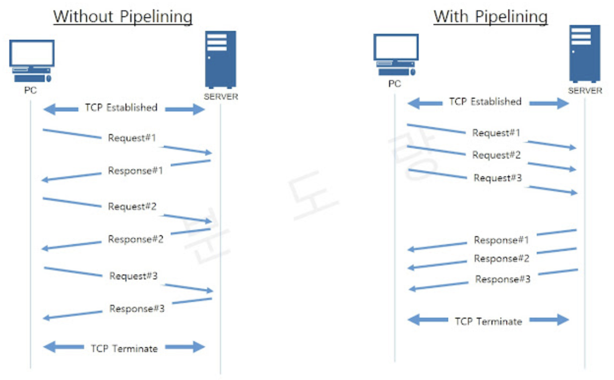
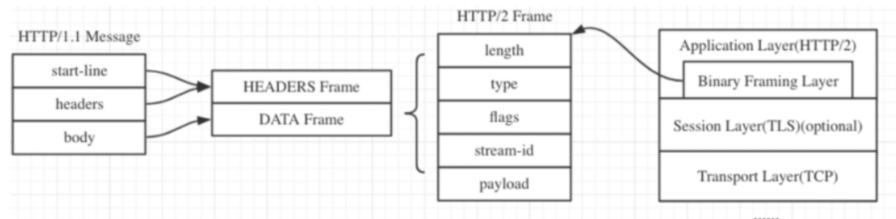
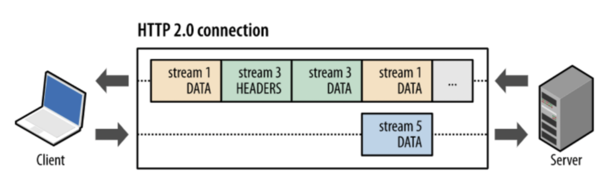
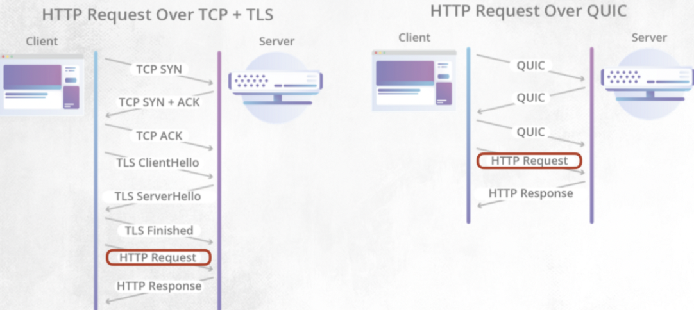
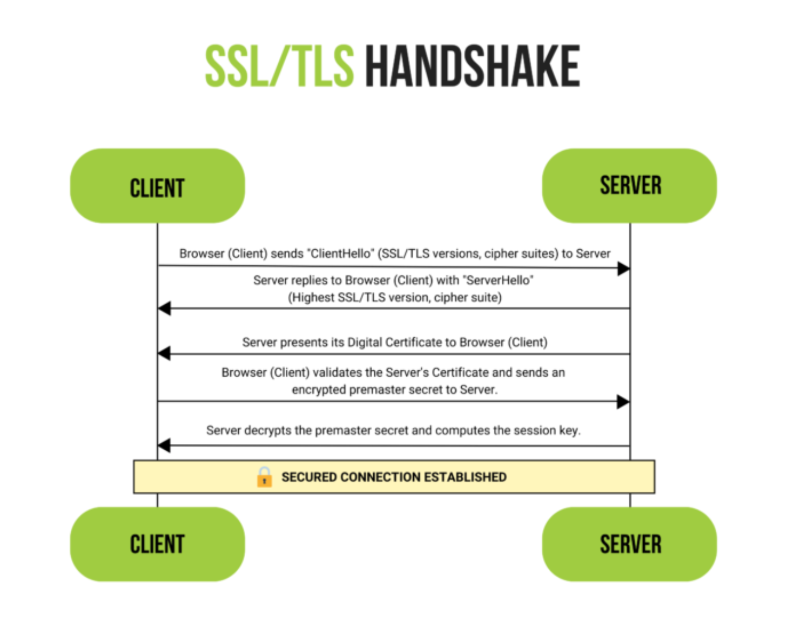
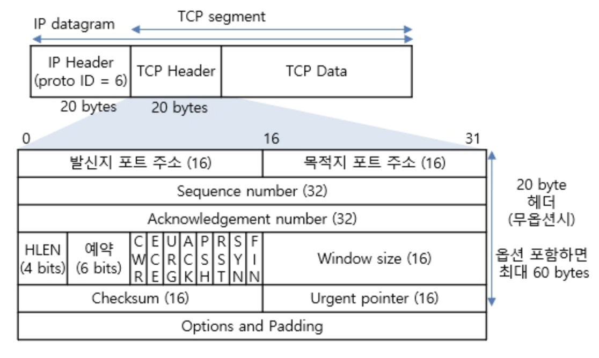

# 1주차(웹 & 네트워크)

## 예상 질문 리스트

### HTTP/HTTPS 파트

1. HTTP와 HTTPS에 대해 설명해주세요

HTTP는 Hypertext Transfer Protocol의 약자로, 클라이언트/서버 모델에서 데이터를 주고받기 위한 프로토콜입니다. 7계층의 프로토콜로, TCP/IP 위에서 동작하며, 80번 포트를 사용합니다. HTTP는 상태를 가지고 있지 않는 Stateless 프로토콜이며 e커머스 같은 상태가 필요한 작업들을 위한 쿠키와 세션이 존재합니다.
HTTP는 클라이언트와 서버 사이에서 데이터를 주고 받을 떄 텍스트 형태로 주고 받으며, 누군가 네트워크에서 신호를 가로채면 내용이 노출될 수 있다는 보안적인 이슈가 존재합니다.
이를 보완하기 위해서 고안된 것이 바로 HTTP Secure라고도 불리는 HTTPS 이며 HTTP에 데이터 암호화를 추가하여 보안성을 강화한 프로토콜입니다. 443 포트를 사용하고, HTTP 레이어 바로 밑단에 SSL이나 TLS 프로토콜을 추가하여, 서버와 클라이언트 사이에서의 모든 통신 내용이 암호화됩니다.

2. 세션과 쿠키란? 사용 이유에 대해 설명

세션과 쿠키는 웹상에서 사용자의 상태 정보를 유지하고, 사용자 경험을 개선하기 위해 사용되는 기술입니다. 이들은 HTTP 프로토콜의 비연결성과 무상태성을 보완하는 역할을 합니다.

### 세션(Session)
세션은 서버 측에서 생성되는 일종의 식별자로, 사용자가 웹 서버에 접속할 때마다 임시로 생성됩니다. 사용자의 정보는 서버에 저장되며, 보안성이 높지만 서버의 부하를 증가시킬 수 있습니다.
세션은 주로 사용자의 로그인 상태나 접속 정보 등을 유지하기 위해 사용되며 세션을 통해 사용자가 여러 페이지를 이동하더라도 로그인 상태를 유지할 수 있습니다.
### 쿠키(Cookie)
쿠키는 클라이언트(브라우저) 측에 저장되는 작은 데이터 파일로, 사용자의 웹 사이트 방문 정보나 선호도 등을 저장합니다. 쿠키는 사용자가 웹 사이트에 다시 접속할 때 해당 정보를 서버에 전송하여 사용자 맞춤형 서비스를 제공할 수 있게 합니다.
쿠키를 사용하는 이유는 사용자의 편의성을 높이고, 웹 사이트의 사용성을 개선하기 위해 사용됩니다. 예를 들어, 쿠키를 통해 사용자의 로그인 정보, 장바구니 정보, 언어 설정 등을 기억하게 할 수 있습니다.
세션과 쿠키는 HTTP의 무상태성과 비연결성을 개선하기 위해 나온 방법으로 e커머스처럼 상태가 필요한 경우 사용자의 정보를 각각 서버(세션)와 클라이언트(쿠키) 측에서 관리하는 방법입니다. 보안성이 중요한 정보는 세션을 통해 서버 측에서 관리하고, 사용자의 편의성을 위한 정보는 쿠키를 통해 클라이언트 측에서 관리하는 것이 일반적입니다. 

3. http1, 2, 3 의 차이는 무엇인가?

**HTTP/1.0**:
- 연결마다 하나의 요청과 응답만 처리하는 클라이언트-서버 모델을 사용합니다.
- 텍스트 기반의 프로토콜로, 헤더 정보와 데이터가 동일한 연결을 통해 전송됩니다.
- 성능과 효율성이 떨어지는 단점이 있으며, 여러 개의 리소스를 동시에 로드하기 어렵습니다.
 

**HTTP/1.1**:

- **지속 연결(Persistent Connection)**과 **파이프라이닝(Pipelining)**을 도입하여 한 번의 TCP 초기화 이후, keep-alive 옵션으로 일정 시간 동안 연결 상태를 유지하며, 클라이언트는 앞 요청의 응답을 기다리지 않고 순차적으로 요청을 전송할 수 있게 되었습니다(하지만, 서버에서는 순서대로 처리해야 해서 병목 현상이 발생하고 HOL 문제가 발생). 
- 헤더 필드의 압축을 통해 일부 성능 향상을 이루었지만, 여전히 성능이 제한됩니다.(쿠키와 같은 다양한 메타 정보가 헤더에 들어가서 보내려 하는 데이터보다 header가 더 커지게 되는 Fat message header 문제가 존재)

 

**HTTP/2**:
- 이진 프레임 형식과 헤더 압축을 도입하여 효율성을 개선했습니다.
- **다중 스트림(Multiplexing)을 지원하여 하나의 연결로 동시에 여러 요청과 응답을 처리**할 수 있습니다.
- **서버 푸시(Server Push)를 통해 서버는 클라이언트 요청 없이 리소스를 전송할 수** 있습니다.
- 보안을 위해 기본적으로 TLS(SSL)을 사용하도록 권장하며 그 위에 binary framing layer가 올라가서 동작합니다. (메시지가 프레임으로 나뉘면 헤더는 헤더 프레임, 데이터는 데이터 프레임으로 나뉨.) 

 

#### Appendix
Stream : 구성된 연결 내에서 전달되는 바이트의 양방향 흐름으로 하나 이상의 메시지가 전달될 수 있습니다.
Message : 논리적 요청 또는 응답 메시지에 매핑되는 프레임의 전체 시퀀스입니다.
Frame : http/2에서 통신의 최소 단위로 각 최소 단위에는 하나의 프레임 헤더가 포함됩니다.
즉, 상위 레벨에서는 스트림으로 묶고 하위 레벨에서는 프레임으로 쪼개져서 통신이 이루어집니다. 각 스트림에는 양방향 메시지 전달에 사용되는 고유 식별자와 우선순위 정보(선택적)가 존재하며 모든 통신은 클라이언트와 서버 사이에 하나의 tcp 연결만을 사용하며 전달될 수 있는 양방향 스트림의 수는 제한이 없습니다. 즉, tcp를 복수로 뚫지 않습니다.

**HTTP/3**:
- 전체적으로 새로운 전송 프로토콜로, **QUIC(Quick UDP Internet Connections)을 기반으로** 합니다.
- UDP를 사용하여 혼잡 제어 및 오류 복구 기능을 더 효과적으로 수행하며, 연결 설정 및 해제에 대한 지연을 감소시킵니다.
- 하나의 연결로 다수의 병렬 스트림을 전송하며, 스트림 간에 영향을 주지 않고 데이터를 동시에 전송합니다.
- 보통 tcp에서는 소켓 번호로 ip주소+포트 번호를 쓰는데 QUIC에서는 독립적으로 connection id를 사용하기 때문에 ip주소가 바뀌어도 연결이 유지됩니다.
- QUIC의 연결 설정 과정이 TLS1.3과 밀결합되어 있는 반면 TCP는 TLS와 서로 독립적이라서 따로 따로 뚫지만 QUIC 은 새로 만들때 그냥 같이 써야해서 같이합니다. (QUIC이 TLS1.3을 사용한 주된 이유는 handshake에 더 적은 라운드 트립이 필요하도록 바뀌었기 때문으로 프로토콜 지연을 줄여주는 효과가 있음.)

(https://suminn0.tistory.com/143)

4. CORS란? 문제 해결 방법에 대해 서술

### CORS(Cross-Origin Resource Sharing)란?

CORS는 웹 브라우저에서 보안을 유지하면서 다른 출처의 리소스를 안전하게 요청할 수 있도록 하는 메커니즘입니다. 서버는 HTTP 헤더를 통해 다른 출처의 요청을 허용할지 결정하며, 이는 원본 사이트의 모방을 방지하고 다른 출처의 데이터 요청을 제한함으로써 공격으로부터 보호하는 데 필요합니다.

#### CORS의 필요성
- 보안 강화: 웹 애플리케이션은 선택된 리소스에 대해 다른 출처의 접근을 허용함으로써, 원본 사이트를 모방하거나 사용자 정보를 도용하는 등의 무단 접근 및 해킹 가능성을 줄일 수 있습니다.
- 통합 용이성: 클라이언트 웹 애플리케이션이 다른 도메인의 리소스와 상호 작용할 수 있게 함으로써, third party API 및 리소스를 클라이언트 측 코드에서 참조하는 것을 용이하게 합니다. 예를 들어, 동영상 플랫폼 API에서 동영상을 가져오거나 글꼴 라이브러리의 글꼴을 사용하는 등의 작업에 활용됩니다.
#### CORS 해결 방법
- 서버 측 설정 변경: 서버에서 특정 출처 또는 모든 출처에 대한 요청을 허용하도록 설정을 변경합니다. 예를 들어, Spring Boot에서는 @CrossOrigin 어노테이션을 사용하거나, WebMvcConfigurer를 구현하여 글로벌 CORS 설정을 할 수 있습니다.
- 프록시 서버 사용: 클라이언트와 서버 사이에 프록시 서버를 두어, 모든 클라이언트 요청을 프록시를 통해 서버로 전달하고, 서버의 응답을 클라이언트에게 전달하는 방식으로 CORS 문제를 우회할 수 있습니다.

5. stateful과 stateless 의 차이점이 무엇인지에 대해 설명

#### Stateful
Stateful(상태 유지) 시스템은 사용자의 상태 정보를 저장하고 이를 기반으로 다음 행동을 결정합니다. 예를 들어, 웹 애플리케이션에서 로그인 세션 관리는 Stateful한 예입니다. 사용자가 로그인하면, 그 사용자의 정보(예: 세션 ID)가 서버에 저장되고, 사용자가 다음 요청을 할 때마다 서버는 해당 정보를 참조하여 사용자를 인식합니다. 이를 통해 사용자마다 개인화된 서비스를 제공할 수 있습니다.

#### Stateless
Stateless(상태 비유지) 시스템은 사용자의 상태 정보를 저장하지 않습니다. 즉, 각 요청이 독립적으로 처리되며, 이전 요청의 정보가 후속 요청에 영향을 주지 않습니다. 예를 들어, HTTP 프로토콜은 Stateless 프로토콜입니다. 클라이언트가 서버에 요청을 보낼 때 마다, 각 요청은 서로 독립적으로 처리되며, 서버는 이전 요청에 대한 정보를 저장하거나 참조하지 않습니다. 이러한 특성은 서버의 복잡성을 줄이고 확장성을 높이는 데 도움이 됩니다.

둘의 차이점은 상태 정보 저장 여부와 응답 방식에 차이가 있으면 Stateful의 경우엔 저장하고 관리한 상태 정보를 기반으로 응답을 결정하는 반면 Stateless는 상태 정보를 유지하지 않고 각 요청을 독립적으로 처리합니다. 따라서 전자의 경우 상태 정보 관리를 위한 리소스가 필요할 수 있으며 이는 시스템의 복잡성을 증가시킬 수 있습니다.

6. SSL/TLS HandShaking 에 대해 설명

SSL(Secure Sockets Layer)과 TLS(Transport Layer Security)는 인터넷 상에서 데이터를 암호화하여 전송하는 기술로, 민감한 정보를 안전하게 전송하기 위해 사용됩니다. SSL은 TLS의 전신이며, 현재는 TLS가 더 널리 사용됩니다. SSL/TLS Handshaking은 클라이언트와 서버 간의 안전한 연결을 설정하는 과정입니다.

클라이언트 헬로(Client Hello): 통신을 시작하는 클라이언트가 서버에게 사용 가능한 암호화 방식, TLS 버전, 임의의 난수(random number) 등을 전송합니다.

서버 헬로(Server Hello): 서버는 클라이언트의 메시지를 받고, 클라이언트와 공통으로 사용할 수 있는 암호화 방식, TLS 버전, 서버의 임의의 난수 등을 선택하여 응답합니다.

서버 인증 및 키 교환(Server Certificate and Key Exchange): 서버는 자신의 인증서를 클라이언트에게 전송합니다. 클라이언트는 인증서의 유효성을 확인하고, 서버의 공개키를 획득합니다. 이 공개키를 이용하여 세션 키를 암호화하여 서버에게 전송합니다.

클라이언트 키 교환(Client Key Exchange): 클라이언트는 서버의 공개키를 사용하여 암호화된 프리마스터 시크릿(premaster secret)을 생성하고 이를 서버에게 전송합니다. 서버는 개인 키를 사용하여 premaster secret(클라이언트가 보낸 키)을 해독합니다. 그런 다음 서버와 클라이언트는 모든 통신의 대칭 암호화에 사용되는 세션 키를 계산합니다.

핸드세이크 완료: 서버와 클라이언트는 서로에게 "Finished" 메시지를 전송하여 핸드셰이킹 과정이 성공적으로 완료되었음을 알립니다. 이 시점부터 클라이언트와 서버 간에 교환되는 데이터는 모두 암호화되어 전송됩니다.

7. SSL ,TLS 가 무엇인가요?

SSL(Secure Sockets Layer)과 TLS(Transport Layer Security)는 인터넷 상의 데이터 전송을 안전하게 보호하기 위한 프로토콜입니다. 이들은 개인 정보, 인증, 데이터 무결성을 보호하며, 특히 온라인 거래와 같은 중요한 정보가 오가는 통신을 암호화하여 보안을 강화합니다. SSL은 TLS의 전신으로, 시간이 지나면서 TLS로 발전했습니다.

#### SSL과 TLS의 역할
- 데이터 암호화: 웹사이트와 브라우저 간에 전송되는 데이터를 암호화하여, 해커들이 개인 또는 금융 정보에 접근하는 것을 방지합니다.
- 통신 보안 강화: 웹 브라우징, 이메일, VoIP와 같은 애플리케이션을 위해 컴퓨터 네트워크 상에서 통신 보안을 제공합니다.

#### SSL과 TLS의 차이점
- 보안 강화: TLS는 SSL의 취약점을 해결한 업그레이드 버전으로, 더 강화된 보안 기능을 제공합니다.
- 표준화: TLS는 1999년 IETF(Internet Engineering Task Force)에 의해 표준화된 SSL의 후속 버전입니다.(TLS 1.0은 SSL 3.0 의 개선 버전으로 시작)

SSL과 TLS는 웹사이트의 신뢰도를 높이고 인터넷 연결을 보호하는 데 중요한 역할을 합니다. 이 프로토콜들은 모든 종류의 정보 교환을 보호하는 데 필수적이며, 전자상거래뿐만 아니라 로그인 정보와 같은 중요 데이터의 안전한 전송을 보장합니다. 

8. REST, RESTful이란 무엇일까요?

REST는 인터넷상에서 클라이언트와 서버 간의 상호작용을 규정하기 위해 고안되었으며, 웹 기술을 사용하여 구현됩니다. RESTful은 REST 원칙을 준수하는 웹 서비스를 의미합니다. 

#### REST 구성 요소
- 자원(Resource) : HTTP URI
- 자원에 대한 행위(Verb) : HTTP Method
- 자원에 대한 행위의 내용 (Representations) : HTTP Message Pay Load

#### REST 주요 특징
- 클라이언트-서버 구조(Client-Server Architecture): 클라이언트와 서버가 독립적으로 동작할 수 있도록 분리됩니다. 이를 통해 각각의 구성 요소가 개별적으로 발전할 수 있습니다.

- 무상태(Stateless): 각 요청은 독립적이며, 이전 요청의 상태 정보를 저장하지 않습니다. 서버는 클라이언트로부터 온 요청만을 처리하며, 이 요청에는 필요한 모든 정보가 포함되어 있어야 합니다.

- 캐시 처리 가능(Cacheable): 서버 응답은 캐싱이 가능하도록 표시될 수 있습니다. 이를 통해 클라이언트는 응답을 재사용하여 애플리케이션의 효율성과 성능을 향상시킬 수 있습니다.

- 계층형 시스템(Layered System): 클라이언트는 서버가 직접적으로 연결되어 있는지, 중간에 다른 계층이 있는지 알 수 없습니다. 이는 시스템의 확장성을 향상시킵니다.

- 코드 온 디맨드(Code on Demand, 선택적): 서버는 실행 가능한 코드를 클라이언트에 전송할 수 있습니다. 이는 클라이언트의 기능을 임시적으로 확장할 수 있게 합니다.

- 일관된 인터페이스(Uniform Interface): 일관된 인터페이스를 통해 시스템 간의 상호작용을 단순화합니다. 이 원칙에는 리소스의 식별, 리소스에 대한 표현, 자기 서술적 메시지, 하이퍼미디어를 통한 애플리케이션 상태의 엔진 등이 포함됩니다.

RESTful 웹 서비스는 이러한 원칙을 따르며, 주로 HTTP 메소드(GET, POST, PUT, DELETE 등)를 사용하여 리소스에 접근하고 조작합니다. RESTful 아키텍처를 사용함으로써, 개발자들은 보다 유연하고 확장 가능한 웹 서비스를 구축할 수 있습니다.

9. URL과 URI는 뭐가 다를까?

#### URI (Uniform Resource Identifier)
URI는 인터넷 상의 자원을 고유하게 식별하거나 이름을 붙이기 위한 문자열입니다.
URI는 자원의 위치나 이름을 나타낼 수 있으며, URL과 URN (Uniform Resource Name)을 포함하는 더 넓은 개념입니다.
ex) mailto:example@example.com (URN), http://example.com/page (URL)
#### URL (Uniform Resource Locator)
URL은 인터넷 상의 자원이 위치한 곳을 나타내기 위한 특정한 형태의 URI입니다.
URL은 자원에 접근하기 위한 구체적인 방법과 위치를 포함합니다. 즉, 해당 자원을 찾기 위한 주소 역할을 합니다.
ex) http://example.com/page

#### 차이점
모든 URL은 URI입니다. 하지만 모든 URI가 URL인 것은 아닙니다. URI는 자원의 위치(URL) 또는 이름(URN)을 나타낼 수 있지만, URL은 오직 자원의 위치만을 나타냅니다.
URL은 자원에 접근하기 위한 경로를 제공하는 반면, URI는 자원을 식별하거나 이름을 붙이는 데 사용됩니다.
즉, URL은 '어디에' 있는지를 알려주고, URI는 '무엇인지'를 식별합니다.

10. PUT과 PATCH의 차이에 대해 설명해주세요.

HTTP 메소드인 PUT과 PATCH는 모두 리소스를 업데이트하는 데 사용되지만, 그 방식에서 차이가 있습니다. PUT은 전체 리소스를 업데이트하는 반면, PATCH는 리소스의 일부분만 업데이트합니다. 예를 들어, PUT 요청을 보내면 리소스의 모든 필드가 업데이트되지만, PATCH 요청을 보내면 특정 필드만 업데이트할 수 있습니다.

#### PUT과 PATCH의 주요 차이점
PUT: 전체 리소스를 업데이트하므로, 업데이트하려는 리소스의 모든 정보를 요청에 포함해야 합니다. 이는 리소스의 일부만 변경하고자 할 때 비효율적일 수 있습니다.
PATCH: 리소스의 특정 부분만을 업데이트하기 때문에, 변경하고자 하는 정보만 요청에 포함하면 됩니다. 이는 효율적인 데이터 전송과 빠른 업데이트를 가능하게 합니다.

11. GET과 POST의 차이점에 대해서 설명해보세요.

GET 메소드는 서버로부터 정보를 조회하기 위해 사용됩니다. 데이터를 URL의 쿼리 스트링을 통해 전송하며, 이 데이터는 URL에 노출됩니다. GET 요청은 브라우저에 의해 캐시될 수 있으며, 북마크와 검색 엔진 크롤링에 적합합니다.
POST 메소드는 서버에 데이터를 제출하여 리소스를 생성하거나 업데이트하기 위해 사용됩니다. 데이터는 요청 본문(body)에 포함되어 전송되며, URL에는 노출되지 않습니다. POST 요청은 캐시되지 않으며, 브라우저 히스토리에도 저장되지 않습니다.

### 웹 통신 파트

www.naver.com에 접속할때  일어나는 일에 대해 설명해주세요.

1. URL 입력: 브라우저의 주소창에 www.naver.com을 입력합니다.

2. DNS 조회: DNS 서버는 도메인 네임을 IP로 변환해주는 역할을 합니다. 먼저 Local DNS에게 URL을 물어보고, 해당 주소가 캐싱되어있다면 바로 IP 주소를 반환하고 그렇지 않다면 다음 단계로 넘어갑니다. Local DNS는 주소를 찾아내기 위해 다른 DNS 서버들과 통신을 시작하게 되며 재귀적으로 Root DNS, TLD DNS, 도메인 DNS에게 차례로 물어보며 IP 주소를 찾게 됩니다.

3. TCP 연결: IP 주소를 획득한 후, 브라우저는 목적지 서버와의 안정적인 통신을 위해 TCP(Transmission Control Protocol) 연결을 시도합니다.(이때 HTTPS인 경우 SSL/TLS 핸드세이크 과정도 진행됩니다.) 이 과정에서는 일반적으로 www.naver.com 서버의 80번 포트(HTTP) 또는 443번 포트(HTTPS)에 연결하려고 합니다.

4. HTTP 요청: TCP 연결이 성공하면, 브라우저는 www.naver.com 서버에 HTTP 요청을 보냅니다. 이 요청에는 웹 페이지를 요청하는 데 필요한 정보가 포함됩니다.

5. 서버 응답: www.naver.com 서버는 브라우저의 요청을 받고 처리한 다음, 요청된 웹 페이지 데이터(HTML, CSS, JavaScript 등)와 함께 HTTP 응답을 보냅니다.

6. 콘텐츠 렌더링: 브라우저는 서버로부터 받은 데이터를 해석하여 화면에 표시합니다. HTML을 먼저 해석하고, CSS 스타일을 적용하며, JavaScript를 실행하여 동적인 웹 페이지를 사용자에게 보여줍니다.

7. 외부 자원 로드: 웹 페이지에는 외부 이미지, 스크립트, 스타일시트 등이 포함될 수 있습니다. 이러한 자원들도 각각 HTTP 요청을 통해 서버로부터 로드됩니다.

DNS란?

DNS(Domain Name System)는 인터넷상에서 도메인 이름을 IP 주소로 변환하는 시스템입니다. 인터넷은 기본적으로 IP 주소를 사용하여 컴퓨터나 서버와 같은 장치를 식별합니다. 그러나 IP 주소는 숫자로 이루어져 있어 사람이 기억하기 어렵습니다. DNS는 이러한 문제를 해결하기 위해 도메인 이름(예: www.example.com)을 사람이 이해할 수 있는 주소로 사용하고, 이를 실제 네트워크에서 장치를 식별하는 데 필요한 IP 주소(예: 192.0.2.1)로 변환합니다.

BGP 에 대해 아는가?

BGP(Border Gateway Protocol)는 인터넷의 핵심 라우팅 프로토콜 중 하나로, **다른 AS(Autonomous System) 간에** **경로 및 라우팅 정보를 교환하고 관리하는 데 사용**되는 프로토콜입니다.(AS란 하나 이상의 네트워크로 구성되어 독자적인 라우팅 정책을 가진 큰 네트워크나 네트워크 그룹을 의미) BGP는 주로 대규모 네트워크와 다른 AS 간의 라우팅을 제어하는 데 사용됩니다.

#### BGP 주요 특징
1. **AS 간 라우팅**: BGP는 다른 AS 간에 라우팅 정보를 교환하는 데 사용됩니다. **AS는 네트워크 관리의 독립적인 영역**으로, 하나 이상의 IP 주소 범위를 관리합니다. BGP는 이러한 **AS 간의 경로 교환을 담당**합니다.
2. **경로 벡터 프로토콜**: BGP는 경로 벡터 프로토콜로서, 경로 정보를 경로 벡터로 표현하고 이를 교환하여 라우팅 결정을 내립니다. 즉, 패킷이 전송될 최적의 경로를 결정하는 데 사용됩니다. 각 경로 벡터는 목적지 네트워크, AS 경로 및 다양한 속성 정보로 구성됩니다.
3. **정책 기반 라우팅**: BGP는 다양한 정책을 적용하여 라우팅 결정을 내릴 수 있습니다. 이는 트래픽 조정, AS 경로 필터링, 목적지 기반 경로 선택 등과 같은 다양한 제어를 가능하게 합니다.
4. **AS 경로 필터링**: BGP는 AS 경로 정보를 이용하여 경로 필터링을 수행할 수 있으므로, 특정 AS로부터 트래픽을 차단하거나 전달할 수 있습니다.
5. **경로 공개 및 철회**: BGP는 경로 공개(Advertise)와 경로 철회(Withdraw)를 통해 네트워크의 상태를 다른 AS에 알리고 변경사항을 통지합니다.
6. **BGP 라우터**: BGP 라우터는 BGP 프로토콜을 구현하는 라우터로, 다른 AS와의 BGP 세션을 설정하고 업데이트 메시지를 교환합니다.
7. **BGP 피어링**: BGP 라우터 간의 연결을 BGP 피어링이라고 합니다. BGP 피어링은 eBGP(External BGP)와 iBGP(Internal BGP) 두 가지 유형이 있습니다. eBGP는 다른 AS와의 피어링을 나타내며, iBGP는 동일한 AS 내의 다른 BGP 라우터와의 피어링을 나타냅니다.

#### 작동 방식
1. 세션 설정: 두 BGP 라우터(피어) 사이에 TCP 연결을 통해 세션이 설정됩니다. BGP는 기본적으로 TCP 포트 179를 사용합니다.
2. 경로 교환: 세션이 설정되면, BGP 피어는 서로에게 자신이 알고 있는 경로 정보를 교환합니다.
3. 경로 갱신: 경로 정보나 네트워크 상태가 변경되면, BGP 피어는 새로운 정보를 서로에게 알립니다.
4. 경로 유지: BGP 피어는 주기적으로 keepalive 메시지를 교환하여 연결을 유지합니다.

BGP는 인터넷의 라우팅을 관리하고 안정적으로 유지하기 위한 핵심 프로토콜로 사용되며, 다양한 정책 및 네트워크 환경에 따라 라우팅 결정을 조절할 수 있습니다.

Calico BGP..

reverse proxy 의 역할과 기능, 구현체(program) 을 아는대로 설명하라

Reverse Proxy는 클라이언트로부터의 요청을 서버로 전달하는 중간자 역할을 하며, 서버로부터의 응답을 다시 클라이언트에게 전달합니다. 그러나 일반적인 프록시 서버와 달리, Reverse Proxy는 클라이언트가 서버에 직접적으로 접근하는 것이 아닌 서버의 앞단에서 작동하여 서버들의 요청을 관리합니다. 이로 인해 여러 가지 중요한 역할과 기능을 수행할 수 있습니다.

#### Reverse Proxy의 역할과 기능
- 로드 밸런싱: 여러 서버에 걸쳐 요청을 분산시켜 서버의 부하를 줄이고, 서비스의 가용성과 신뢰성을 높입니다.
- 보안 강화: 클라이언트와 서버 사이의 중간자로서 작동하여 서버의 실제 IP 주소를 숨기고, 보안 위협으로부터 서버를 보호합니다.
- 캐싱: 자주 요청되는 리소스를 캐시에 저장하여 서버의 부하를 줄이고 응답 시간을 단축합니다.
#### Reverse Proxy 구현체
- Nginx: 고성능을 자랑하는 웹 서버이자 가장 인기 있는 리버스 프록시 소프트웨어 중 하나입니다. 로드 밸런싱, 캐싱 등의 기능을 제공합니다.
- Apache HTTP Server: mod_proxy 모듈을 통해 리버스 프록시 기능을 제공합니다. 유연한 구성과 다양한 모듈을 통해 많은 기능을 지원합니다.
- HAProxy: 고성능 로드 밸런서 및 프록시 서버로, 특히 대규모 웹 사이트와 애플리케이션에 적합합니다. 세밀한 트래픽 관리와 보안 기능을 제공합니다.

이러한 리버스 프록시 소프트웨어들은 웹 서비스의 성능을 향상시키고, 보안을 강화하며, 관리를 용이하게 하는 등의 역할을 수행합니다.

검색 엔진에서 검색어를 입력하면 POST 가 아닌 GET API 를 사용한다. 왜 그럴까?

- URL을 통한 공유: GET 요청은 요청하는 데이터가 URL의 일부로 포함되어 있기 때문에, 사용자가 검색 결과를 쉽게 다른 사람과 공유할 수 있습니다. 예를 들어, 검색어가 URL에 포함되어 있어 링크를 복사하여 다른 사람에게 보낼 수 있습니다.

- 캐싱: GET 요청은 결과를 캐시할 수 있어서 동일한 검색 요청에 대해 더 빠른 응답 시간을 제공할 수 있습니다. 이는 서버의 부하를 줄이고 사용자 경험을 개선하는 데 도움이 됩니다.

검색 엔진에서 GET 방식을 사용하는 것은 사용자 경험을 향상시키고, 검색 결과의 공유와 재사용을 용이하게 하기 위한 선택입니다. 검색어를 URL에 포함시킴으로써, 사용자는 검색 결과를 쉽게 다른 사람과 공유하고, 나중에 다시 접근할 수 있습니다.

Cookie, Session, JWT의 차이점에 대해 설명해주세요

Cookie와 Session은 클라이언트와 서버 간의 상태를 유지하기 위해 사용되며, 서로 보완적인 관계에 있습니다. 반면, JWT는 사용자 인증 정보를 안전하게 전송하고 검증하기 위한 목적으로 사용됩니다.

#### Cookie:
- 클라이언트(브라우저)에 저장되는 작은 데이터 파일입니다.
- 사용자 인증, 세션 관리, 사용자 선호도 기록 등에 사용됩니다.
- 이름, 값, 만료 시간, 도메인, 경로 등으로 구성됩니다.
#### Session
- 서버 측에서 관리되는 사용자 정보의 저장소입니다.
- 클라이언트에게 고유한 세션 ID를 제공하여 사용자를 식별합니다.
- 서버의 메모리에 저장되어, 동시에 많은 사용자가 접속할 경우 서버에 부하를 줄 수 있습니다.
#### JWT (JSON Web Token)
- 사용자 인증 및 정보 교환에 사용되는 자가 수용적(self-contained) 방식의 JSON 토큰입니다.
- 토큰에는 사용자에 대한 정보, 발급자, 만료 시간 등이 포함될 수 있습니다.
- 디지털 서명이 되어 있어, 정보가 중간에 변경되었는지 검증할 수 있습니다.
- 세션과 달리 서버의 메모리를 사용하지 않아 서버 부하를 줄일 수 있습니다

### OSI 7계층 파트

OSI 7계층에 대해서 설명해주세요

OSI(Open Systems Interconnection) 7계층 모델은 컴퓨터 네트워크 프로토콜과 통신을 7개의 계층으로 나누어 정의한 표준 모델입니다.

1. 물리 계층(Physical Layer): 데이터 전송과 수신을 위한 하드웨어 수준의 전송 매체(케이블, RJ45 등)와 전기적 신호를 다룹니다. 이 계층은 데이터를 비트로 변환하여 전송합니다.

2. 데이터 링크 계층(Data Link Layer): 네트워크 장비 간의 물리적 연결을 관리하고, 오류 검출 및 수정 기능을 제공합니다. 이 계층에서는 프레임이라는 단위로 데이터를 전송하며, MAC 주소를 사용하여 통신합니다.

3. 네트워크 계층(Network Layer): 다양한 네트워크 간의 데이터 전송을 담당하며, IP 주소를 사용하여 최적의 경로(Routing)를 결정합니다. 이 계층에서는 패킷이라는 단위로 데이터를 전송합니다.

4. 전송 계층(Transport Layer): 종단 간(End-to-End) 데이터 전송을 관리하며, 통신을 위한 세션 관리와 오류 검출 및 복구 기능을 제공합니다. TCP/UDP 프로토콜이 이 계층에서 작동합니다.

5. 세션 계층(Session Layer): 네트워크 상에서 통신하는 양쪽 시스템 간의 세션을 생성, 관리, 종료하는 기능을 담당합니다. 이 계층은 통신의 시작과 끝을 정의합니다.

6. 표현 계층(Presentation Layer): 데이터의 표현 형식을 관리하고 변환합니다. 예를 들어, 암호화 및 압축을 처리합니다. 이 계층은 데이터를 어플리케이션이 이해할 수 있는 형태로 변환하거나, 네트워크 형식으로 변환하는 역할을 합니다.

7. 응용 계층(Application Layer): 최종 사용자와 직접적으로 상호 작용하는 애플리케이션들을 위한 인터페이스를 제공합니다. 이메일 클라이언트, 웹 브라우저와 같은 응용 프로그램이 이 계층에서 작동합니다.

OSI 7 계층으로 나눈 이유가 무엇인가?

네트워크 통신 과정을 7계층으로 나누어 각 계층의 역할을 명확히 함으로써 네트워크 통신 과정의 복잡성을 해결하고, 문제 해결의 효율성을 높이며(네트워크 문제 발생 시 특정 계층을 타켓팅하여 문제 해결), 계층 간 독립성을 보장하고, 표준화와 호환성을 향상시키는 등 네트워크 관리와 운영에 많은 장점을 제공하기 떄문입니다.

물리 계층이 하는 역할은 무엇인가?

0과 1로 나열된 데이터를(비트) 전기적인 **아날로그 신호로 변환**해서 주고 받는 기능을 하는 계층입니다. 

L4와 L7 로드밸런서의 차이가 무엇인가?

#### L4 로드밸런서 (계층 4: 전송 계층)
IP 주소와 포트 번호를 기반으로 네트워크 트래픽을 분산시킵니다. TCP/UDP 트래픽의 분산을 담당하며, 세션 계층 정보나 애플리케이션 계층의 데이터 내용은 처리하지 않습니다.
장점: 처리 속도가 빠르며, 단순한 트래픽 분산에 효율적입니다.

#### L7 로드밸런서 (계층 7: 애플리케이션 계층)
HTTP, HTTPS 같은 애플리케이션 프로토콜의 내용을 기반으로 트래픽을 분산시킵니다. URL, HTTP 헤더, 쿠키 등을 분석하여 더 정교한 라우팅 결정을 내릴 수 있습니다.
장점: 애플리케이션의 요구사항에 맞춰 트래픽을 제어할 수 있어, 보다 세분화된 로드밸런싱이 가능합니다. 예를 들어, 특정 URL 패턴이나 특정 타입의 트래픽을 특정 서버 그룹에 전달하는 것과 같은 작업을 수행할 수 있습니다.

L4는 IP 주소와 포트 번호 같은 네트워크 및 전송 계층 정보만을 사용하여 트래픽을 분산시키는 반면 L7은 HTTP 헤더, URL, 쿠키 등 애플리케이션 계층의 데이터를 분석하여 더 정교한 로드밸런싱을 제공합니다.
또한, L7은 애플리케이션의 세부적인 요구사항에 맞춰 트래픽을 분산시킬 수 있으며, 캐싱, 애플리케이션 방화벽 기능 등 추가 기능을 제공할 수 있습니다.

공인 IP와 사설 IP란 무엇일까요?

#### 공인 IP (Public IP Address)
공인 IP 주소는 인터넷 상에서 고유하며 전 세계적으로 특정 장치를 식별하는 데 사용됩니다.
이 주소를 통해 인터넷 상의 다른 장치들과 통신이 가능하며, 일반적으로 인터넷 서비스 제공업체(ISP)에 의해 할당됩니다.
공인 IP 주소는 인터넷에 직접 연결된 장치에 할당되어 외부에서 접근할 수 있게 해 줍니다.

#### 사설 IP (Private IP Address):
사설 IP 주소는 한 조직 또는 가정 내부 네트워크에서만 사용되며, 인터넷 상에서는 고유하지 않습니다.
사설 IP 주소는 네트워크 내에서 장치들이 서로 통신하는 데 사용되며, 외부 네트워크와의 통신에는 공인 IP 주소를 통한 NAT(네트워크 주소 변환)이 필요합니다.
사설 IP 주소는 일반적으로 라우터나 스위치 같은 네트워크 장비에 의해 자동으로 할당되거나 수동으로 설정됩니다.(DHCP 같은 프로토콜 사용)
사설 IP 주소 범위는 IANA(Internet Assigned Numbers Authority)에 의해 정의되어 있으며, 일반적으로 다음과 같습니다:
10.0.0.0 ~ 10.255.255.255
172.16.0.0 ~ 172.31.255.255
192.168.0.0 ~ 192.168.255.255

### **TCP & UDP**

TCP/IP 4계층이란?

TCP/IP 4계층은 인터넷 통신에 사용되는 프로토콜 집합으로, OSI 7계층 모델을 단순화한 모델입니다. 
1. 네트워크 액세스 계층(Network Access Layer) :  이 계층은 물리적 네트워크 하드웨어와 밀접하게 관련되어 있으며, 데이터를 전기 신호로 변환하여 네트워크를 통해 전송하는 기능을 담당합니다. Ethernet, Wi-Fi 같은 물리적 및 데이터 링크 기술이 여기에 속합니다.
2. 인터넷 계층(Internet Layer) : 이 계층은 데이터 패킷을 소스에서 목적지까지 전달하는 기능을 담당합니다. 가장 중요한 프로토콜인 IP(Internet Protocol)가 이 계층에 속하며, 주소 지정과 라우팅을 담당합니다.
3. 전송 계층(Transport Layer) : 이 계층은 통신을 활성화하는 끝점 간의 연결을 관리합니다. TCP(Transmission Control Protocol)와 UDP(User Datagram Protocol)와 같은 프로토콜이 이 계층에 속하며, 데이터의 순차적 전송, 신뢰성 있는 전송, 오류 검출 및 복구 등을 담당합니다.
4. 애플리케이션 계층(Application Layer) : 사용자와 가장 가까운 계층으로, 사용자가 네트워크에 접근할 수 있는 인터페이스와 프로토콜을 제공합니다. HTTP, FTP, SMTP, DNS 등의 프로토콜이 이 계층에 속하며, 웹 브라우징, 이메일 전송, 파일 전송 등 다양한 인터넷 기반 서비스를 가능하게 합니다.

디테일 참고 - https://yozm.wishket.com/magazine/detail/1956/

TCP와 UDP의 차이점에 대해 설명해주세요

TCP(Transmission Control Protocol)와 UDP(User Datagram Protocol)는 TCP/IP 프로토콜 스택의 전송 계층에서 사용되는 대표적인 프로토콜입니다. 
##### 연결 방식
TCP는 연결 지향형 프로토콜로, 데이터 전송 전에 3-way handshaking 과정을 거쳐 연결을 설정합니다.
UDP는 비연결형 프로토콜로, 데이터를 보내기 전 연결 설정 과정이 없습니다.

##### 신뢰성
TCP는 데이터 전송 과정에서 오류 검사, 재전송, 흐름 제어 등의 기능을 제공하여 안정적인 데이터 전송을 보장합니다.
UDP는 데이터 전송 과정에서 오류 검사나 재전송 기능이 없어 신뢰성이 낮습니다.

##### 속도
TCP는 연결 설정, 오류 검사, 재전송 등의 과정으로 인해 UDP보다 상대적으로 느립니다.
UDP는 연결 설정 과정이 없어 빠른 속도로 데이터를 전송할 수 있습니다.

##### 용도
TCP는 이메일, 파일 전송, 웹 브라우징 등 신뢰성이 중요한 애플리케이션에 사용됩니다.
UDP는 실시간 스트리밍, 온라인 게임, DNS 등 속도가 중요한 애플리케이션에 사용됩니다.

##### 패킷 전송 방식
TCP는 패킷의 순서를 보장하고 누락된 패킷을 재전송합니다.
UDP는 패킷의 순서를 보장하지 않으며, 누락된 패킷은 재전송하지 않습니다.

#### TCP와 UDP의 특징

##### TCP(Transmission Control Protocol)의 주요 특징
- 연결 지향형 프로토콜: 데이터 전송 전 3-way handshaking을 통해 연결을 설정합니다.
- 신뢰성 있는 데이터 전송: 오류 검사, 재전송, 흐름 제어 등의 기능을 제공합니다.
- 순서 보장: 패킷의 순서를 보장하며, 누락된 패킷은 재전송합니다.
- 느린 속도: 연결 설정, 오류 검사, 재전송 등의 과정으로 인해 UDP보다 상대적으로 느립니다.

##### UDP(User Datagram Protocol)의 주요 특징
- 비연결형 프로토콜: 데이터 전송 전 연결 설정 과정이 없습니다.
- 신뢰성 낮음: 오류 검사, 재전송 기능이 없어 데이터 전송의 신뢰성이 낮습니다.
- 순서 보장 없음: 패킷의 순서를 보장하지 않으며, 누락된 패킷은 재전송하지 않습니다.
- 빠른 속도: 연결 설정 과정이 없어 TCP보다 상대적으로 빠른 속도로 데이터를 전송할 수 있습니다.

TCP 흐름제어와 혼잡제어의 차이?

흐름제어는 송신자와 수신자 사이의 데이터 전송 속도를 조절하여 데이터 손실을 방지하는 반면, 혼잡제어는 네트워크 내의 데이터 전송량을 조절하여 네트워크 혼잡을 방지하거나 완화하는 데 초점을 맞춥니다.

#### 흐름제어(Flow Control)
흐름제어는 송신자와 수신자 사이의 데이터 전송 속도를 조절하는 메커니즘입니다. 목적은 수신자가 처리할 수 있는 속도 이상으로 데이터가 전송되어 버퍼가 넘치는 상황을 방지하는 것입니다. 이는 수신자의 처리 능력에 맞추어 데이터의 흐름을 제어함으로써 데이터 손실을 방지합니다.

TCP에서는 주로 "슬라이딩 윈도우" 프로토콜을 사용하여 흐름제어를 구현합니다. 이를 통해 수신자가 지정한 윈도우 크기만큼만 데이터를 전송하고, 수신 확인(ACK)을 받은 후에 다음 데이터를 전송합니다.

#### 혼잡제어(Congestion Control)
혼잡제어는 네트워크 내의 데이터 전송량을 조절하여 네트워크의 혼잡을 방지하거나 완화하는 메커니즘입니다. 네트워크 혼잡이 발생하면 패킷 손실이나 지연이 증가할 수 있으므로, TCP는 네트워크의 혼잡 상태를 감지하고 이에 대응하여 데이터 전송 속도를 조절합니다.

##### Appendix => TCP 혼잡제어 알고리즘
- Slow Start: 처음에는 작은 크기의 데이터를 전송하다가 점차 전송 속도를 높여나가는 방식
- Congestion Avoidance: 혼잡 상황을 감지하여 전송 속도를 점진적으로 늘리는 방식
- Fast Retransmit: 패킷 손실을 빨리 감지하여 재전송하는 방식
- Fast Recovery: 패킷 손실 후 전송 속도를 빨리 복구하는 방식

DNS와 DHCP는 UDP와 TCP중 어떤 프로토콜을 사용할까요?

#### DNS
DNS는 주로 UDP를 사용합니다. DNS 쿼리는 대부분 짧은 메시지로 구성되며, 빠른 응답 시간이 중요하기 때문에 연결 설정에 시간이 걸리는 TCP보다는 연결 없이 바로 데이터를 전송할 수 있는 UDP가 선호됩니다. 그러나, 응답 메시지가 크거나 신뢰성이 중요한 경우에는 TCP를 사용하기도 합니다. 예를 들어, DNS 존 전송(Zone Transfer)은 일반적으로 TCP를 사용합니다.

#### DHCP
DHCP는 주로 UDP를 사용합니다. DHCP는 클라이언트와 서버 간에 IP 주소 및 기타 네트워크 구성 정보를 동적으로 할당하고 관리하는 프로토콜입니다. DHCP 통신은 네트워크의 초기 구성 단계에서 이루어지며, 빠른 구성 변경이 필요할 때 UDP의 비연결성이 유용합니다. DHCP 메시지는 일반적으로 데이터그램 형식으로 전송되며, 네트워크의 초기 설정 단계에서도 작동할 수 있도록 설계되었습니다.

DNS 서버에게 IP 주소를 요청할 때 UDP를 사용하는 이유는?

DNS 서버에게 IP 주소를 요청할 때 UDP를 사용하는 이유는 빠른 응답 속도, 연결 유지 불필요(일회성 요청), 대량 클라이언트 처리(DNS 질의는 보통 많음), 신뢰성 불필요(일회성 요청) 등 UDP의 특성이 DNS 서비스에 잘 부합하기 때문입니다.

tcp 패킷의 구성요소에 대해 아는 만큼 설명하라

TCP (Transmission Control Protocol) 패킷, 일반적으로 세그먼트라고 불리는, 다음과 같은 주요 구성 요소가 있습니다:

- 소스 포트(Source Port)와 목적지 포트(Destination Port): 각각 16비트 필드로, 소스 포트는 패킷을 보내는 어플리케이션의 포트 번호를, 목적지 포트는 패킷을 받는 어플리케이션의 포트 번호를 나타냅니다.

- 시퀀스 번호(Sequence Number): TCP 연결에서 전송되는 각 바이트에 순차적으로 할당되는 번호입니다. 이는 수신 측에서 데이터의 순서를 정확하게 재구성하는 데 사용됩니다.

- 응답 번호(Acknowledgment Number): 수신자가 다음에 받기를 기대하는 시퀀스 번호입니다. 즉, 수신자가 성공적으로 받은 데이터의 양을 송신자에게 알립니다.

- 데이터 오프셋(Data Offset, 그림에선 HLEN): TCP 헤더의 길이를 나타냅니다. 이 필드는 페이로드(실제 데이터)가 시작되기 전까지의 세그먼트 내의 위치를 지정합니다.

- 플래그(Flags): 여러 제어 플래그가 포함되어 있으며, 각 플래그는 1비트입니다. 대표적인 플래그로는 SYN(연결 설정), ACK(응답 확인), FIN(연결 종료), RST(연결 초기화), PSH(데이터 즉시 전달 요청), URG(긴급 데이터 표시) 등이 있습니다.

- 윈도우 크기 (window size): 수신자가 한 번에 받을 수 있는 데이터의 양(바이트 단위)을 지정합니다. 이는 흐름 제어에 사용되어 네트워크 혼잡을 방지합니다. 16비트 필드.

- 체크섬(Checksum): 패킷의 오류 검출을 위한 필드입니다. 송신자가 세그먼트를 생성할 때 계산되며, 수신자가 이를 검증하여 데이터의 정확성을 확인합니다.

- 긴급 포인터(Urgent Pointer): URG 플래그가 설정되었을 때, 이 필드는 긴급 데이터의 끝(마지막 바이트에 대한 일련번호)을 가리킵니다.

- 옵션(Options): 선택적으로 사용되는 필드로, TCP 세그먼트의 기능을 확장합니다. 예를 들어, 최대 세그먼트 크기(Maximum Segment Size, MSS)를 설정하는 데 사용될 수 있습니다.

- 데이터(Data): 실제 전송하고자 하는 애플리케이션 데이터입니다. 데이터 오프셋 필드가 헤더의 크기를 지정하기 때문에, 데이터는 해당 부분 이후에 위치합니다.

TCP (L4) 패킷이 라우터를 거쳐가면서 패킷이 어떻게 변화하는지 간단히 설명하라

TCP 패킷은 네트워크를 통해 전송되는 동안 다양한 네트워크 장비를 거치게 되는데, 그 중 라우터는 중요한 역할을 합니다. 하지만 TCP 패킷 자체는 라우터를 거치면서 본질적으로 변화하지 않습니다. 대신, 라우터는 패킷의 IP 헤더를 확인하고 이를 기반으로 다음 목적지로 패킷을 전송하는 역할을 합니다. 
1. 캡슐화 및 헤더 변경: TCP 패킷은 IP 패킷 내부에 캡슐화됩니다. 라우터는 IP 헤더의 정보를 확인하고 라우팅 테이블을 참조하여 다음 목적지를 결정합니다. 라우터는 TCP 패킷의 헤더 정보는 건드리지 않고, IP 헤더의 정보만 변경합니다.
2. 라우팅 및 전송: 라우터는 IP 헤더의 정보를 바탕으로 TCP 패킷을 다음 목적지로 전송합니다. 라우터는 라우팅 테이블을 참조하여 최적의 경로를 선택하여 패킷을 전송합니다. 라우터는 TCP 패킷의 내용을 해석하지 않고, 단순히 IP 헤더 정보를 이용하여 패킷을 전달합니다.
3. QoS (Quality of Service) 적용: 라우터는 TCP 패킷의 QoS 정보를 확인하고, 이에 따라 패킷 처리 우선순위를 결정할 수 있습니다. 예를 들어, 실시간 트래픽인 VoIP 패킷을 우선적으로 처리할 수 있습니다.
4. 보안 기능 적용: 라우터는 방화벽 기능을 통해 TCP 패킷의 보안을 검사할 수 있습니다. 불법적이거나 의심스러운 TCP 패킷은 차단될 수 있습니다. 

3-way handshake, 4-way handshake에 대해 설명해주세요

##### 3-way Handshake (연결 설정)
3-way handshake는 TCP 연결을 시작하기 위해 사용되며, 다음과 같은 세 단계로 이루어져 있습니다:

1. SYN: 클라이언트는 서버에게 연결을 요청하는 SYN(Synchronize Sequence Number) 패킷을 보냅니다. 이 때, 클라이언트는 자신의 초기 시퀀스 번호(ISN)를 함께 전송합니다.
2. SYN-ACK: 서버는 클라이언트의 연결 요청을 수락하고, 클라이언트에게 SYN-ACK(Synchronize-Acknowledgment) 패킷을 보냅니다. 이 패킷에는 서버의 ISN과 클라이언트의 ISN에 1을 더한 값(ACK)이 포함됩니다.
3. ACK: 클라이언트는 서버의 ISN에 1을 더한 값을 ACK로 하여 ACK 패킷을 서버로 보냄으로써 연결을 확립합니다.
이 과정을 통해 클라이언트와 서버는 신뢰성 있는 연결을 설정하고, 양방향 데이터 전송이 가능해집니다.

##### 4-way Handshake (연결 해제)
4-way handshake는 TCP 연결을 종료하기 위해 사용되며, 다음과 같은 네 단계로 이루어져 있습니다:

1. FIN: 연결을 종료하고자 하는 측(일반적으로 클라이언트)은 FIN(Finish) 플래그가 설정된 패킷을 상대방에게 전송합니다.
2. ACK: 상대방(서버)은 FIN 패킷을 받고, ACK(Acknowledgment) 패킷을 보내어 수신을 확인합니다. 이 시점에서 서버는 클라이언트로부터 추가적인 데이터 수신을 중단하지만, 서버로부터 클라이언트로의 데이터 전송은 계속될 수 있습니다.
3. FIN: 서버가 모든 데이터 전송을 완료했을 때, 서버도 FIN 플래그가 설정된 패킷을 클라이언트에게 보냅니다.
4. ACK: 클라이언트는 FIN 패킷을 받고, 마지막으로 ACK 패킷을 서버로 보냅니다. 이 ACK 패킷을 서버가 수신하면 연결이 완전히 종료됩니다.
이와 같이 4-way handshake 과정을 통해 양측은 안전하게 TCP 연결을 종료할 수 있습니다.

### ETC

- SNI 에 대해 설명하라 ([ref](https://www.lawtimes.co.kr/news/192600))
    
    이 발표 듣는것도 추천 ㅎㅎ
    
    [검열을 피하는 방법 - 김민석](https://www.youtube.com/watch?v=7NVanLXbGXI&t=1s)
    
- wireshark 등의 패킷분석 도구를 사용해본 경험이 있다면 그 경험에 대해 설명하라
- A 서버에서 지구 반대편 B 서버에 ping 을 쏠 때, 정상적으로 응답이 돌아오지 않을 수 있는 가능성에 대해서 생각나는대로 말해보라
- LAN, MAN, WAN의 차이에 대해 설명해주세요.
- NAT(Network Address Translation)이란?
- 로드밸런싱이란 ? 

